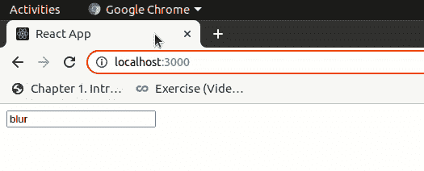

## document.getElementById() 在 React 中的等价形式是什么？

> 原文：[What is the equivalent of document.getElementById() in React?](https://www.geeksforgeeks.org/what-is-the-equivalent-of-document-getelementbyid-in-react/)

在 React 中，我们有一个 **Refs** 的概念，它相当于 JavaScript 中的 `document.getElementById()`。Refs 提供了一种访问在渲染方法中创建的 DOM 节点或 React 元素的方法。

### 创建 Refs

Refs 是使用 `React.createRef()` 创建的，并通过 `ref` 属性附加到 React 元素。

```jsx
class App extends React.Component {
 constructor(props) {
   super(props);
   // creating ref
   this.myRef = React.createRef();
 }
 render() {
   // assigning ref
   return <div ref={this.myRef} />;
 }
}
```

### 访问 Refs

当我们在渲染中给一个元素分配一个 Ref 时，我们可以使用 Ref 的 `current` 属性来访问这个元素。

```jsx
const node = this.myRef.current;
```

### 创建 React 应用程序

**步骤 1：** 使用以下命令创建一个 React 应用程序：

```bash
npx create-react-app foldername
```

**步骤 2：** 创建项目文件夹（即 `foldername`）后，使用以下命令移动到该文件夹：

```bash
cd foldername
```

**项目结构：** 如下图。


**文件路径：** `src/App.js`

### JavaScript 描述

```jsx
import React from 'react'

class App extends React.Component {

  constructor(props) {
    super(props);
    this.myRef = React.createRef();
  }

  onFocus() {
    this.myRef.current.value = "focus"
  }

  onBlur() {
    this.myRef.current.value = "blur"
  }

  render() {
    return (
      <div>
        <input
          ref={this.myRef}
          onFocus={this.onFocus.bind(this)}
          onBlur={this.onBlur.bind(this)}
        />
      </div>
    );
  }
}

export default App;
```

**输出：** 