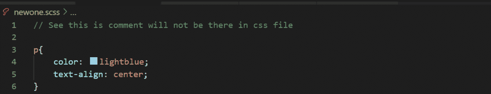
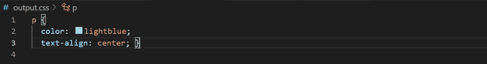
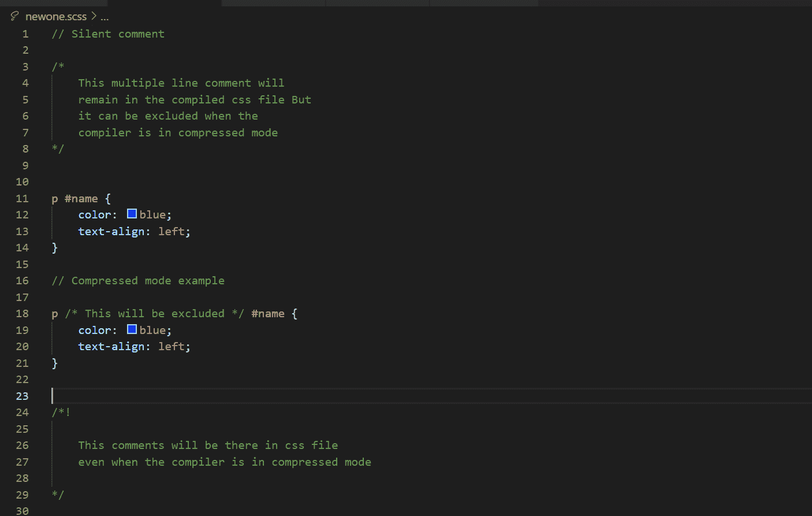
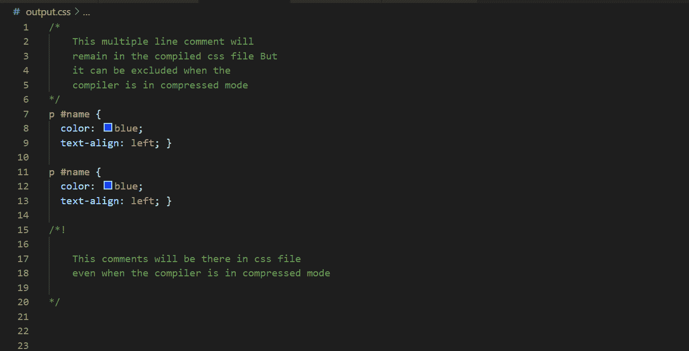

# SASS |评论

> 原文:[https://www.geeksforgeeks.org/sass-comments/](https://www.geeksforgeeks.org/sass-comments/)

[`SASS`](https://www.geeksforgeeks.org/css-preprocessor-sass/)中的注释与任何其他编程语言中的注释非常相似。但是，当我们谈论编译后的 [`CSS`](https://www.geeksforgeeks.org/css-preprocessor-sass/) 文件中的注释类型时，就会有所不同。

## [`Sass`](https://www.geeksforgeeks.org/css-preprocessor-sass/) 中有两类评论:

### 1. Silent Comments
`Silent comments`是单行注释。当我们编译 [`Sass`](https://www.geeksforgeeks.org/css-preprocessor-sass/) 文件时，这些注释不会反映在编译后的 [`CSS`](https://www.geeksforgeeks.org/css-preprocessor-sass/) 文件中，意味着这些注释不会出现在 [`CSS`](https://www.geeksforgeeks.org/css-preprocessor-sass/) 文件中。

请看下面的例子来了解这个想法:

*   **[`SCSS`](https://www.geeksforgeeks.org/css-preprocessor-sass/) 文件:**
        
    *   **编译好的 [`CSS`](https://www.geeksforgeeks.org/css-preprocessor-sass/) 文件:**
        

### 2. Loud Comments
`Loud comments`是多行注释。如果编译器不处于压缩模式，这些注释将保留在编译后的 [`CSS`](https://www.geeksforgeeks.org/css-preprocessor-sass/) 文件中。
请看下面的例子来了解这个想法:
*   **[`SCSS`](https://www.geeksforgeeks.org/css-preprocessor-sass/) 文件:**
        
    *   **编译好的 [`CSS`](https://www.geeksforgeeks.org/css-preprocessor-sass/) 文件:**
        

如果你想在压缩模式下也包含注释，那么就在注释的开头加上`/*!`标记，而不是`/*`。这些注释将一直存在于 [`CSS`](https://www.geeksforgeeks.org/css-preprocessor-sass/) 文件中。