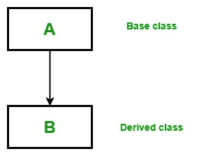
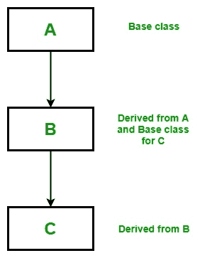
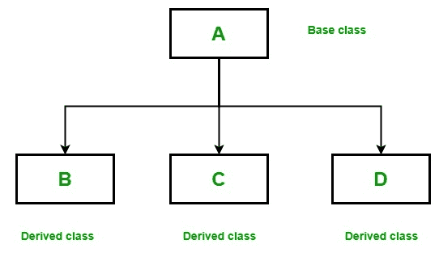
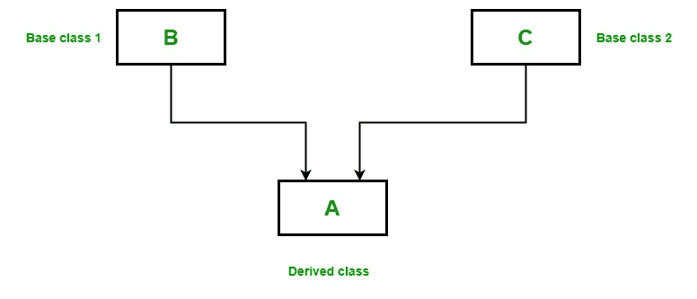

# Scala 中的继承

> 原文: [https://www.geeksforgeeks.org/inheritance-in-scala/](https://www.geeksforgeeks.org/inheritance-in-scala/)

继承是面向对象编程的重要支柱。这是 Scala 中允许一个类继承另一个类的特性(字段和方法)的机制。

**重要术语:**

*   **超类:** 特征被继承的类称为超类(或基类或父类)。
*   **子类:** 继承另一个类的类称为子类(或派生类、扩展类或子类)。除了超类字段和方法之外，子类还可以添加自己的字段和方法。
*   **可重用性:** 继承支持“可重用性”的概念，即当我们想要创建一个新的类，并且已经有一个类包含了我们想要的一些代码时，我们可以从现有的类中派生出我们的新类。通过这样做，我们重用了现有类的字段和方法。

## 如何在 Scala 中使用继承

用于继承的关键字是 `extends`。

**语法:**

```scala
class parent_class_name extends child_class_name{
// Methods and fields
}
```

**示例:**

```scala
// Scala program to illustrate the 
// implementation of inheritance

// Base class
class Geeks1{
    var Name: String = "Ankita"
}

// Derived class
// Using extends keyword 
class Geeks2 extends Geeks1
{
    var Article_no: Int = 130

// Method
    def details()
    {
    println("Author name: " +Name);
    println("Total numbers of articles: " +Article_no);
    }
}

object Main 
{

// Driver code
    def main(args: Array[String]) 
    {

// Creating object of derived class
        val ob = new Geeks2();
        ob.details();
    }
}
```

**输出:**

```scala
Author name: Ankita
Total numbers of articles: 130
```

**说明:** 在上例中，`Geeks1` 是基类，`Geeks2` 是派生类，使用 `extends` 关键字从 `Geeks1` 派生而来。在主方法中，当我们创建 `Geeks2` 类的对象时，基类的所有方法和字段的副本都会在该对象中获取内存。这就是为什么通过使用派生类的对象，我们也可以访问基类的成员。

## 继承类型

下面是 Scala 支持的不同类型的继承。

### Single Inheritance

在单继承中，派生类继承一个基类的特性。在下图中，类 A 作为派生类 B 的基类。


**示例:**

```scala
// Scala program to illustrate the 
// Single inheritance

// Base class
class Parent
{
    var Name: String = "Ankita"
}

// Derived class
// Using extends keyword 
class Child extends Parent
{
    var Age: Int = 22

// Method
    def details()
    {
    println("Name: " +Name);
    println("Age: " +Age);
    }
}

object Main
{

// Driver code
    def main(args: Array[String]) 
    {

// Creating object of the derived class
        val ob = new Child();
        ob.details();
    }
}
```

**输出:**

```scala
Name: Ankita
Age: 22
```

### Multilevel Inheritance

在多级继承中，一个派生类将继承一个基类，并且该派生类本身也作为另一个类的基类。在下图中，类 A 作为派生类 B 的基类，而类 B 又作为派生类 C 的基类。


**示例:**

```scala
// Scala program to illustrate the 
// Multilevel inheritance

// Base class
class Parent
{
    var Name: String = "Soniya"
}

// Derived from parent class
// Base class for Child2 class
class Child1 extends Parent
{
    var Age: Int = 32
}

// Derived from Child1 class
class Child2 extends Child1
{
    // Method
    def details(){
    println("Name: " +Name);
    println("Age: " +Age);
    }
}

object Main
{

// Drived Code
    def main(args: Array[String]) 
    {

// Creating object of the derived class
        val ob = new Child2();
        ob.details();
    }
}
```

**输出:**

```scala
Name: Soniya
Age: 32
```

### Hierarchical Inheritance

在分层继承中，一个类作为多个子类的超类(基类)。在下图中，类 A 作为派生类 B、C 和 D 的基类。


**示例:**

```scala
// Scala program to illustrate the 
// Hierarchical inheritance

// Base class
class Parent
{
    var Name1: String = "Siya"
    var Name2: String = "Soniya"
}

// Derived from the parent class
class Child1 extends Parent
{
    var Age: Int = 32
    def details1()
    {
    println(" Name: " +Name1);
    println(" Age: " +Age);
    }
}

// Derived from Parent class
class Child2 extends Parent
{
    var Height: Int = 164

// Method
    def details2()
    {
    println(" Name: " +Name2);
    println(" Height: " +Height);
    }
}

object Main 
{

// Driver code
    def main(args: Array[String]) 
    {

// Creating objects of both derived classes
        val ob1 = new Child1();
        val ob2 = new Child2();
        ob1.details1();
        ob2.details2();
    }
}
```

**输出:**

```scala
 Name: Siya
 Age: 32
 Name: Soniya
 Height: 164
```

### Multiple Inheritance

在多重继承中，一个类可以有多个超类，并从所有父类继承特性。Scala 不支持类的多重继承，但可以通过特质(trait)来实现。


**示例:**

```scala
// Scala program to illustrate the 
// multiple inheritance using traits

// Trait 1
trait Geeks1
{
    def method1()
}

// Trait 2
trait Geeks2
{
    def method2()
}

// Class that implement both Geeks1 and Geeks2 traits
class GFG extends Geeks1 with Geeks2
{

// method1 from Geeks1
    def method1()
    {
        println("Trait 1");
    }

// method2 from Geeks2
    def method2()
    {
        println("Trait 2");
    }
}
object Main 
{
    // Driver code
    def main(args: Array[String])
    {

// Creating object of GFG class
        var obj = new GFG();
        obj.method1();
        obj.method2();
    }
}
```

**输出:**

```scala
Trait 1
Trait 2
```

### Hybrid Inheritance

混合继承是上述两种或两种以上继承类型的混合。因为 Scala 不支持类的多重继承，所以类的混合继承也是不可能的。在 Scala 中，我们只能通过特质来实现混合继承。