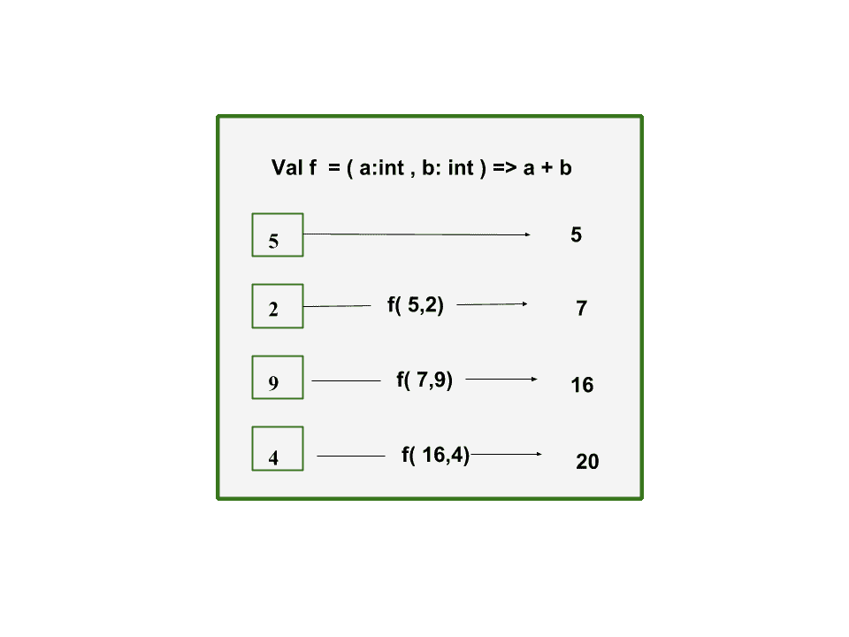
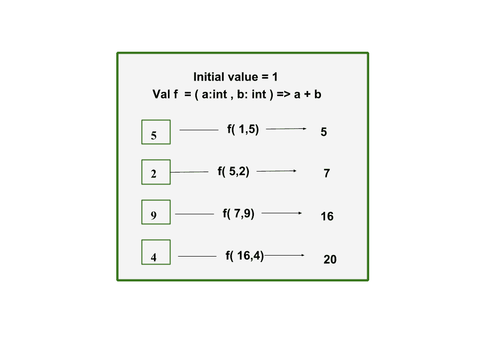
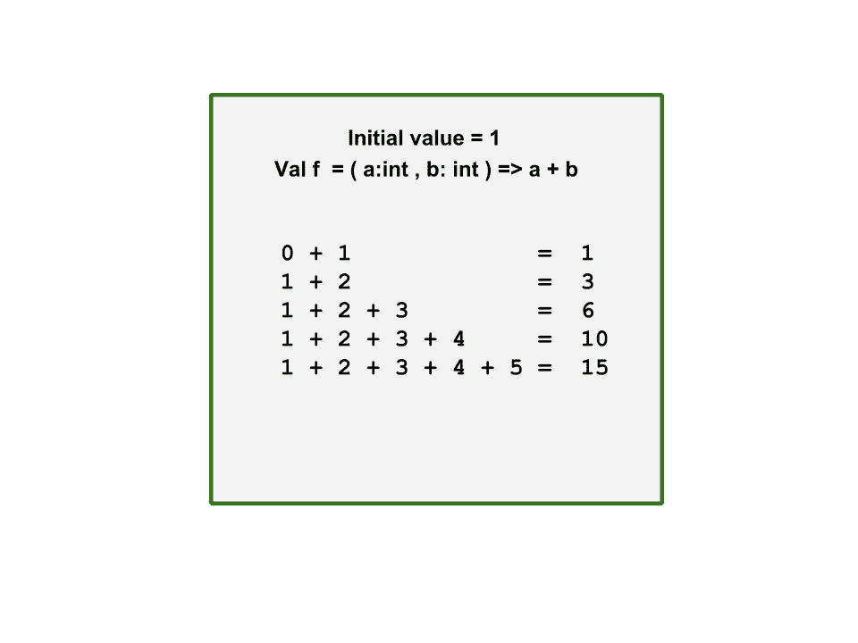

# Scala | 缩小、折叠或扫描

> 原文: [https://www.geeksforgeeks.org/scala-reduce-fold-or-scan/](https://www.geeksforgeeks.org/scala-reduce-fold-or-scan/)

在本教程中，我们将学习 Scala 中的缩减、折叠和扫描功能。

## 1. Reduce

`Reduce` 函数应用于 Scala 中的集合数据结构，如列表、集合、映射、序列和元组。`reduce` 函数的参数是一个*二元操作*，它合并集合中的所有元素并返回一个单值。前两个值通过二元操作合并，操作的结果再与集合中的下一个值合并，最终我们得到一个单值。



此代码使用 `reduce` 函数实现序列中元素的求和。

### 例:

```scala
// Scala program sum of elements 
// using reduce function

// Creating object
object geeks
{
    // Main method
    def main(arg:Array[String])
    {
        // initialize a sequence of elements
        val seq_elements: Seq[Double] = Seq(3.5, 5.0, 1.5)
        println(s"Elements = $seq_elements")

        // find the sum of the elements
        // using reduce function
        val sum: Double = seq_elements.reduce((a, b) => a + b)
        println(s"Sum of elements = $sum")
    }   
}
```

### 输出:

```scala
Elements  = List(3.5, 5.0, 1.5)
Sum of elements = 10.0
```

该代码使用 `reduce` 函数找到序列中的最大和最小元素。

### 例:

```scala
// Scala program to find maximum and minimum 
// using reduce function

// Creating object
object geeks
{
    // Main method
    def main(arg:Array[String])
    {
        // initialize a sequence of elements
        val seq_elements : Seq[Double] = Seq(3.5, 5.0, 1.5)
        println(s"Elements = $seq_elements")

        // find the maximum element using reduce function
        val maximum : Double = seq_elements.reduce(_ max _)
        println(s"Maximum element = $maximum")

        // find the minimum element using reduce function
        val minimum : Double = seq_elements.reduce(_ min _)
        println(s"Minimum element = $minimum")
    }
}
```

### 输出:

```scala
Elements = List(3.5, 5.0, 1.5)
Maximum element = 5.0
Minimum element = 1.5
```

## 2. Fold

与 `reduce` 类似，`fold` 也接受一个二元操作来合并集合中的所有元素并返回一个单值。不同之处在于，`fold` 允许我们定义一个初始值。由于这个特性，`fold` 也可以处理空集合。如果集合为空，初始化的值将成为最终答案。因此，我们还可以使用其他数据类型的初始值，从集合中返回一个不同类型的结果。`reduce` 只能返回相同类型的值，因为它的初始值是集合中的第一个值。



该代码使用 `fold` 函数实现序列中元素的求和。这里初始值取 `0.0`，因为序列的数据类型是 `Double`。

### 例:

```scala
// Scala program sum of elements 
// using fold function

// Creating object
object geeks
{
    // Main method
    def main(arg:Array[String])
    {
        // initialize a sequence of elements
        val seq_elements: Seq[Double] = Seq(3.5, 5.0, 1.5)
        println(s"Elements = $seq_elements")

        // find the sum of the elements using fold function
        val sum: Double = seq_elements.fold(0.0)((a, b) => a + b)
        println(s"Sum of elements = $sum")
    }
}
```

### 输出:

```scala
Elements = List(3.5, 5.0, 1.5)
Sum of elements = 10.0
```

这段代码用连字符连接字符串。我们使用初始值作为空字符串。因此，我们的 `fold` 方法将对空字符串应用运算符，并且使用 `reduce`，我们不会在集合的第一个值之前获得连字符。

### 例:

```scala
// Scala program concatenate string 
// using fold function

// Creating object
object geeks
{
    // Main method
    def main(arg:Array[String])
    {
        // initialize a sequence of strings
        val str_elements: Seq[String] = Seq("hello",
                            "Geeks", "For", "Geeks")
        println(s"Elements = $str_elements")

        // Concatenate strings with fold function
        val concat: String = str_elements.fold("")(
                                (a, b) => a + "-" + b)
        println(s"After concatenation = $concat")
    }
}    
```

### 输出:

```scala
Elements = List(hello, Geeks, For, Geeks)
After concatenation = -hello-Geeks-For-Geeks
```

## 3. Scan

`Scan` 函数接受二元操作作为参数，并返回集合中每个元素进行该操作后的值。它返回集合中该二元操作符的每一次迭代结果。在 `scan` 中我们也可以定义初始值。



该代码使用 `scan` 函数实现所有元素之和的迭代。

### 例:

```scala
// Scala program sum of elements 
// using scan function

// Creating object
object geeks
{
    // Main method
    def main(arg:Array[String])
    {
        //initialize a sequence of numbers
        val numbers: Seq[Int] = Seq(4, 2, 1, 6, 9)
        println(s"Elements of numbers = $numbers")

        //find the sum of the elements using scan function
        val iterations: Seq[Int] = numbers.scan(0)(_ + _)
        println("Running total of all elements" +
                s"in the collection = $iterations")
    }
}    
```

### 输出:

```scala
Elements of numbers = List(4, 2, 1, 6, 9)
Running total of all elements in the collection = List(0, 4, 6, 7, 13, 22)
```

这是用连字符连接字符串的实现，并显示了迭代。

### 例:

```scala
// Scala program concatenate string 
// using scan function

// Creating object
object geeks
{
    // Main method
    def main(arg:Array[String])
    {
        // initialize a sequence of strings
        val str_elements : Seq[String] = Seq("hello", 
                            "Geeks", "For", "Geeks")
        println(s"Elements = $str_elements")

        // Concatenate strings with scan function
        val concat : Seq[String]
                    = str_elements.scan("")((a, b) => a + "-" + b)
        println(s"After concatenation = $concat")
    }
}    
```

### 输出:

```scala
Elements = List(hello, Geeks, For, Geeks)
After concatenation = List(, -hello, -hello-Geeks, -hello-Geeks-For, -hello-Geeks-For-Geeks)
```