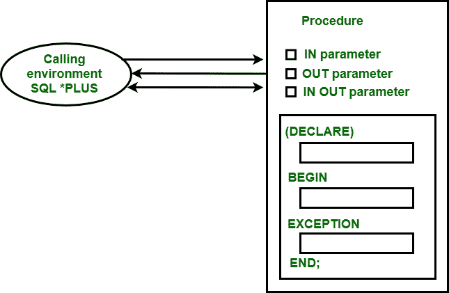

# PL/SQL 中的参数模式

> 原文：`https://www.geeksforgeeks.org/argument-modes-in-pl-sql/`

**参数模式**基本上用来描述**形式参数**的行为。子程序中使用了三种参数模式，如下所示：

1.  IN 模式
2.  OUT 模式
3.  IN OUT 模式



模式如何与调用环境交互的表示。

## IN Mode
这是子程序中默认的参数模式。此模式将常量值从调用环境传递到子程序中。

**示例–**
以下示例说明了 IN 模式参数的工作方式：

```sql
SQL> CREATE OR REPLACE PROCEDURE PR1(X IN NUMBER, Y IN NUMBER)
AS
    S NUMBER;
BEGIN
    S:=X+Y;
    DBMS_OUTPUT.PUT_LINE('SUM IS : '||S);
END PR1;
```

**输出–**

```
Procedure created.
```

```sql
SQL> DECLARE
    N1 NUMBER:=10;
    N2 NUMBER:=20;
BEGIN
    PR1(N1, N2);
END;
```

**输出–**

```
SUM IS : 30
PL/SQL procedure successfully completed.
SQL>
```

## OUT Mode
此模式将值从子程序传递回调用环境。

**示例–**
以下示例说明了 OUT 模式参数的工作方式：

```sql
SQL> CREATE OR REPLACE PROCEDURE PR2(Z OUT NUMBER) AS
    X NUMBER:=11;
    Y NUMBER:=22;
BEGIN
    Z:=X+Y;
END;
```

**输出–**

```
Procedure created.
```

```sql
SQL> DECLARE
    R NUMBER;
BEGIN
    PR2(R);
    DBMS_OUTPUT.PUT_LINE('RESULT IS: '||R);
END;
```

**输出–**

```
RESULT IS : 33
PL/SQL procedure successfully completed.
SQL>
```

## IN OUT Mode
此模式是 IN 和 OUT 模式的混合。就像 IN 模式一样，它将值从调用环境传递到子程序中；又像 OUT 模式一样，它可能使用同一个参数将不同的值从子程序传递回调用环境。

**示例–**
以下示例说明了 IN OUT 模式参数的工作方式：

```sql
SQL> CREATE OR REPLACE PROCEDURE PR3(B IN OUT NUMBER) AS
    A NUMBER:=11;
BEGIN
    B:=A+B;
END;
```

**输出–**

```
Procedure created.
```

```sql
SQL> DECLARE
    R NUMBER:=22;
BEGIN
    PR3(R);
    DBMS_OUTPUT.PUT_LINE('RESULT IS: '||R);
END;
```

**输出–**

```
RESULT IS : 33
PL/SQL procedure successfully completed.
SQL>
```