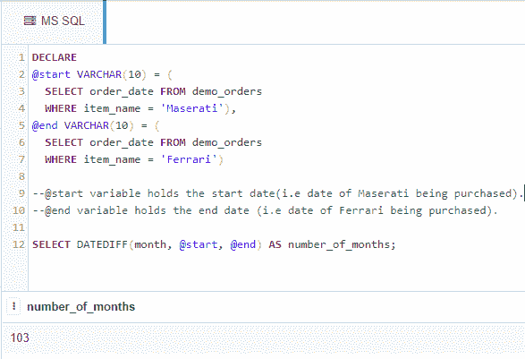

# 在 SQL 中计算两个特定日期之间的月数

> 原文: [https://www.geeksforgeeks.org/calculate-the-number-of-months-between-two-specific-dates-in-sql/](https://www.geeksforgeeks.org/calculate-the-number-of-months-between-two-specific-dates-in-sql/)

在本文中，我们将讨论计算两个特定日期之间的月数的 SQL 查询的概述，并将借助一个示例来实现，以便更好地理解。我们一步一步来讨论。

## 概述
下面我们就来看看，如何借助 SQL 查询使用 `DATEDIFF()` 函数计算两个给定日期之间的月数。为了演示，我们将在名为 `geeks` 的数据库中创建一个 `demo_orders` 表。实现 SQL 查询计算两个特定日期之间的月数有以下步骤。

## 步骤 1: 创建数据库
使用下面的 SQL 语句创建一个名为 `geeks` 的数据库，如下所示。

```sql
CREATE DATABASE geeks;
```

## 步骤 2: 使用数据库
使用下面的 SQL 语句将数据库上下文切换到 `geeks`，如下所示。

```sql
USE geeks;
```

## 步骤 3: 表定义
我们的 `geeks` 数据库中有以下演示表。

```sql
CREATE TABLE demo_orders 
(
ORDER_ID INT IDENTITY(1,1) PRIMARY KEY, 
--IDENTITY(1,1) is same as AUTO_INCREMENT in MySQL.
--Starts from 1 and increases by 1 with each inserted row.
ITEM_NAME VARCHAR(30) NOT NULL,
ORDER_DATE DATE
);
```

## 步骤 4: 验证
可以使用下面的语句查询创建的表的描述:

```sql
EXEC SP_COLUMNS demo_orders;
```

**输出:**

| TABLE_NAME | COLUMN_NAME | DATA_TYPE | TYPE_NAME | PRECISION | LENGTH | REMARKS |
| :--- | :--- | :--- | :--- | :--- | :--- | :--- |
| demo_orders | ORDER_ID | 4 | int identity | 10 | 4 | NULL |
| demo_orders | ITEM_NAME | 12 | varchar | 30 | 30 | NULL |
| demo_orders | ORDER_DATE | -9 | date | 10 | 3 | NULL |

## 步骤 5: 向表中添加数据
使用下面的语句向 `demo_orders` 表中添加数据，如下所示。

```sql
INSERT INTO demo_orders 
--no need to mention columns explicitly as we are inserting into all columns and ID gets
--automatically incremented.
VALUES
('Maserati', '2007-10-03'),
('BMW', '2010-07-23'),
('Mercedes Benz', '2012-11-12'),
('Ferrari', '2016-05-09'),
('Lamborghini', '2020-10-20');
```

## 步骤 6: 验证
要验证表格的内容，请使用如下语句。

```sql
SELECT * FROM demo_orders;
```

**输出:**

| ORDER_ID | ITEM_NAME | ORDER_DATE |
| :--- | :--- | :--- |
| 1 | Maserati | 2007-10-03 |
| 2 | BMW | 2010-07-23 |
| 3 | Mercedes Benz | 2012-11-12 |
| 4 | Ferrari | 2016-05-09 |
| 5 | Lamborghini | 2020-10-20 |

## 步骤 7: 计算两个特定日期之间的月数的 SQL 查询
现在，让我们使用 `DATEDIFF()` 函数在表格中查找“玛莎拉蒂”和“法拉利”订单日期之间的月数。下面是 `DATEDIFF()` 函数的语法。

```sql
DATEDIFF(day/month/year, <start_date>, <end_date>);
```

**示例:**

```sql
DECLARE 
@start VARCHAR(10) = (
  SELECT order_date FROM demo_orders
  WHERE item_name = 'Maserati'),
@end VARCHAR(10) = (
  SELECT order_date FROM demo_orders
  WHERE item_name = 'Ferrari')

--@start variable holds the start date(i.e date of Maserati being purchased).

--@end variable holds the end date (i.e date of Ferrari being purchased).

SELECT DATEDIFF(month, @start, @end) AS number_of_months;

--In place of *month* we could use *year* or *day* and that would give the respective no. of years and 
--days in between those dates.
```

**输出:**

