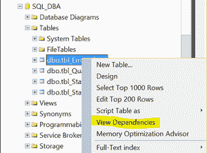
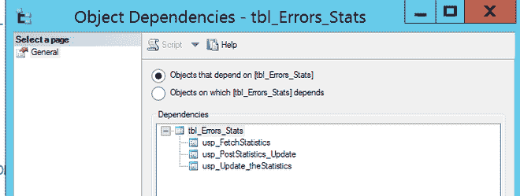

# 检查 SQL Server 中某个表的依赖关系

> 原文: [https://www.geeksforgeeks.org/check-the-dependencies-of-a-table-in-sql-server/](https://www.geeksforgeeks.org/check-the-dependencies-of-a-table-in-sql-server/)

作为一名数据库管理员，您可能需要使用 SQL Server 管理工作室或 SQL Query 在 SQL Server 中查找表的依赖关系。在更改或删除任何表时，有关于依赖关系的信息将是有用的。

## 使用 SQL Server 管理工作室在 SQL Server 中查找表依赖项

**步骤-1:**
展开数据库，展开表，右键单击表名。


**步骤-2:**
点击查看依赖关系。


## 使用 SQL Quires 在 SQL Server 中查找表依赖项

### 方法-1

使用 `sp_depends` 存储过程。它将返回指定对象的所有依赖项，包括表、视图、存储过程、约束等。

**查询:**

```sql
Use DatabaseName ;
EXEC sp_depends @objname = N'ObjectName' ;
```

**示例-1:**

```sql
Use SQL_DBA ;
EXEC sp_depends @objname = N'[dbo].[tbl_Errors_Stats]' ;
```

**输出:**

| 名字 | 类型 |
| --- | --- |
| dbo.usp_FetchStatistics | 存储过程 |
| dbo.usp_PostStatistics_Update | 存储过程 |
| dbo.usp_Update_统计信息 | 存储过程 |

### 方法-2

**查询:**

```sql
Use DatabaseName ;
SELECT * FROM sys.dm_sql_referencing_entities('ObjectName', 'OBJECT') ;
```

**示例-1:**

```sql
use SQL_DBA ;
SELECT * FROM sys.dm_sql_referencing_entities('[dbo].[tbl_Errors_Stats]', 'OBJECT') ;
```

**输出:**

| 引用_schema_name | 引用_entity_name | 引用_id | 引用_class | 引用_class_desc | is_caller_dependent |
| --- | --- | --- | --- | --- | --- |
| dbo | usp_FetchStatistics | 597577167 | 1 | 对象或列 | 0 |
| dbo | USP_post_statistics_更新 | 581577110 | 1 | 对象或列 | 0 |
| dbo | USP_Update_统计 | 565577053 | 1 | 对象_或_列 | 0 |

### 方法-3

**查询:**

```sql
SELECT ROUTINE_SCHEMA,
      ROUTINE_NAME,  
      ROUTINE_TYPE,
      ROUTINE_DEFINITION  
FROM INFORMATION_SCHEMA.ROUTINES  
WHERE ROUTINE_DEFINITION LIKE '%ObjectName%'
```

**示例-1:**

```sql
use SQL_DBA

SELECT ROUTINE_SCHEMA,
ROUTINE_NAME, 
ROUTINE_TYPE
FROM INFORMATION_SCHEMA.ROUTINES
WHERE ROUTINE_DEFINITION LIKE '%tbl_Errors_Stats%'
```

**输出:**

| 例程_架构 | 例程名 | 例程类型 |
| --- | --- | --- |
| dbo | usp_Update_统计信息 | 程序 |
| dbo | usp_PostStatistics_Update | 程序 |
| dbo | usp_FetchStatistics | 程序 |

### 方法-4

**查询:**

```sql
SELECT *
FROM sys.sql_expression_dependencies A, sys.objects B
WHERE referenced_id = OBJECT_ID(N'ObjectName') AND  
 A.referencing_id = B.object_id

GO
```

**示例-1:**

```sql
use SQL_DBA

SELECT referenced_id, referenced_database_name, referenced_schema_name, name
FROM sys.sql_expression_dependencies A, sys.objects B
WHERE referenced_id = OBJECT_ID(N'tbl_Errors_Stats') AND
A.referencing_id = B.object_id

GO
```

**输出:**

| 引用的_id | 引用的数据库名 | 引用的_架构_名称 | 名字 |
| --- | --- | --- | --- |
| 613577224 | SQL_DBA | dbo | usp_Update_统计信息 |
| 613577224 | SQL_DBA | dbo | usp_PostStatistics_Update |
| 613577224 | SQL_DBA | dbo | usp_FetchStatistics |