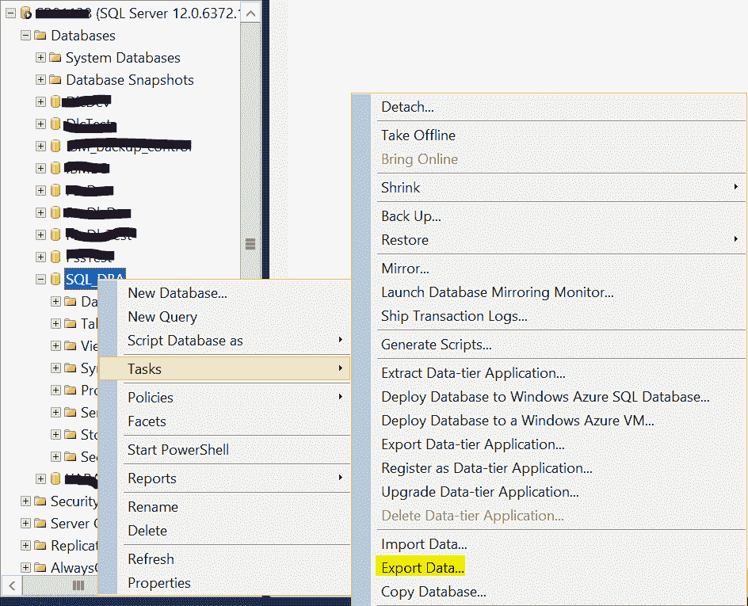
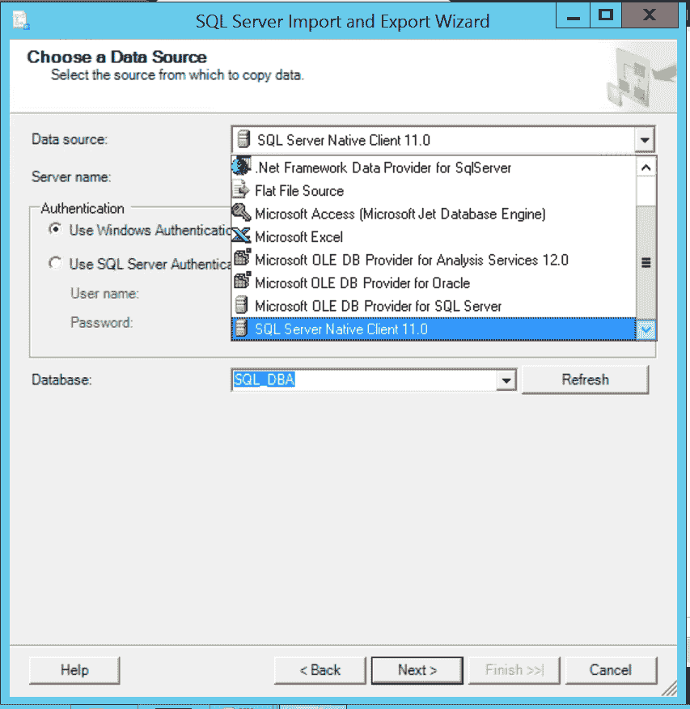
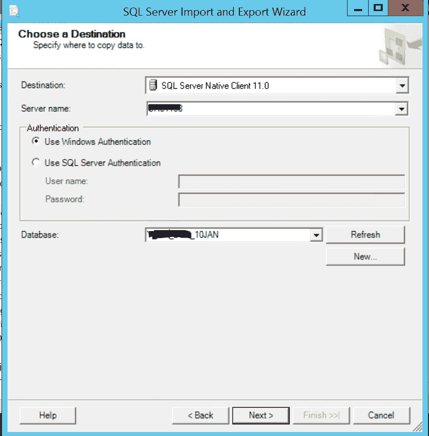
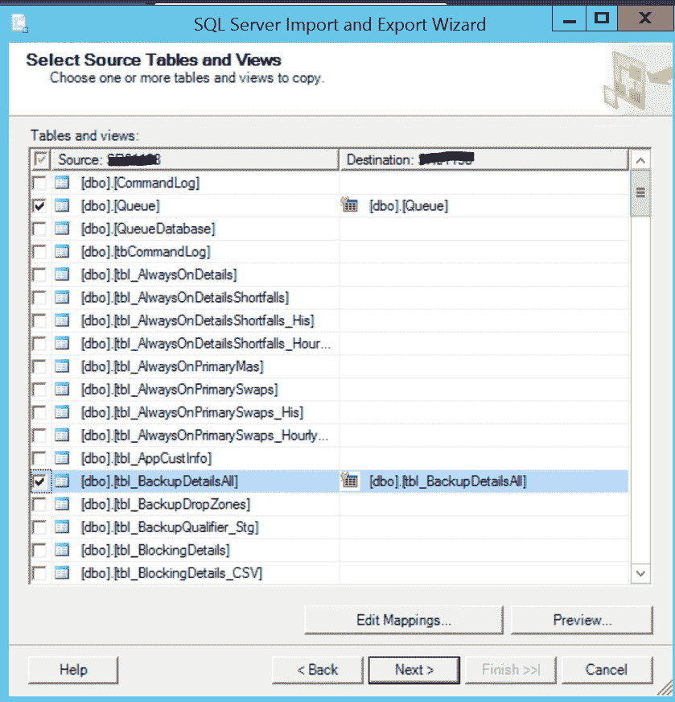
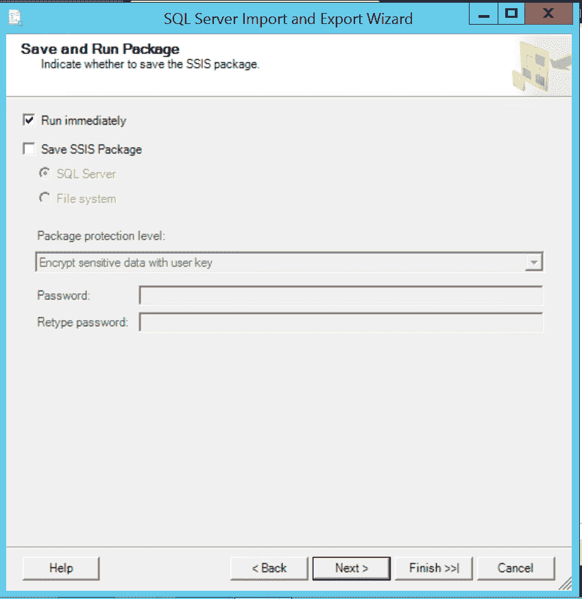
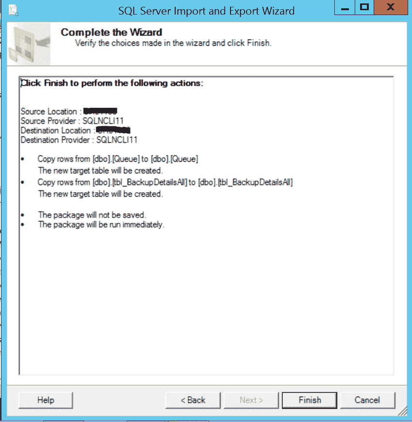

# 使用导入和导出向导

在 SQL Server 中的数据库之间复制表

> 原文: [https://www.geeksforgeeks.org/copy-tables-between-databases-in-sql-server-using-import-and-export-wizard/](https://www.geeksforgeeks.org/copy-tables-between-databases-in-sql-server-using-import-and-export-wizard/)

## 导入导出向导简介

该向导允许简单地完成一个过程，并且只需编写很少或不编写代码就可以执行数据复制过程。但是，要将数据从一个源导入和导出到另一个源，可以遵循以下步骤：

1.  打开 `Object Explorer`，选择数据库，右键单击数据库名称，选择 `Tasks` 并选择 `Export Data…` 选项。

    

2.  现在选择数据源，可以使用不同的源。例如，`SQL Native Client 11.0`，选择 `Server name` 和 `Database name`。

    

3.  现在选择一个目标 `Server name` 和 `Database`，然后单击 `Next`。

    

4.  选择要从中复制数据的对象（从表/视图到目标），或者编写查询以进行数据传输，然后单击 `Next`。

    

5.  选择 `Run immediately` 或 `Save SSIS Package`，然后单击 `Next`。

    

6.  将显示使用向导将执行的操作摘要。单击 `Finish` 以执行作业步骤。

    

向导成功完成后，表将在目的数据库中可见。

## 使用导入导出向导的好处

将特定表的对象和内容从一个数据库复制到同一实例或不同 SQL 实例中的另一个数据库，例如：将特定表从生产数据库复制到开发数据库，用于测试或排除问题。

## 使用导入导出向导的限制

副本取决于表的数量、大小和数据库中的当前可用空间等因素。如果表的总大小超过数据库总大小的 50%，则导入和导出向导会很耗时。