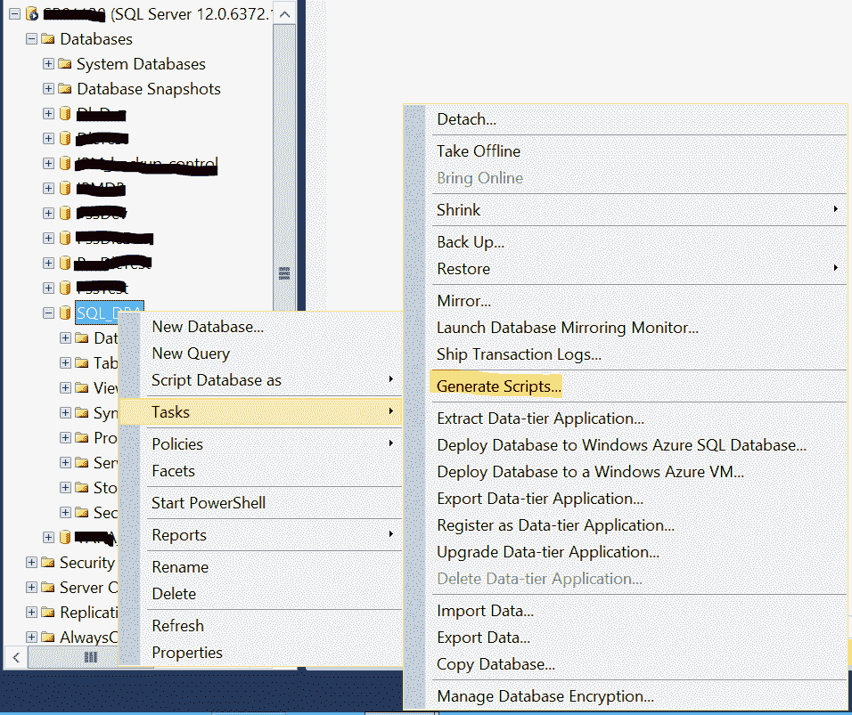
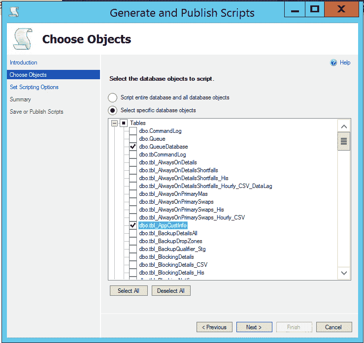
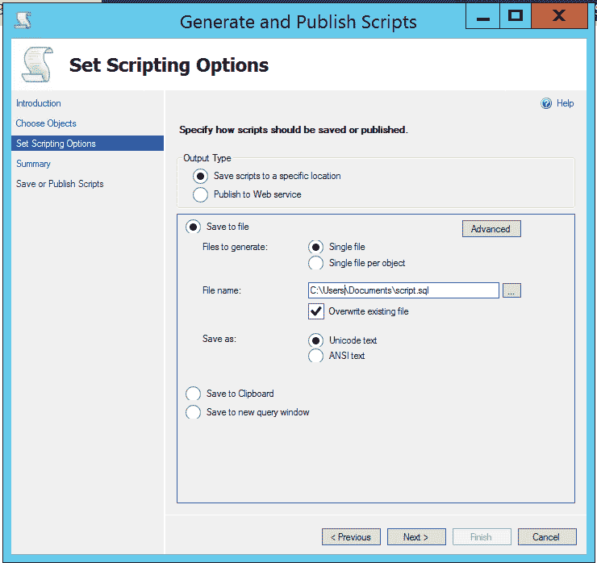
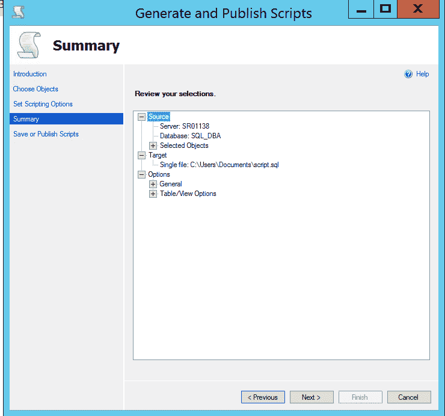
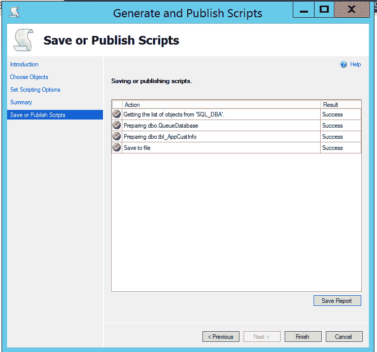

# 在 SQL Server 中的数据库之间复制表

> 原文: [https://www.geeksforgeeks.org/copy-tables-between-databases-in-sql-server/](https://www.geeksforgeeks.org/copy-tables-between-databases-in-sql-server/)

作为数据库管理员，您可能需要将特定表的对象和内容从一个数据库复制到同一实例或任何不同的 SQL 实例中的另一个数据库。您可能会想到在 MS SQL Server 中使用 `Insert Into Select` 语句，但是它在一些场景中没有用，例如将几个表从生产数据库转移到开发数据库进行测试或故障排除。此外，这取决于数据库中的表的数量、大小和可用空间。如果表的总大小超过数据库总大小的 50%，建议使用的方法是备份和恢复数据库。

## 通过使用 SQL Server 管理工作室生成脚本在 SQL Server 中的数据库之间复制表

请遵循以下步骤：

1.  连接 SQL Server 实例，打开对象资源管理器并选择数据库。
2.  右键单击数据库，选择“任务”(Tasks)，然后单击“生成脚本”(Generate Scripts)，单击“下一步”(Next)。

3.  在“选择对象”(Choose Object)页面，选择“编写整个数据库和所有数据库对象的脚本”(Script entire database and all database objects)或“选择特定数据库对象”(Select specific database objects)选项，然后单击“下一步”(Next)。

4.  对于“设置脚本编写选项”(Set Scripting Options)，选择“输出类型”(Output Type)，选择文件目标并命名，然后单击“下一步”(Next)。

5.  现在将显示整个过程的“摘要”(Summary)页面详情。单击“下一步”(Next)。

6.  现在，“保存或发布脚本”(Save or Publish Scripts)页面显示整个过程的进度，如下所示，单击“完成”(Finish)。

该脚本将在所选位置可用并在所需的数据库中执行。