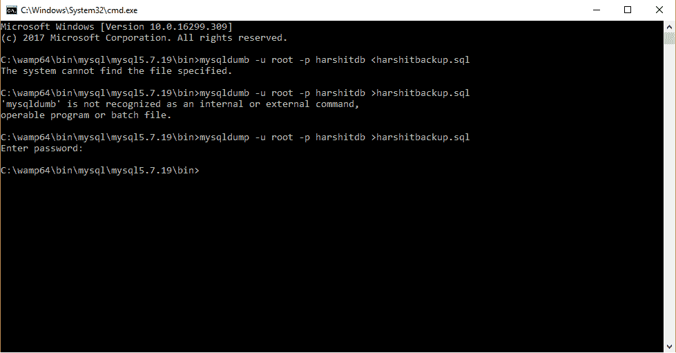

# MySQL 数据库备份

> 原文: [https://www.geeksforgeeks.org/database-backup-from-mysql/](https://www.geeksforgeeks.org/database-backup-from-mysql/)

在日常工作中，创建的数据库非常重要。这些从 MySQL 创建的数据库可以在系统之间转移，并能防止数据被破坏。有时系统会因各种错误而损坏，因此需要确保创建的数据库备份是完好的。所以，可以选择从 MySQL Wamp 服务器创建数据库备份。

## 从 Wamp 服务器创建备份的步骤

1.  进入 C 盘。
2.  打开名为 `Wamp` 的服务器文件夹。
3.  打开名为 `bin` 的文件夹，然后打开 `MySQL` 文件夹。
4.  现在打开名为 `mysql5.7.19` 的文件夹（这里的 `5.7.19` 是 Wamp 服务器的版本号，不同版本的文件夹名会有所不同，你应该进入对应版本的文件夹）。
5.  然后再次打开 `bin` 文件夹。
6.  在文件夹地址栏中输入 `CMD` 并按回车。

然后会出现一个命令提示符窗口，其路径已定位到上述地址。接着输入：

```sql
mysqldump -u root -p harshitdb > harshitbackup.sql
```

在这里，`harshitdb` 表示数据库名称（`harshit` 是数据库名，`db` 表示数据库）。执行后，它会创建一个数据库备份文件，您可以共享此文件，它不会被损坏或丢失。

打开命令提示符（CMD）后，完整的命令示例如下：

```sql
C:\wamp\bin\mysql\mysql5.7.19\bin>mysqldump -u root -p harshitdb > harshitbackup.sql
```

然后按回车键。

