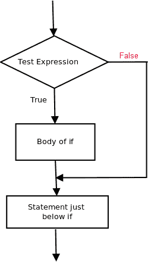
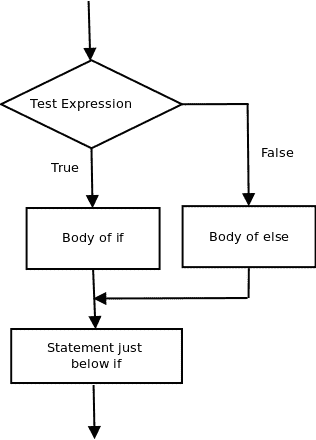
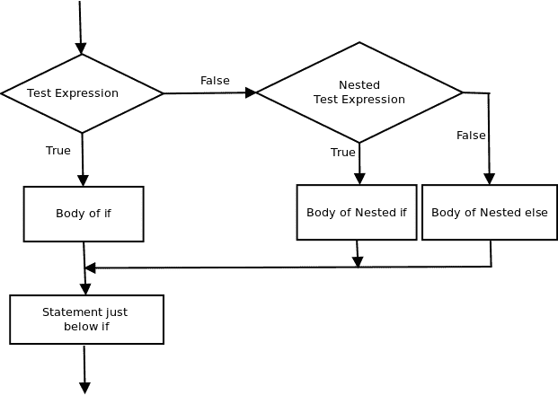

# PL/SQL 中的决策（如果-那么，如果-那么-否则，嵌套如果-那么，如果-那么-否则-那么-否则）

> 原文：[https://www.geeksforgeeks.org/decision-making-plsql-else-nested-elsif-else/](https://www.geeksforgeeks.org/decision-making-plsql-else-nested-elsif-else/)

在现实生活中，有些情况下我们需要做出一些决定，根据这些决定，我们决定下一步该做什么。类似的情况也会出现在编程中，我们需要做出一些决定，并根据这些决定执行下一个代码块。

编程语言中的决策语句决定了程序执行的流向。PL/SQL 中可用的决策语句有：

1.  `if then` 语句
2.  `if-then-else` 语句
3.  嵌套 `if-then` 语句
4.  `if-then-else-if-then-else` 梯子

## `if then` 语句

`if then` 语句是最简单的决策语句。它用于决定是否执行某个语句或语句块，即如果某个条件为真，则执行某个语句块，否则不执行。

**语法：**

```sql
if condition then
    -- do something
end if;
```

这里，评估后的条件不是真就是假。`if` 语句接受布尔值——如果值为真，则它将执行其下的语句块，否则不执行。`if` 和 `end if` 在这里视为一个块。

**示例：**

### 结构化查询语言

```sql
declare
    -- declare the values here
begin
    if condition then
        dbms_output.put_line('output');
    end if;
    dbms_output.put_line('output2');
end;
```



### 结构化查询语言

```sql
-- pl/sql program to illustrate If statement
declare
    num1 number:= 10;
    num2 number:= 20;
begin
    if num1 > num2 then
        dbms_output.put_line('num1 small');
    end if;
    dbms_output.put_line('I am Not in if');
end;
```

因为 `if` 语句中的条件为假。所以，`if` 语句下面的块没有被执行。

**输出：**

```sql
I am Not in if
```

## `if – then- else`

`if` 语句 alone 告诉我们，如果条件为真，它将执行一个语句块；如果条件为假，则不会执行。但如果我们想在条件为假时做点别的事情呢？这时就用到了 `else` 语句。我们可以将 `else` 语句与 `if` 语句结合使用，以便在条件为假时执行一个代码块。

**语法：**

```sql
if (condition) then
    -- Executes this block if
    -- condition is true
else
    -- Executes this block if
    -- condition is false
end if;
```



**示例：**

### 结构化查询语言

```sql
-- pl/sql program to illustrate If else statement
declare
    num1 number:= 10;
    num2 number:= 20;
begin
    if num1 < num2 then
        dbms_output.put_line('i am in if block');
    ELSE
        dbms_output.put_line('i am in else Block');
    end if;
    dbms_output.put_line('i am not in if or else Block');
end;
```

**输出：**

```sql
i'm in if Block
i'm not in if and not in else Block
```

`else` 语句后面的代码块在调用不在块中（没有空格）的语句后，作为 `if` 语句中的条件 `false` 执行。

## 嵌套 `if-then`

嵌套 `if-then` 是一个作为另一个 `if` 语句目标的 `if` 语句。嵌套 `if-then` 语句意味着一个 `if` 语句在另一个 `if` 语句内部。是的，PL/SQL 允许我们在 `if-then` 语句中嵌套 `if` 语句。即，我们可以将一个 `if then` 语句放在另一个 `if then` 语句内部。

**语法：**

```sql
if (condition1) then
    -- Executes when condition1 is true
    if (condition2) then
        -- Executes when condition2 is true
    end if;
end if;
```



### 结构化查询语言

```sql
-- pl/sql program to illustrate nested If statement
declare
    num1 number:= 10;
    num2 number:= 20;
    num3 number:= 20;
begin
    if num1 < num2 then
        dbms_output.put_line('num1 small num2');
        if num1 < num3 then
            dbms_output.put_line('num1 small num3 also');
        end if;
    end if;
    dbms_output.put_line('after end if');
end;
```