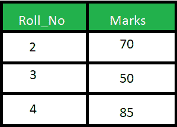

# SQL 中自然连接和内部连接的区别

> 原文: [https://www.geeksforgeeks.org/difference-between-natural-join-and-inner-join-in-sql/](https://www.geeksforgeeks.org/difference-between-natural-join-and-inner-join-in-sql/)

先决条件 – [连接 (内部、左侧、右侧和完全连接)](https://www.geeksforgeeks.org/sql-join-set-1-inner-left-right-and-full-joins/)

**1. 自然连接:**
自然连接基于相同的属性名和数据类型连接两个表。生成的表将包含两个表的所有属性，但只保留每个公共列的一个副本。

**示例:**
考虑下面给出的两个表格:

学生表


标记表



考虑给定的查询

```sql
SELECT * 
FROM Student NATURAL JOIN Marks;
```

**输出:**


**2. 内部连接:**
内部连接基于 `on` 子句中明确指定的列连接两个表。结果表将包含两个表的所有属性，包括公共列。

**示例:**
考虑以上两个表，查询如下:

```sql
SELECT * 
FROM student S INNER JOIN Marks M ON S.Roll_No = M.Roll_No; 
```

**输出:**


**SQL 中 Natural JOIN 和 INNER JOIN 的区别:**

| SR number | Natural JOIN | 内部连接 |
| --- | --- | --- |
| 1. | Natural join connects two tables based on the same attribute name and data type. | Inner join joins two tables according to the columns explicitly specified in the `on` clause. |
| 2. | In a natural join, the result table will contain all the attributes of the two tables, but only one copy will be kept for each common column. | In the inner join, the result table will contain all the attributes of the two tables, including duplicate columns. |
| 3. | In a natural join, if no condition is specified, rows based on common columns are returned. | In an inner join, only rows that exist in both tables will be returned. |
| 4. | Syntax: `Select * from Table1 Natural Join Table2;` | Syntax: `Select * from Table1 Inner Join Table2 on Table1.Column_name = Table2.Column_name;` |

`SQL Server Management Studio` 不支持自然连接，也称为微软 SQL Server。