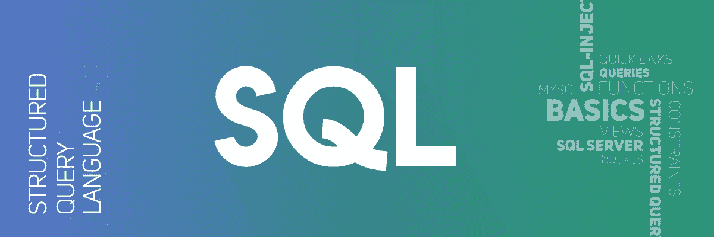

# 如何为健壮的流处理开发标准的 SQL 套件？

> 原文：[https://www.geeksforgeeks.org/how-to-develop-a-standard-sql-suite-for-a-robust-streaming-process/](https://www.geeksforgeeks.org/how-to-develop-a-standard-sql-suite-for-a-robust-streaming-process/)

在当前的数字化时代，企业需要实时数据分析和管理来保持领先。`SQL` 一直是此类数据流分析和管理的前沿。然而，它有一定的局限性，这限制了流式传输过程。



企业使用表和流的组合以及历史数据来为几个应用程序（如决策和其他业务操作）进行数据分析。尽管出现了数据分析和人工智能，SQL 仍然是用于数据流过程的主要查询语言之一。

因此，在这里，我们将使用三种不同的方法，通过以下方式更高效地实现 SQL 的流式处理：

*   时变关系
*   事件时间语义
*   物化控制

## 当前的 SQL 方法

在我们使用这些新方法之前，让我们先了解一下当前的 SQL 方法：

*   **`Apache Spark`：**
    这个声明式 API 建立在 `Spark SQL` 的执行引擎和优化器之上，实际上是 `Spark` 的数据集 API。通常，数据集程序在有限的数据流上执行。数据集应用编程接口的流通常被称为 `结构化流`。结构化流查询通过微批处理执行引擎进行评估，该引擎小批量处理数据流并找到容错保证。
*   **`KSQL`：**
    它建立在 `Kafka streams` 之上，是在 `Apache Kafka` 项目下开发的一个流处理框架。`KSQL` 是一个声明性包装器，它覆盖了 `Kafka` 流，并开发了一个定制的 `SQL` 类型语法来声明流和表。它更侧重于物化视图语义。
*   **`Apache Flink`：**
    它由两个关系 API 组成：`Flink` 风格的表 API 和 `SQL`。对于来自两个关系 API 的查询，它使用一个通用的逻辑计划表示和一个优化的 `Apache Calcite`。然后以批处理或流式处理的方式执行。
*   **`Apache Beam`：**
    它是特别开发的，牢记 `Beam` 的有界和无界数据处理的统一优化。它使用语义子集来执行数据流。
*   **`Apache Calcite`：**
    它是一个流行的流式 `SQL` 解析器，用于 `Flink SQL` 和 `Beam SQL`。它解析、优化并支持流处理语义。

## 三种新的流式 SQL 方法

现在，让我们跳到三种新的流式 SQL 方法。

### 时变关系

这种方法论侧重于元素 `时间`。每当我们处理流关系时，我们需要考虑随时间变化的相对时间关系。对于这个问题，我们可以使用时变关系（`TVR`），这是一种关系，其内容随时间变化。

`TVR` 可以多种方式编码或具体化，特别是作为一系列经典关系或一系列“插入”和“删除”操作。这两种编码是相互对偶的，并且对应于表和流。虽然编码的双重性可能是一个问题，但我们打算把它作为一个优势。

我们可以利用流和表都是公共语义对象的表示这一事实。虽然我们可以使用流本身的变化统一处理 `TVR`，但是 `TVR` 可以优化和物化流，以获得更好的查询结果。

### 事件时间语义

在许多情况下，假定数据是按照事件时间排列的，但这在移动应用开发、分布式系统或分片归档数据中并不成立。通常，数据是根据事件的时间进行流式处理的，然而执行逻辑的进度并不遵守同样的顺序。

这是因为一小时的处理时间与一小时的事件时间无关。因此，必须考虑事件时间以获得正确的结果。`STREAM` 系统计算事件时间，并包括一个名为心跳的特性，该特性缓冲不按事件时间顺序的数据，并将其输入查询处理器。这允许通过引发延迟来扭曲时间戳。而 `Millwheel` 系统使用水印——它可以计算出与元数据一起出现故障的数据。

但是，最佳实践是时间戳和水印的组合，因为它们一起可以允许正确计算事件时间。这些计算是通过对时间间隔进行分组并在没有无限资源的情况下执行的。

### 物化控制

这种方法提供了对行被物化时关系如何呈现的控制。在第一种方法中，我们可以使用 `流变更日志`，它捕获两个版本关系之间的元素差异，并进一步使用 `INSERT` 和 `DELETE` 的编码序列来突变 `TVR`。

另一种方法是 `物化延迟`——这种方法是通过将表和流建模为 `TVR` 来使用的，所获得的结果关系是 `TVR`。

## 示例与总结

**基于 `NEXmark` 基准的数据流查询示例：**

其中查询监控当前拍卖的最高价格项目，其时间相对结果为每 10 分钟，它得出具有最高出价的结果。

**`CQL` 某查询：**

```sql
SELECT
     Rstream ( B . price, B . itemid )
FROM
     Bid [ RANGE 10 MINUTE SLIDE 10 MINUTE ] B
WHERE
B . price =
       ( SELECT MAX ( B1 . price ) FROM BID
       [ RANGE 10 MINUTE SLIDE 10 MINUTE ] B1 );
```

**`SQL` 中的一个查询：**

```sql
SELECT
MaxBid . wstart, MaxBid . wend,
Bid . bidtime, Bid . price, Bid . itemid
FROM
Bid,
( SELECT
     MAX ( TumbleBid . price ) maxPrice,
     TumbleBid . wstart wstart,
     TumbleBid . wend wend
FROM
     Tumble (
         data = > TABLE ( Bid ),
         timecol = > DESCRIPTOR ( bidtime )
         dur = > INTERVAL '10 ' MINUTE ) TumbleBid
 GROUP BY
     TumbleBid . wend ) MaxBid

WHERE
     Bid . price = MaxBid . maxPrice AND
     Bid . bidtime >= MaxBid . wend
                  - INTERVAL '10 ' MINUTE AND
     Bid . bidtime < MaxBid . wend ;
```

**总结：**

与以前的方法相反，这种方法使用时间戳作为显式数据，并且 `出价` 流中的行不会按照 `出价时间` 的顺序出现。翻滚是一个 `TVR`，它为每个 `出价流` 分配包含 `出价时间` 的 10 分钟间隔。

通过上面的例子，我们可以看到，随着出价关系随着时间的推移而演变，并且随着时间的推移添加了新的元素，查询定义的关系也随之演变。因此，我们可以使用上述方法，并归纳出一个可以随着查询元素的变化而变化的 `TVR`。