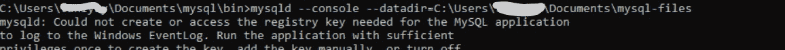
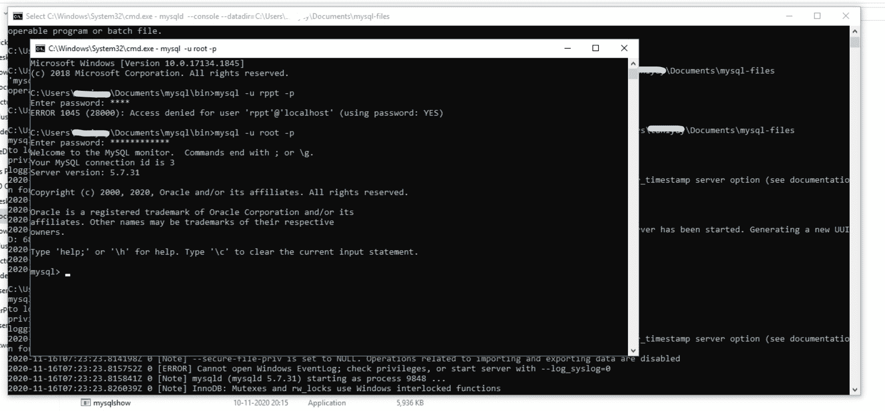

# 如何在 Windows 上安装 MySQL？

> 原文：[https://www.geeksforgeeks.org/how-to-install-mysql-in-windows/](https://www.geeksforgeeks.org/how-to-install-mysql-in-windows/)

## 先决条件

*   从下面给定的目录下载存档 zip 文件。
    [下载目录](https://downloads.mysql.com/archives/installer/)
*   解压文件。
*   用`mysql`将其重命名（以便于在后面的步骤中使用该文件夹）。

之后，要为 MySQL 设置路径，您必须遵循以下步骤。

## 步骤-1：创建新目录

在`cmd`提示符下为数据创建新目录。当您使用数据库时，您需要一个目录，您的所有文件都将保存在这个目录中。创建一个名为`mysql-files`的目录（你也可以选择任何其他名称）来保存你所有的作品。

使用以下步骤在`cmd`提示符下为数据创建一个新目录。

```
"Search" button ⇒ Enter "cmd" ⇒ Click on "Command Prompt"
```

这里，在 Documents 文件夹中创建一个目录，您可以在打开命令提示符后使用命令，如下所示。

*   `cd Documents`（将进入文件夹）

```
C:Users\Uesrname>cd Documents
```

*   现在你可以使用关键字`mkdir`创建一个目录。

```
mkdir mysql-files
```


## 步骤 2：初始化数据库

*   开始一个`CMD`。
*   转到重命名为`mysql`后保存的路径，然后使用关键字`cd`文件名转到`bin`文件夹。

```
C:Users\Uesrname>cd Documents
C:Users\Uesrname\Documents>cd mysql
C:Users\Uesrname\Documentsmysql>cd bin
C:Users\Uesrname\Documents\mysql\bin>
```

*   在`mysql`解压路径的`bin`的`cmd`路径中执行以下命令（即在路径`C:Users\Uesrname\Documents\mysql\bin>`中）。

```
mysqld –console –initialize –basedir=(path of newly created data directory) 
–datadir=(path of newly created data directory)
```


*   执行初始化命令后，将生成临时密码。别忘了记下密码。

## 步骤-3：添加目录

在命令提示符下或在如下相同路径下执行以下命令。

*   添加我们在步骤1中创建的名为`mysql-files`的数据目录。

```
mysqld --console --datadir=(path of newly created data directory)
```



## 步骤-4：启动服务器

现在打开另一个命令提示符，不关闭当前命令提示符（在 MySQL 的 path bin 的另一个`cmd`窗口中）

*   按如下方式执行以下命令。

```
mysql -u root -p
```

*   首次使用时，您需要在打开服务器时更改密码（您在步骤-2中记下的临时密码），如下所示。



## 步骤-5：更改用户 root 的密码

*   最后一步：首次使用时，您需要在打开服务器时更改密码（因为您使用了临时密码），如下所示。

```
ALTER USER root@localhost IDENTIFIED 
BY '<Your password>';
```


现在，你的`mysql`已经可以使用了。以上步骤是第一次安装使用。
以后每次使用 MySQL 时，可以按照第 3 步和第 4 步操作：

1.  如下执行以下命令。

```
mysqld –console –datadir=(path of newly created data directory)
```

2.  （在`mysql`路径`bin`的另一个`cmd`窗口中）
    执行如下命令。

```
mysql -u root -p
```