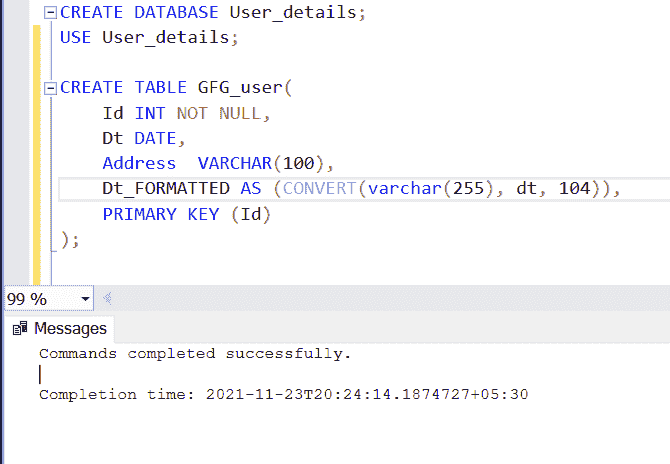
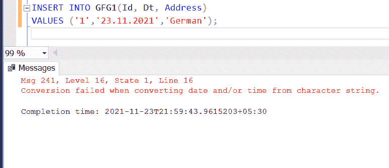
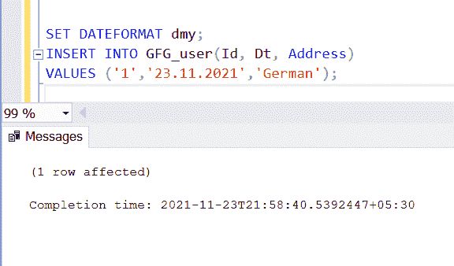
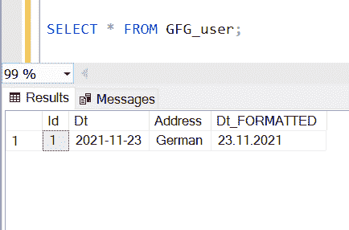

# 如何在创建表格时指定日期格式，并用 SQL 填写？

> 原文: [https://www.geeksforgeeks.org/how-to-specify-a-date-format-on-creating-a-table-and-fill-it-in-sql/](https://www.geeksforgeeks.org/how-to-specify-a-date-format-on-creating-a-table-and-fill-it-in-sql/)

每当我们使用数据库时，我们发现几乎每个表都包含一个日期列。毕竟，在分析数据时，数据的日期起着重要的作用。以特定或可理解的格式存储日期非常重要。在本文中，我们将学习如何在 SQL Server 上指定日期格式。

## 让我们创建演示数据库和表格。

### 步骤 1: 创建数据库

使用以下命令创建数据库。

**查询:**

```sql
CREATE DATABASE User_details;
```

### 步骤 2: 使用数据库

**查询:**

```sql
USE User_details;
```

### 步骤 3: 表格定义

数据库中有以下 GFG 用户表。

**查询:**

```sql
CREATE TABLE GFG_user(Id INT NOT NULL,Dt DATE,
Address  VARCHAR(100),Dt_FORMATTED AS
(convert(varchar(255), dt, 104)),
PRIMARY KEY (Id) );
```

**输出:**



在这里，我们已经创建了一个名为 `Dt_FORMATTED` 的列，我们将在其中保存我们的格式化日期。

现在，我们看到 `CONVERT()` 功能。`CONVERT()` 函数只是将任何类型的值转换为指定的数据类型。

**语法:**

```sql
CONVERT ( data_type ( length ) ,
expression , style )
```

通过使用这个函数，我们将字符串转换为日期。在风格论证的地方，我们提到了 `'104'`。它是指定日期格式的数字代码。

查看此表，查看不同格式使用的不同代码:

| 代码 | 世纪 (YY) | 世纪 (yyyy) | 标准 | 输入/输出 |
| :--- | :--- | :--- | :--- | :--- |
| 0 或 100 | – | – | 默认值 | mon dd yyyy hh:mi:ss:mmm(24 小时) |
| 1 | 101 | 美国 | mm/dd/yy |
| 2 | 102 | ANSI | yy.mm.dd |
| 3 | 103 | 英国/法国 | dd/mm/yy |
| 4 | 104 | 德国 | dd.mm.yy |
| 5 | 105 | 意大利 | dd-mm-yy |
| 6 | 106 | – | dd mon yy |
| 7 | 107 | – | 'mon dd, yy' |
| 10 | 110 | 美国 | mm-dd-yy |
| 11 | 111 | 日本 | yy/mm/dd |
| 12 | 112 | ISO | yymmdd |
| 13 | 113 | 欧洲默认值+ms | dd mon yyyy hh:mi:ss:mmm(24 小时) |
| 14 | 114 | – | hh:mi:ss:mmm(24 小时) |
| 20 | 120 | ODBC 规范 | yyyy-mm-dd hh:mi:ss:mmm(24 小时) |
| 21 | 121 | ODBC 规范（带毫秒） | yyyy-mm-dd hh:mi:ss:mmm(24 小时) |
| – | 130 | 回历 (5) | dd mon yyyy hh:mi:ss:mmmAM |
| – | 131 | 回历 (2) | dd/mm/yy hh:mi:ss:mmmAM |

这里，我们只提到了 10 种最常用的格式。

### 第 4 步: 插入数值

以下命令用于将值插入表中。

**查询:**

```sql
SET DATEFORMAT dmy;
INSERT INTO GFG_user
(Id, Dt, Address) VALUES ('1','23.11.2021',
'German');
```



在这个查询中，我们使用 `DATEFORMAT` 设置。

**语法:**

```sql
SET DATEFORMAT format
```

当我们插入字符串时，服务器会尝试在将字符串插入到表中之前将其转换为日期。因为它无法判断我们是将月份放在日期之前还是日期放在月份之前。例如，假设您试图插入 `06.07.2000`。服务器无法检测日期是 7 月 6 日还是 6 月 7 日。虽然它使用正在运行的用户帐户的本地化设置来计算，但不提及 `DATEFORMAT` 可能会给你一个错误，因为大多数情况下，运行该操作的帐户被设置为美国格式，即–**月日年(mdy)**。

导致错误的原因是我们想将其保存为 `dmy`，而不是 `mdy`。然而，使用 `DATEFORMAT` 将帮助您摆脱它。

**输出:**



我们已经完成了我们的表，现在让我们检查我们是否得到了我们想要的输出。

### 第五步: 查看表格数据

**查询:**

```sql
SELECT * FROM GFG_user;
```

**输出:**



我们已经成功地在 `Dt_FORMATTED` 列中获得了我们的德语格式的日期。