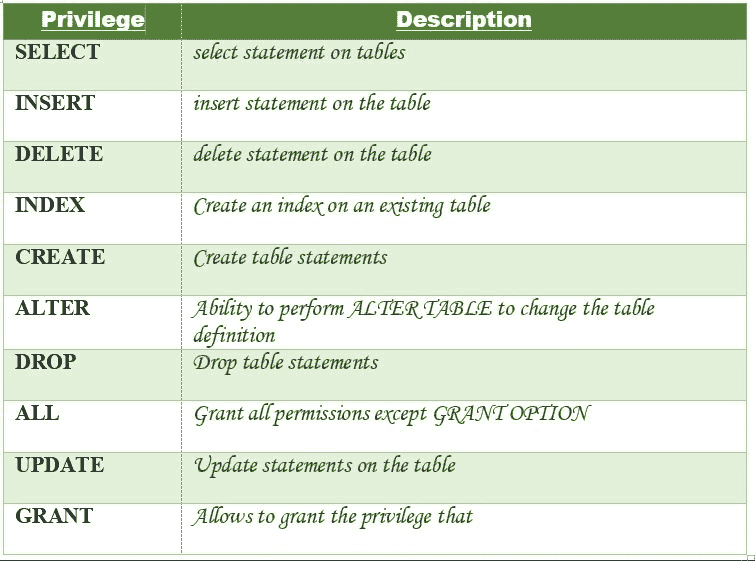

# MySQL 授予/撤销权限

> 原文: [https://www.geeksforgeeks.org/mysql-grant-revoke-privileges/](https://www.geeksforgeeks.org/mysql-grant-revoke-privileges/)

## 授予特权

我们已经了解了如何使用 [MySQL | 创建用户语句](https://www.geeksforgeeks.org/mysql-create-user-statement/)在 MySQL 中创建用户。但是使用创建用户语句只会创建一个新用户，而不会授予用户帐户任何权限。因此，要授予用户帐户权限，需要使用 `GRANT` 语句。

### 语法

```sql
GRANT privileges_names ON object TO user;
```

### 使用的参数

*   `privileges_names`：这些是授予用户的访问权限或权限。
*   `object`：是被授予权限的数据库对象的名称。在授予表权限的情况下，这将是表名。
*   `user`：是将被授予权限的用户的名称。

### 权限

下面列出了可以授予用户的权限以及说明：


现在让我们了解授予用户权限的不同方式：

1.  **向表中的用户授予 Select 权限**：要向用户名为 `Amit` 的名为 `Users` 的表授予 `SELECT` 权限，应执行以下 `GRANT` 语句。

    ```sql
    GRANT SELECT ON Users TO 'Amit'@'localhost';
    ```

2.  **向表中的用户授予多个权限**：要向表 `Users` 中名为 `Amit` 的用户授予多个权限，应执行以下 `GRANT` 语句。

    ```sql
    GRANT SELECT, INSERT, DELETE, UPDATE ON Users TO 'Amit'@'localhost';
    ```

3.  **向表中的用户授予所有权限**：要向表 `Users` 中名为 `Amit` 的用户授予所有权限，应执行以下 `GRANT` 语句。

    ```sql
    GRANT ALL ON Users TO 'Amit'@'localhost';
    ```

4.  **向表中的所有用户授予特定权限**：要向表 `Users` 中的所有用户授予特定权限，应执行以下 `GRANT` 语句。

    ```sql
    GRANT SELECT ON Users TO '*'@'localhost';
    ```

    在上例中，`*` 符号用于向表 `Users` 的所有用户授予 `SELECT` 权限。

5.  **在函数/存储过程上授予权限**：在使用函数和存储过程时，`GRANT` 语句可用于授予用户在 MySQL 中执行函数和存储过程的能力。

    **授予执行权限**：`EXECUTE` 权限赋予执行函数或存储过程的能力。

    **语法**：

    ```sql
    GRANT EXECUTE ON [ PROCEDURE | FUNCTION ] object TO user;
    ```

    授予执行权限的不同方式：

    *   **授予 MySQL 中某个函数的 `EXECUTE` 权限**：如果有一个名为 `CalculateSalary` 的函数，并且您想授予名为 `Amit` 的用户 `EXECUTE` 访问权限，那么应该执行下面的 `GRANT` 语句。

        ```sql
        GRANT EXECUTE ON FUNCTION CalculateSalary TO 'Amit'@'localhost';
        ```

    *   **授予所有用户对 MySQL 中某个函数的执行权限**：如果有一个名为 `CalculateSalary` 的函数，并且您想授予所有用户 `EXECUTE` 访问权限，那么应该执行下面的 `GRANT` 语句。

        ```sql
        GRANT EXECUTE ON FUNCTION CalculateSalary TO '*'@'localhost';
        ```

    *   **授予用户在 MySQL 存储过程中的执行权限**：如果有一个名为 `DBMSProcedure` 的存储过程，并且您想授予名为 `Amit` 的用户 `EXECUTE` 访问权限，那么应该执行下面的 `GRANT` 语句。

        ```sql
        GRANT EXECUTE ON PROCEDURE DBMSProcedure TO 'Amit'@'localhost';
        ```

    *   **授予所有用户对 MySQL 中某个存储过程的执行权限**：如果有一个名为 `DBMSProcedure` 的存储过程，并且您想授予所有用户 `EXECUTE` 访问权限，那么应该执行下面的 `GRANT` 语句。

        ```sql
        GRANT EXECUTE ON PROCEDURE DBMSProcedure TO '*'@'localhost';
        ```

### 检查授予用户的权限

要查看授予用户的权限，使用 `SHOW GRANTS` 语句。要检查授予名为 `Amit` 的用户和作为 `localhost` 的主机的权限，将执行以下 `SHOW GRANTS` 语句：

```sql
SHOW GRANTS FOR 'Amit'@'localhost';
```

**输出**：

```sql
GRANTS FOR Amit@localhost

GRANT USAGE ON *.* TO `Amit`@`localhost`
```

## 从表中撤销权限

`REVOKE` 语句用于撤销过去授予用户的部分或全部权限。

### 语法

```sql
REVOKE privileges ON object FROM user;
```

### 使用的参数

*   `object`：是被撤销权限的数据库对象的名称。在撤销表权限的情况下，这将是表名。
*   `user`：是被撤销权限的用户的名称。

### 权限

特权可以是以下值：


撤销用户权限的不同方式：

1.  **撤销表中用户的选择权限**：要撤销用户名为 `Amit` 的 `Users` 表的 `SELECT` 权限，应执行以下 `REVOKE` 语句。

    ```sql
    REVOKE SELECT ON Users FROM 'Amit'@'localhost';
    ```

2.  **撤销表中用户的多个权限**：要撤销表 `Users` 中名为 `Amit` 的用户的多个权限，应执行以下 `REVOKE` 语句。

    ```sql
    REVOKE SELECT, INSERT, DELETE, UPDATE ON Users FROM 'Amit'@'localhost';
    ```

3.  **撤销表中用户的所有权限**：要撤销表 `Users` 中名为 `Amit` 的用户的所有权限，应执行以下 `REVOKE` 语句。

    ```sql
    REVOKE ALL ON Users FROM 'Amit'@'localhost';
    ```

4.  **撤销表中所有用户的权限**：要撤销表 `Users` 中所有用户的特定权限，应执行以下 `REVOKE` 语句。

    ```sql
    REVOKE SELECT ON Users FROM '*'@'localhost';
    ```

5.  **在函数/存储过程上撤销权限**：在使用函数和存储过程时，`REVOKE` 语句可用于撤销过去授予用户的 `EXECUTE` 权限。

    **语法**：

    ```sql
    REVOKE EXECUTE ON [ PROCEDURE | FUNCTION ] object FROM user;
    ```

    *   **撤销 MySQL 中某个函数的 `EXECUTE` 权限**：如果有一个名为 `CalculateSalary` 的函数，你想撤销对名为 `Amit` 的用户的 `EXECUTE` 访问，那么应该执行下面的 `REVOKE` 语句。

        ```sql
        REVOKE EXECUTE ON FUNCTION CalculateSalary FROM 'Amit'@'localhost';
        ```

    *   **撤销 MySQL 中某个函数对所有用户的 `EXECUTE` 权限**：如果有一个函数叫做 `CalculateSalary`，你想撤销所有用户的 `EXECUTE` 访问权限，那么应该执行下面的 `REVOKE` 语句。

        ```sql
        REVOKE EXECUTE ON FUNCTION CalculateSalary FROM '*'@'localhost';
        ```

    *   **撤销用户在 MySQL 存储过程中的执行权限**：如果有一个名为 `DBMSProcedure` 的存储过程，并且您想要撤销对名为 `Amit` 的用户的 `EXECUTE` 访问，那么应该执行下面的 `REVOKE` 语句。

        ```sql
        REVOKE EXECUTE ON PROCEDURE DBMSProcedure FROM 'Amit'@'localhost';
        ```

    *   **撤销所有用户对 MySQL 中某个存储过程的执行权限**：如果有一个名为 `DBMSProcedure` 的存储过程，并且您想要撤销对所有用户的 `EXECUTE` 访问权限，那么应该执行下面的 `REVOKE` 语句。

        ```sql
        REVOKE EXECUTE ON PROCEDURE DBMSProcedure FROM '*'@'localhost';
        ```