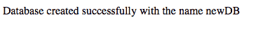

# PHP | MySQL(创建数据库)

> 原文:[https://www.geeksforgeeks.org/php-mysql-creating-database/](https://www.geeksforgeeks.org/php-mysql-creating-database/)

## 什么是数据库？

[数据库](https://www.geeksforgeeks.org/database-management-system-introduction-set-1/)是相互关联的数据的集合，有助于从数据库中高效地检索、插入和删除数据，并以表格、视图、模式、报告等形式组织数据。例如，大学数据库组织关于学生、教师和管理人员等的数据。这有助于有效地从中检索、插入和删除数据。

我们知道，在 MySQL 中，为了创建数据库，我们需要执行一个查询。您可以参考[这篇](https://www.geeksforgeeks.org/sql-create/)文章中的 SQL 查询来创建数据库。

## 使用 PHP 创建 MySQL 数据库的基本步骤

使用 PHP 创建 MySQL 数据库的基本步骤是:

*   按照本文中的描述，从您的 PHP 脚本建立到 MySQL 服务器的连接。
*   如果连接成功，编写一个 SQL 查询来创建一个数据库，并将其存储在一个字符串变量中。
*   执行查询。

我们已经学习了在 PHP 中建立连接和创建变量。我们可以用 3 种不同的方式执行 PHP 脚本中的查询，如下所述:

### 1. 使用 MySQLi 面向对象过程

如果使用面向对象过程建立了 MySQL 连接，那么我们可以使用 `mysqli` 类的 `query()` 函数来执行查询，语法如下所述。

**语法**:

```sql
<?php
$servername = "localhost";
$username = "username";
$password = "password";

// 创建连接
$conn = new mysqli($servername, $username, $password);
// 检查连接
if ($conn->connect_error) {
    die("Connection failed: " . $conn->connect_error);
}
// 创建一个名为 newDB 的数据库
$sql = "CREATE DATABASE newDB";
if ($conn->query($sql) === TRUE) {
    echo "Database created successfully with the name newDB";
} else {
    echo "Error creating database: " . $conn->error;
}

// 关闭连接
$conn->close();
?>
```

**注意:** 每当创建数据库时，为 `mysqli` 对象指定三个参数 `servername`、`username` 和 `password`。

**输出**:


### 2. 使用 MySQLi 过程式过程

如果使用过程式过程建立了 MySQL 连接，那么我们可以使用 PHP 的 `mysqli_query()` 函数来执行查询，语法如下所述。

**语法**:

```sql
<?php
$servername = "localhost";
$username = "username";
$password = "password";

// 创建连接
$conn = mysqli_connect($servername, $username, $password);
// 检查连接
if (!$conn) {
    die("Connection failed: " . mysqli_connect_error());
}

// 创建一个名为 newDB 的数据库
$sql = "CREATE DATABASE newDB";
if (mysqli_query($conn, $sql)) {
    echo "Database created successfully with the name newDB";
} else {
    echo "Error creating database: " . mysqli_error($conn);
}

// 关闭连接
mysqli_close($conn);
?>
```

**输出**:


### 3. 使用 PDO 过程

如果使用 PDO 过程建立了 MySQL 连接，那么我们可以按照下面的语法执行查询。

**语法**:

```sql
<?php
$servername = "localhost";
$username = "username";
$password = "password";

try {
    $conn = new PDO("mysql:host=$servername;dbname=newDB", $username, $password);
    // 将 PDO 错误模式设置为异常
    $conn->setAttribute(PDO::ATTR_ERRMODE, PDO::ERRMODE_EXCEPTION);
    $sql = "CREATE DATABASE newDB";
    // 使用 exec() 因为没有结果返回
    $conn->exec($sql);
    echo "Database created successfully with the name newDB";
}
catch(PDOException $e)
{
    echo $sql . "\n" . $e->getMessage();
}
$conn = null;
?>
```

**注意:** `PDO` 的异常类用于处理我们的数据库查询中可能出现的任何问题。如果在 `try{ }` 块中引发异常，脚本将停止执行，并直接流向第一个 `catch(){ }` 块。

**输出**:
