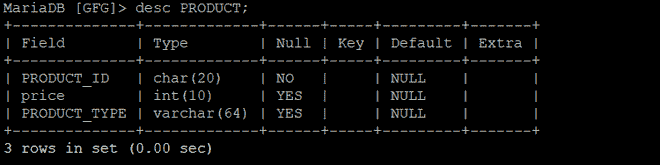
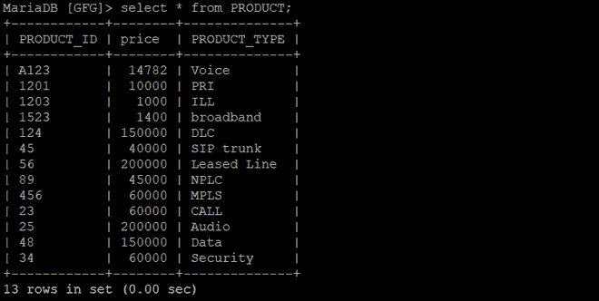
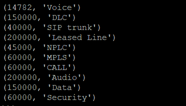
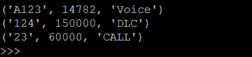

# Python MariaDB – 使用 PyMySQL 的 WHERE 子句

> 原文: [https://www.geeksforgeeks.org/python-mariadb-where-clause-using-pymysql/](https://www.geeksforgeeks.org/python-mariadb-where-clause-using-pymysql/)

在 MariaDB 中使用 `WHERE` 子句，根据需要的条件过滤数据。您可以使用 `WHERE` 子句获取、删除或更新 MariaDB 中的特定数据集。

## 语法

```sql
SELECT column1, column2, …. columnN FROM [TABLE NAME] WHERE [CONDITION];
```

上面的语法用于显示符合条件的特定数据集。

## 示例 1

考虑以下名为 `GFG` 的数据库，其表名为 `PRODUCT`。

**表的模式:**



**表数据:**



## Python 中的 WHERE 子句

在 Python 中使用 `WHERE` 子句的步骤是:

1.  首先在 MariaDB 和 Python 程序之间形成连接。这是通过导入 `pymysql` 包并使用 `pymysql.connect()` 方法来完成的，用于将用户名、密码、主机（可选默认值: `localhost`）和数据库（可选）作为参数传递给它。
2.  现在，使用 `cursor()` 方法在上面创建的连接对象上创建一个游标对象。数据库游标是一种控制结构，可以遍历数据库中的记录。
3.  然后，通过 `execute()` 方法传递 `WHERE` 子句语句来执行它。

```python
import pymysql

# Create a connection object
# IP address of the MySQL database server
Host = "localhost"

# User name of the database server
User = "user"

# Password for the database user
Password = ""

database = "GFG"

conn = pymysql.connect(host=Host, user=User, password=Password, database=database)

# Create a cursor object
cur = conn.cursor()

query = f"SELECT price, PRODUCT_TYPE FROM PRODUCT WHERE price > 10000"

cur.execute(query)

rows = cur.fetchall()
for row in rows:
    print(row)

conn.close()
```

**输出:**



## 示例 2

```python
import pymysql

# Create a connection object
conn = pymysql.connect('localhost', 'user', 'password', 'database')

# Create a cursor object
cur = conn.cursor()

query = f"SELECT * FROM PRODUCT WHERE PRODUCT_TYPE in ('Voice', 'DLC', 'CALL')"

cur.execute(query)

rows = cur.fetchall()
for row in rows:
    print(row)

conn.close()
```

**输出:**

