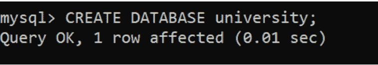
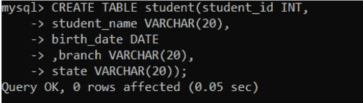
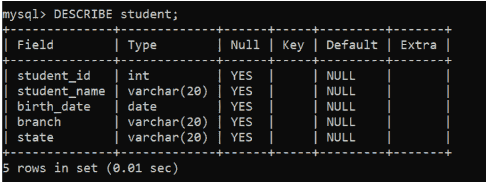
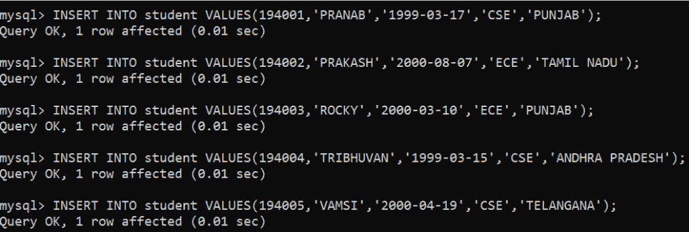
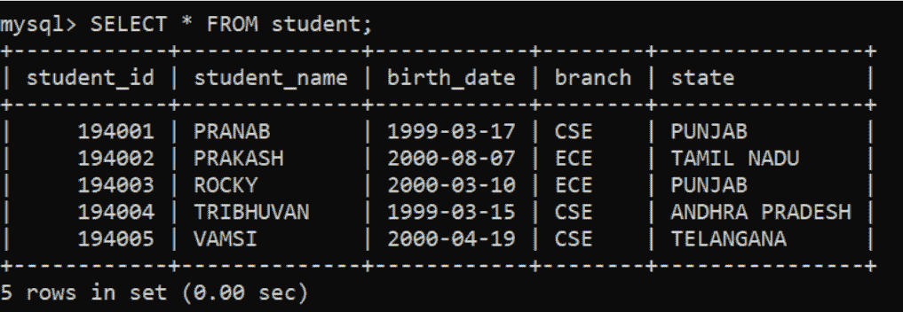
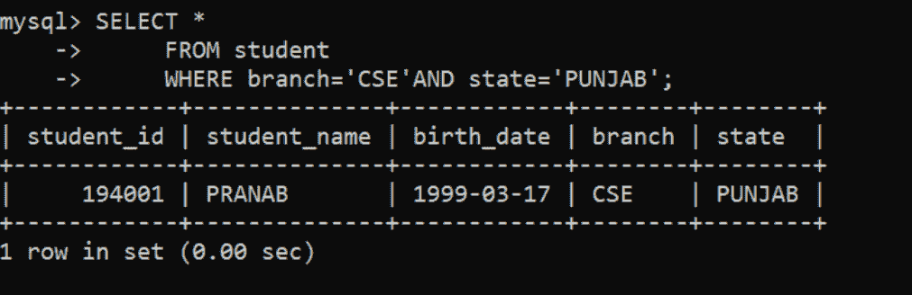
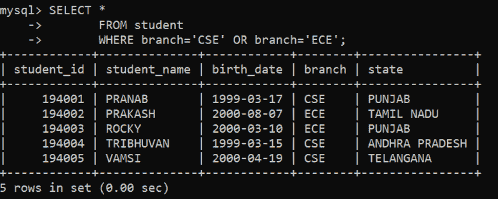
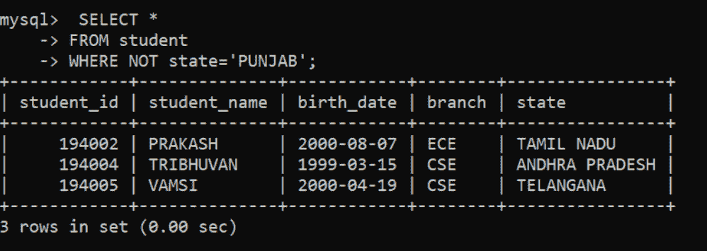

# 在 MySQL 中使用与、或、非运算符的查询

> 原文: [https://www.geeksforgeeks.org/queries-using-and-or-not-operators-in-mysql/](https://www.geeksforgeeks.org/queries-using-and-or-not-operators-in-mysql/)

`AND`，`OR`，`NOT` 运算符基本上与 `WHERE` 子句一起使用，以便通过使用 `MySQL` 中的 `AND`，`OR`，`NOT` 过滤某些条件来从表中检索数据。
在本文中，让我们逐步看到使用 `AND`、`OR`、`NOT` 运算符对学生表的不同查询。

### 第一步: 创建数据库 university

```sql
CREATE DATABASE university;
```



### 第二步: 使用数据库 university

```sql
USE university;
```


### 第三步: 创建表格 student

```sql
CREATE TABLE student(
student_id INT,
student_name VARCHAR(20),
birth_date DATE,
branch VARCHAR(20),
state VARCHAR(20)
);
```



### 第四步: 查看表格 student 描述

```sql
DESCRIBE student;
```



### 第五步: 在学生表中添加行

```sql
INSERT INTO student VALUES(194001,'PRANAB','1999-03-17','CSE','PUNJAB');
INSERT INTO student VALUES(194002,'PRAKASH','2000-08-07','ECE','TAMIL NADU');
INSERT INTO student VALUES(194003,'ROCKY','2000-03-10','ECE','PUNJAB');
INSERT INTO student VALUES(194004,'TRIBHUVAN','1999-03-15','CSE','ANDHRA PRADESH');
INSERT INTO student VALUES(194005,'VAMSI','2000-04-19','CSE','TELANGANA');
```



### 第六步: 查看表格中的行

```sql
SELECT * FROM student;
```



> `AND` 运算符的语法:
> `SELECT * FROM table_name WHERE condition1 AND condition2 AND ....CONDITIONn`

### 示例-1
使用 MySQL 中的 `and` 运算符查询查找带有 `CSE` 分支和 `PUNJAB` 州的学生记录:

```sql
SELECT *
   FROM student
   WHERE branch='CSE' AND state='PUNJAB';
```



所有有 `CSE` 分支和 `PUNJAB` 州的学生。

> `OR` 运算符的语法:
> `SELECT * FROM table_name WHERE condition1 OR condition2 OR ....CONDITIONn`

### 示例-2
在 MySQL 中使用 `or` 运算符查询查找带有 `CSE` 或 `ECE` 分支的学生记录:

```sql
SELECT *
   FROM student
   WHERE branch='CSE' OR branch='ECE';
```



所有有分支的学生要么是 `CSE`，要么是 `ECE`。

> `NOT` 运算符的语法:
> `SELECT * FROM table_name WHERE NOT condition1 NOT condition2 NOT ....CONDITIONn`

### 示例-3
使用 MySQL 中的 `NOT` 运算符查询查找不在 `PUNJAB` 的学生记录:

```sql
SELECT *
   FROM student
   WHERE NOT state='PUNJAB';
```



所有来自 `PUNJAB` 以外的学生。