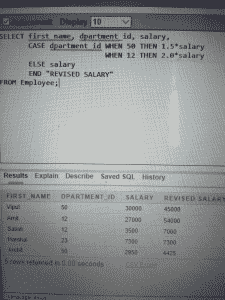
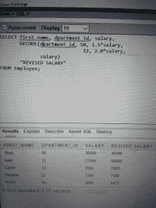
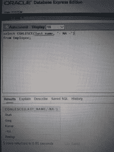
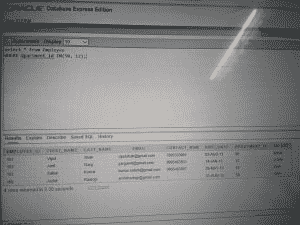
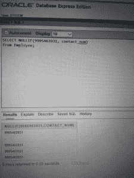

# SQL条件表达式

> 原文: [https://www.geeksforgeeks.org/sql-conditional-expressions/](https://www.geeksforgeeks.org/sql-conditional-expressions/)

以下是 SQL 中的条件表达式。

## 1. CASE 表达式

`CASE` 表达式允许你使用 `IF-THEN-ELSE` 语句而无需调用存储过程。

在简单 `CASE` 表达式中，SQL 会搜索第一个 `WHEN……THEN` 对，其中 `expr` 等于 `comparison_expr`，并返回 `return_expr`。如果上述条件不满足，且存在 `ELSE` 子句，则 SQL 返回 `else_expr`。否则，返回 `NULL`。

不能为 `return_expr` 和 `else_expr` 指定字面量 `null`。所有表达式（`expr`，`comparison_expr`，`return_expr`）必须具有相同的数据类型。

**语法:**

```sql
CASE expr WHEN comparison_expr1 THEN return_expr1
         [WHEN comparison_expr2 THEN return_expr2
          .
          .
          .
          WHEN comparison_exprn THEN return_exprn
          ELSE else_expr]
END
```

**示例:**

```sql
Input :
SELECT first_name, dpartment_id, salary,
       CASE dpartment_id WHEN 50 THEN 1.5*salary
                         WHEN 12 THEN 2.0*salary
       ELSE salary
       END "REVISED SALARY"
FROM Employee;
```

**输出:**



**说明:** 在上面的 SQL 语句中，`department_id` 的值被解码。如果是 50，那么工资是 1.5 倍，如果是 12，那么工资是 2 倍，否则工资没有变化。

## 2. DECODE 函数

`DECODE` 函数通过执行 `CASE` 或 `IF-THEN-ELSE` 语句的工作来简化条件查询。

`DECODE` 函数以类似于各种语言中使用的 `IF-THEN-ELSE` 逻辑的方式解码表达式。`DECODE` 函数在将表达式与每个搜索值进行比较后对其进行解码。如果表达式与 `search` 相同，则返回 `result`。

如果省略了默认值，则当搜索值与任何结果值都不匹配时，将返回空值。

**语法:**

```sql
DECODE(col/expression, search1, result1
                        [, search2, result2,........,]
                        [, default])
```

**示例:**

```sql
Input :
SELECT first_name, dpartment_id, salary,
       DECODE(dpartment_id, 50, 1.5*salary,
                             12, 2.0*salary,
              salary)
       "REVISED SALARY"
FROM Employee;
```

**输出:**



**说明:** 在上面的 SQL 语句中，测试了 `department_id` 的值。如果是 50，那么工资是 1.5 倍，如果是 12，那么工资是 2 倍，否则工资没有变化。

## 3. COALESCE

`COALESCE` 返回第一个非空参数。仅当所有参数都为空时才返回 `null`。它通常用于在检索数据进行显示时，为空值替换默认值。

注意：与 `CASE` 表达式一样，`COALESCE` 也不会评估在找到第一个非空参数右侧的参数。

**语法:**

```sql
COALESCE(value [, ......] )
```

**示例:**

```sql
Input:
SELECT COALESCE(last_name, '- NA -')
from Employee;
```

**输出:**



**解释:** 对于姓氏为空的地方，将显示 `-NA-`，否则将显示各自的姓氏。

## 4. GREATEST

`GREATEST` 从任意数量的表达式列表中返回最大值。比较区分大小写。如果列表中所有表达式的数据类型都不相同，剩下的所有表达式都转换为第一个表达式的数据类型进行比较，如果这种转换不可能，SQL 将抛出一个错误。

注意：如果列表中的任何表达式为空，则返回空。

**语法:**

```sql
GREATEST(expr1, expr2 [, .....] )
```

**示例 1:**

```sql
Input:
SELECT GREATEST('XYZ', 'xyz')
from dual;
```

```sql
Output:
GREATEST('XYZ', 'xyz')
xyz
```

**说明:** 小写字母的 ASCII 值较大。

**示例 2:**

```sql
Input:
SELECT GREATEST('XYZ', null, 'xyz')
from dual;
```

```sql
Output:
GREATEST('XYZ', null, 'xyz')
-
```

**解释:** 由于存在空值，空值将显示为输出（如上面描述中提到的注意事项）。

## 5. IFNULL

如果 `expr1` 不为空，则返回 `expr1`；否则它返回 `expr2`。根据使用它的上下文，返回一个数值或字符串值。

**语法:**

```sql
IFNULL(expr1, expr2)
```

**示例 1:**

```sql
Input:
SELECT IFNULL(1,0) 
FROM dual;
```

```sql
Output:
1
```

**说明:** 没有表达式为空。

**示例 2:**

```sql
Input:
SELECT IFNULL(NULL,10) 
FROM dual;
```

```sql
Output:
10
```

**解释:** 由于 `expr1` 为空，因此显示 `expr2`。

## 6. IN

`IN` 检查一个值是否存在于一组值中，可以与 `WHERE`、`CHECK` 和视图创建一起使用。

注意：与 `CASE` 和 `COALESCE` 表达式一样，`IN` 也不会评估在找到第一个非空参数右侧的参数。

**语法:**

```sql
WHERE column IN (x1, x2, x3 [,......] )
```

**示例:**

```sql
Input:
SELECT * from Employee
WHERE dpartment_id IN(50, 12);
```

**输出:**



**说明:** 员工的所有数据都用部门 ID 50 或 12 显示。

## 7. LEAST

`LEAST` 从任意数量的表达式列表中返回最小值。比较区分大小写。如果列表中所有表达式的数据类型都不相同，剩下的所有表达式都转换为第一个表达式的数据类型进行比较，如果这种转换不可能，SQL 将抛出一个错误。

注意：如果列表中的任何表达式为空，则返回空。

**语法:**

```sql
LEAST(expr1, expr2 [, ......])
```

**示例 1:**

```sql
Input:
SELECT LEAST('XYZ', 'xyz')
from dual;
```

```sql
Output:
LEAST('XYZ', 'xyz')
XYZ
```

**说明:** 大写字母的 ASCII 值较小。

**示例 2:**

```sql
Input:
SELECT LEAST('XYZ', null, 'xyz')
from dual;
```

```sql
Output:
LEAST('XYZ', null, 'xyz')
-
```

**解释:** 由于存在空值，空值将显示为输出（如上面描述中提到的注意事项）。

## 8. NULLIF

如果 `value1` 等于 `value2`，则 `NULLIF` 返回一个空值，否则返回 `value1`。

**语法:**

```sql
NULLIF(value1, value2)
```

**示例:**

```sql
Input:
SELECT NULLIF(9995463931, contact_num) 
from Employee;
```

**输出:**



**说明:** 对于与给定号码匹配的员工，显示空。对于其余员工，返回值 1。

本文由 [Akansha Gupta](https://auth.geeksforgeeks.org/profile.php?user=akanshgupta&list=practice) 供稿。如果你喜欢 GeeksforGeeks 并想投稿，你也可以使用 [contribute.geeksforgeeks.org](http://www.contribute.geeksforgeeks.org) 写一篇文章或者把你的文章邮寄到 `contribute@geeksforgeeks.org`。看到你的文章出现在极客博客主页上，帮助其他极客。

如果你发现任何不正确的地方，或者你想分享更多关于上面讨论的话题的信息，请写评论。