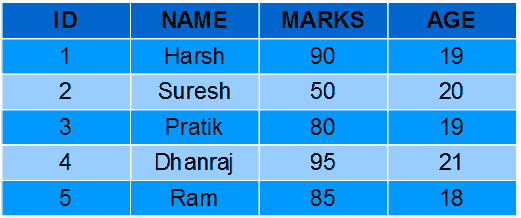

# SQL函数（聚合和标量函数）

> 原文：[https://www.geeksforgeeks.org/sql-functions-aggregate-scalar-functions/](https://www.geeksforgeeks.org/sql-functions-aggregate-scalar-functions/)

为了对数据进行操作，SQL有许多内置函数，它们被分为两类，并在每一类下进一步细分为不同的七个函数。这些类别是：

1.  **聚合函数：**
    这些函数用于对列的值进行运算，并返回单个值。
    *   `AVG()`
    *   `COUNT()`
    *   `FIRST()`
    *   `LAST()`
    *   `MAX()`
    *   `MIN()`
    *   `SUM()`
2.  **标量函数：**
    这些函数基于用户输入，这些也返回单个值。
    *   `UCASE()`
    *   `LCASE()`
    *   `MID()`
    *   `LEN()`
    *   `ROUND()`
    *   `NOW()`
    *   `FORMAT()`

学生表：
[](https://media.geeksforgeeks.org/wp-content/uploads/Screenshot-58.png)

## 聚合函数

### `AVG()`
它返回对数值列中的值进行计算后的平均值。
语法：
```sql
SELECT AVG(column_name) FROM table_name;
```

**查询：**

1.  计算学生的平均分数。
    ```sql
    SELECT AVG(MARKS) AS AvgMarks FROM Students;
    ```
    输出：
    | AvgMarks |
    | --- |
    | 80 |

2.  计算学生的平均年龄。
    ```sql
    SELECT AVG(AGE) AS AvgAge FROM Students;
    ```
    输出：
    | AvgAge |
    | --- |
    | 19.4 |

### `COUNT()`
它用于计算`SELECT`语句返回的行数。它不能在MS ACCESS中使用。
语法：
```sql
SELECT COUNT(column_name) FROM table_name;
```

**查询：**

1.  计算学生总数。
    ```sql
    SELECT COUNT(*) AS NumStudents FROM Students;
    ```
    输出：
    | NumStudents |
    | --- |
    | 5 |

2.  计算年龄唯一/不同的学生数量。
    ```sql
    SELECT COUNT(DISTINCT AGE) AS NumStudents FROM Students;
    ```
    输出：
    | NumStudents |
    | --- |
    | 4 |

### `FIRST()`
`FIRST()`函数返回所选列的第一个值。
语法：
```sql
SELECT FIRST(column_name) FROM table_name;
```

**查询：**

1.  从`Students`表中获取第一个学生的分数。
    ```sql
    SELECT FIRST(MARKS) AS MarksFirst FROM Students;
    ```
    输出：
    | MarksFirst |
    | --- |
    | 90 |

2.  从`Students`表中获取第一个学生的年龄。
    ```sql
    SELECT FIRST(AGE) AS AgeFirst FROM Students;
    ```
    输出：
    | AgeFirst |
    | --- |
    | 19 |

### `LAST()`
`LAST()`函数返回所选列的最后一个值。它只能在MS ACCESS中使用。
语法：
```sql
SELECT LAST(column_name) FROM table_name;
```

**查询：**

1.  从`Students`表中获取最后一个学生的分数。
    ```sql
    SELECT LAST(MARKS) AS MarksLast FROM Students;
    ```
    输出：
    | MarksLast |
    | --- |
    | 82 |

2.  从`Students`表中获取最后一个学生的年龄。
    ```sql
    SELECT LAST(AGE) AS AgeLast FROM Students;
    ```
    输出：
    | AgeLast |
    | --- |
    | 18 |

### `MAX()`
`MAX()`函数返回所选列的最大值。
语法：
```sql
SELECT MAX(column_name) FROM table_name;
```

**查询：**

1.  从`Students`表中获取学生中的最高分。
    ```sql
    SELECT MAX(MARKS) AS MaxMarks FROM Students;
    ```
    输出：
    | MaxMarks |
    | --- |
    | 95 |

2.  从`Students`表中获取学生中的最大年龄。
    ```sql
    SELECT MAX(AGE) AS MaxAge FROM Students;
    ```
    输出：
    | MaxAge |
    | --- |
    | 21 |

### `MIN()`
`MIN()`函数返回所选列的最小值。
语法：
```sql
SELECT MIN(column_name) FROM table_name;
```

**查询：**

1.  从`Students`表中获取学生中的最低分。
    ```sql
    SELECT MIN(MARKS) AS MinMarks FROM Students;
    ```
    输出：
    | MinMarks |
    | --- |
    | 50 |

2.  从`Students`表中获取学生中的最小年龄。
    ```sql
    SELECT MIN(AGE) AS MinAge FROM Students;
    ```
    输出：
    | MinAge |
    | --- |
    | 18 |

### `SUM()`
`SUM()`函数返回所选列所有值的总和。
语法：
```sql
SELECT SUM(column_name) FROM table_name;
```

**查询：**

1.  从`Students`表中获取学生分数的总和。
    ```sql
    SELECT SUM(MARKS) AS TotalMarks FROM Students;
    ```
    输出：
    | TotalMarks |
    | --- |
    | 400 |

2.  从`Students`表中获取学生年龄的总和。
    ```sql
    SELECT SUM(AGE) AS TotalAge FROM Students;
    ```
    输出：
    | TotalAge |
    | --- |
    | 97 |

## 标量函数

### `UCASE()`
它将字段的值转换为大写。
语法：
```sql
SELECT UCASE(column_name) FROM table_name;
```

**查询：**

1.  将`Students`表中的学生姓名转换为大写。
    ```sql
    SELECT UCASE(NAME) FROM Students;
    ```
    输出：
    | NAME |
    | --- |
    | RIYA |
    | SURESH |
    | VIJAY |
    | DHANRAJ |
    | RAM |

### `LCASE()`
它将字段的值转换为小写。
语法：
```sql
SELECT LCASE(column_name) FROM table_name;
```

**查询：**

1.  将`Students`表中的学生姓名转换为小写。
    ```sql
    SELECT LCASE(NAME) FROM Students;
    ```
    输出：
    | NAME |
    | --- |
    | riya |
    | suresh |
    | vijay |
    | dhanraj |
    | ram |

### `MID()`
`MID()`函数从文本字段中提取文本。
语法：
```sql
SELECT MID(column_name,start,length) AS some_name FROM table_name;
```
指定`length`是可选的，`start`表示起始位置（从1开始）。

**查询：**

1.  从`Students`表中获取学生姓名的前四个字符。
    ```sql
    SELECT MID(NAME,1,4) FROM Students;
    ```
    输出：
    | NAME |
    | --- |
    | RIYA |
    | SURE |
    | VIJA |
    | DHAN |
    | RAM |

### `LEN()`
`LEN()`函数返回文本字段中值的长度。
语法：
```sql
SELECT LENGTH(column_name) FROM table_name;
```

**查询：**

1.  从`Students`表中获取学生姓名的长度。
    ```sql
    SELECT LENGTH(NAME) FROM Students;
    ```
    输出：
    | NAME |
    | --- |
    | 5 |
    | 6 |
    | 6 |
    | 7 |
    | 3 |

### `ROUND()`
`ROUND()`函数用于将数值字段四舍五入到指定的小数位数。注意：许多数据库系统采用IEEE 754标准进行算术运算，该标准规定当任何数字以.5结尾时，四舍五入到最接近的偶数整数，即5.5和6.5都四舍五入为6。
语法：
```sql
SELECT ROUND(column_name,decimals) FROM table_name;
```
`decimals` - 要获取的小数位数。

**查询：**

1.  将`Students`表中的分数四舍五入到整数。
    ```sql
    SELECT ROUND(MARKS,0) FROM Students;
    ```
    输出：
    | MARKS |
    | --- |
    | 90 |
    | 50 |
    | 80 |
    | 95 |
    | 85 |

### `NOW()`
`NOW()`函数返回当前系统日期和时间。
语法：
```sql
SELECT NOW() FROM table_name;
```

**查询：**

1.  获取当前系统时间。
    ```sql
    SELECT NAME, NOW() AS DateTime FROM Students;
    ```
    输出：
    | NAME | DateTime |
    | --- | --- |
    | RIYA | 2017-01-13 13:30:11 |
    | SURESH | 2017-01-13 13:30:11 |
    | VIJAY | 2017-01-13 13:30:11 |
    | DHANRAJ | 2017-01-13 13:30:11 |
    | RAM | 2017-01-13 13:30:11 |

### `FORMAT()`
`FORMAT()`函数用于格式化字段的显示方式。
语法：
```sql
SELECT FORMAT(column_name,format) FROM table_name;
```

**查询：**

1.  将当前日期格式化为‘YYYY-MM-DD’。
    ```sql
    SELECT NAME, FORMAT(NOW(),'YYYY-MM-DD') AS Date FROM Students;
    ```
    输出：
    | NAME | Date |
    | --- | --- |
    | RIYA | 2017-01-13 |
    | SURESH | 2017-01-13 |
    | VIJAY | 2017-01-13 |
    | DHANRAJ | 2017-01-13 |
    | RAM | 2017-01-13 |

本文由 **[Pratik Agarwal](https://www.facebook.com/Pratik.Agarwal01)** 供稿。如果你喜欢GeeksforGeeks并想投稿，你也可以使用[write.geeksforgeeks.org](https://write.geeksforgeeks.org)写一篇文章或者把你的文章邮寄到`review-team@geeksforgeeks.org`。看到你的文章出现在极客博客主页上，帮助其他极客。

如果你发现任何不正确的地方，或者你想分享更多关于上面讨论的话题的信息，请写评论。