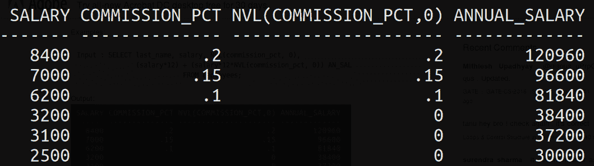
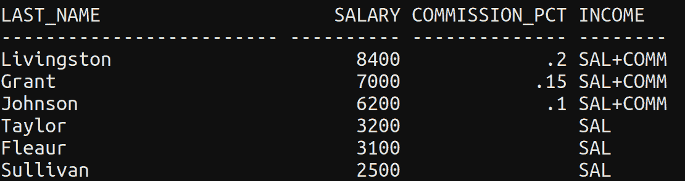
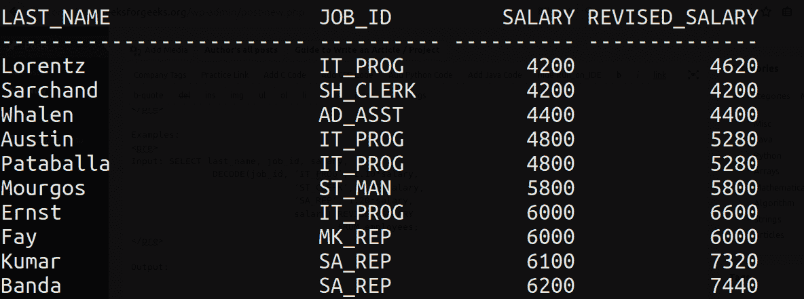
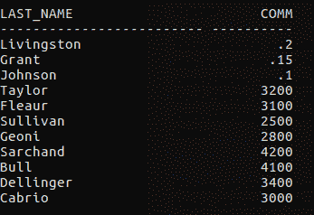
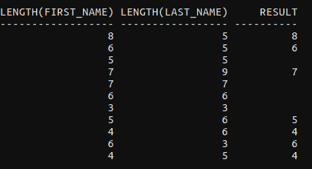
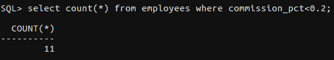
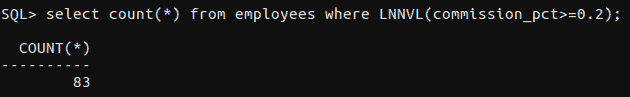
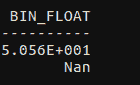
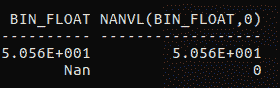

# SQL 通用函数：NVL、NVL2、DECODE、COALESCE、NULLIF、LNNVL 和 NANVL

> 原文：[https://www.geeksforgeeks.org/sql-general-functions-nvl-nvl2-decode-coalesce-nullif-lnnvl-nanvl/](https://www.geeksforgeeks.org/sql-general-functions-nvl-nvl2-decode-coalesce-nullif-lnnvl-nanvl/)

在本文中，我们将讨论一些强大的 SQL 通用函数，它们是——`NVL` 函数、`NVL2` 函数、`DECODE` 函数、`COALESCE` 函数、`NULLIF` 函数、`LNNVL` 函数和 `NANVL` 函数。

这些函数适用于任何数据类型，并且适用于表达式列表中空值的使用。这些都是`单行函数`，即每行提供一个结果。

## NVL(expr1, expr2)

在 SQL 中，`NVL()` 将空值转换为实际值。可以使用的数据类型包括日期、字符和数字。数据类型必须相互匹配，即 `expr1` 和 `expr2` 必须是相同的数据类型。

**语法：**

```sql
NVL (expr1, expr2)
```

- `expr1` 是可能包含空值的源值或表达式。
- `expr2` 是转换空值的目标值。

**示例：**

```sql
SELECT salary, NVL(commission_pct, 0),
    (salary*12) + (salary*12*NVL(commission_pct, 0)) annual_salary
FROM employees;
```

输出：


## NVL2(expr1, expr2, expr3)

`NVL2` 函数检查第一个表达式。如果第一个表达式不为 null，则 `NVL2` 函数返回第二个表达式。如果第一个表达式为 null，则返回第三个表达式。即，如果 `expr1` 不为 null，`NVL2` 返回 `expr2`；如果 `expr1` 为 null，`NVL2` 返回 `expr3`。参数 `expr1` 可以是任何数据类型。

**语法：**

```sql
NVL2 (expr1, expr2, expr3)
```

- `expr1` 是可能包含 null 的源值或表达式。
- `expr2` 是 `expr1` 不为 null 时返回的值。
- `expr3` 是 `expr1` 为 null 时返回的值。

**示例：**

```sql
SELECT last_name, salary, commission_pct,
    NVL2(commission_pct, 'SAL+COMM', 'SAL') income
FROM employees;
```

输出：


## DECODE()

`DECODE()` 函数通过执行 `CASE` 或 `IF-THEN-ELSE` 语句的工作来实现条件查询。`DECODE` 函数对表达式的解码方式类似于各种语言中使用的 `IF-THEN-ELSE` 逻辑。`DECODE` 函数在将表达式与每个搜索值进行比较后对其进行解码。如果表达式与搜索值相同，则返回结果。如果省略了默认值，则在搜索值与任何结果值都不匹配时返回 null 值。

**语法：**

```sql
DECODE(col|expression, search1, result1 
    [, search2, result2,...,][, default])
```

**示例：**

```sql
SELECT last_name, job_id, salary,
    DECODE(job_id, 'IT_PROG', 1.10*salary,
        'ST_CLERK', 1.15*salary,
        'SA_REP', 1.20*salary,
        salary) REVISED_SALARY
FROM employees;
```

输出：


## COALESCE()

`COALESCE()` 函数检查第一个表达式，如果第一个表达式不为空，则返回该表达式；否则，它会对剩余的表达式进行聚结。与 `NVL()` 函数相比，`COALESCE()` 函数的优势在于它可以采用多个替代值。简单来说，`COALESCE()` 函数返回列表中的第一个非空表达式。

**语法：**

```sql
COALESCE (expr_1, expr_2, ... expr_n)
```

**示例：**

```sql
SELECT last_name, 
    COALESCE(commission_pct, salary, 10) comm
FROM employees ORDER BY commission_pct;
```

输出：


## NULLIF()

`NULLIF` 函数比较两个表达式。如果它们相等，函数返回 null。如果它们不相等，函数返回第一个表达式。不能为第一个表达式指定字面量 `NULL`。

**语法：**

```sql
NULLIF (expr_1, expr_2)
```

**示例：**

```sql
SELECT LENGTH(first_name) "expr1",
    LENGTH(last_name) "expr2",
    NULLIF(LENGTH(first_name), LENGTH(last_name)) result
FROM employees;
```

输出：


## LNNVL()

`LNNVL()` 在条件的一个或两个操作数可能为 null 时评估该条件。该函数只能在查询的 `WHERE` 子句中使用。它接受一个条件作为参数，如果条件为 `FALSE` 或 `UNKNOWN` 则返回 `TRUE`，如果条件为 `TRUE` 则返回 `FALSE`。

**语法：**

```sql
LNNVL( condition(s) )
```

**示例：**

```sql
SELECT COUNT(*) FROM employees 
WHERE commission_pct < .2;
```

输出：


上面的例子根本没有考虑那些没有提成的员工。为了也包含它们，我们使用了 `LNNVL()`。

```sql
SELECT COUNT(*) FROM employees 
WHERE LNNVL(commission_pct >= .2);
```

输出：


## NANVL()

`NANVL` 函数仅对 `BINARY_FLOAT` 或 `BINARY_DOUBLE` 类型的浮点数有用。它指示数据库，如果输入值 `n1` 是 `NaN`（非数字），则返回替代值 `n2`。如果 `n1` 不是 `NaN`，则数据库返回 `n1`。此函数对于将 `NaN` 值映射到 `NULL` 非常有用。

**语法：**

```sql
NANVL( n1 , n2 )
```

考虑以下名为 `nanvl_demo` 的表格：


**示例：**

```sql
SELECT bin_float, NANVL(bin_float,0)
FROM nanvl_demo;
```

输出：


**参考**：Oracle 9i SQL 入门（第 1 册）