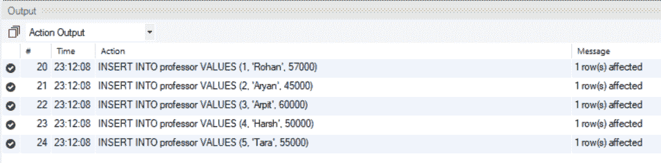
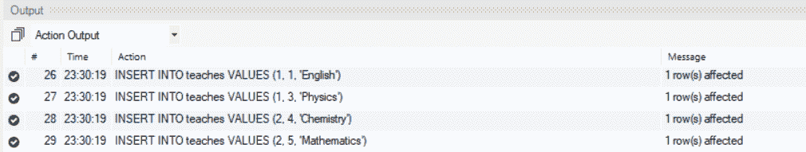

# SQL 内部连接

> 原文: [https://www.geeksforgeeks.org/sql-inner-join/](https://www.geeksforgeeks.org/sql-inner-join/)

`概述:`
结构化查询语言或 `SQL` 是一种标准的数据库语言，用于创建、维护和检索关系数据库（如 `MySQL`、`Oracle` 等）中的数据。连接是笛卡尔乘积和选择过程的组合。当且仅当满足给定的连接条件时，连接操作将来自不同关系的两个元组配对。内部联接是只包含满足某些条件的元组的联接。在本文中，我们将使用 `MySQL` 来演示 `SQL` 内部连接的工作原理。

`实现 SQL 内部连接的步骤:`
这里，我们将讨论 `SQL` 内部连接的实现如下。

`步骤-1: 创建数据库:`
这里，我们将使用如下 `SQL` 查询创建数据库。

```sql
CREATE DATABASE geeks;
```

`第二步: 使用数据库:`
在这里，我们将使用 `geeks` 数据库。

```sql
USE geeks;
```

`步骤-3: 添加表:`
我们将向数据库添加 2 个表，如下所示。
1.  第一个表将是 `professor`，其中将包含 `ID`，教授的名字，和 `Salary`。
2.  第二个表格将是 `teaches`，该表格将包含 `course_id`、`prof_id` 和 `course_name`。

`添加表 professor–`

```sql
CREATE TABLE professor(
    ID int,
    Name varchar(20),
    Salary int
);
```

`添加表格 teaches–`

```sql
CREATE TABLE teaches(
    course_id int,
    prof_id int,
    course_name varchar(20)
);
```

`第 4 步: 表的描述:`
我们可以使用下面的 `SQL` 命令获得这两个表的描述，如下所示。

```sql
DESCRIBE professor;
```

**输出:**

| Field | Type |
| --- | --- |

```sql
DESCRIBE teaches;
```

**输出:**

| Field | Type |
| --- | --- |

`步骤-5: 插入行:`
这里，我们将在两个表中逐个插入行，如下所示。

`在 professor 表中插入行–`

```sql
INSERT INTO professor VALUES (1, 'Rohan', 57000);
INSERT INTO professor VALUES (2, 'Aryan', 45000);
INSERT INTO professor VALUES (3, 'Arpit', 60000);
INSERT INTO professor VALUES (4, 'Harsh', 50000);
INSERT INTO professor VALUES (5, 'Tara', 55000);
```

**输出:**



`在 teaches 表中插入行–`

```sql
INSERT INTO teaches VALUES (1, 1, 'English');
INSERT INTO teaches VALUES (1, 3, 'Physics');
INSERT INTO teaches VALUES (2, 4, 'Chemistry');
INSERT INTO teaches VALUES (2, 5, 'Mathematics');
```

**输出:**



`步骤-6: 表的当前状态:`
验证两个表中的数据如下。

`professor 表–`

```sql
SELECT * FROM professor;
```

**输出:**

| id | name | salary |
| --- | --- | --- |

`teaches 表格–`

```sql
SELECT * FROM teaches;
```

**输出:**

| course_id | prof_id | course_name |
| --- | --- | --- |
| 1 | 1 | English |
| 1 | 3 | Physics |
| 2 | 4 | Chemistry |
| 2 | 5 | Mathematics |

`第 7 步: 内部连接查询:`

`语法:`

```sql
SELECT comma_separated_column_names
FROM table1 INNER JOIN table2 ON condition;
```

`示例–`

```sql
SELECT teaches.course_id, teaches.prof_id, professor.Name, professor.Salary
FROM professor INNER JOIN teaches ON professor.ID = teaches.prof_id;
```

**输出:**
使用内部连接，我们能够基于一个条件组合两个表中的信息，并且不满足所需条件的两个表的笛卡尔乘积中的元组不包括在结果表中。

| course_id | prof_id | name | salary |
| --- | --- | --- | --- |
| 1 | 1 | Rohan | 57000 |
| 1 | 3 | Arpit | 60000 |
| 2 | 4 | Harsh | 50000 |
| 2 | 5 | Tara | 55000 |