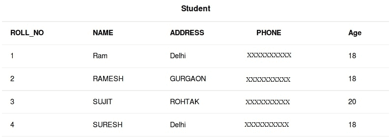
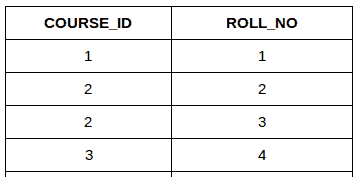
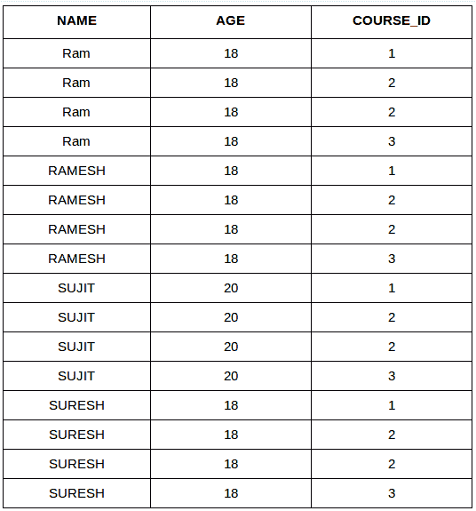
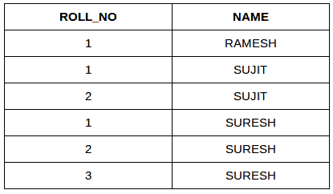

# SQL | 连接 (笛卡尔连接 & 自连接)

> 原文: [https://www.geeksforgeeks.org/sql-join-cartesian-join-self-join/](https://www.geeksforgeeks.org/sql-join-cartesian-join-self-join/)

[SQL | JOIN (内部、左侧、右侧和完全联接)](https://www.geeksforgeeks.org/sql-join-set-1-inner-left-right-and-full-joins/)

在本文中，我们将讨论剩下的两个联接：

*   **笛卡尔连接**
*   **自连接**

考虑下面两张表：

[](https://media.geeksforgeeks.org/wp-content/cdn-uploads/table2.jpg)

**学生课程**

[](https://media.geeksforgeeks.org/wp-content/uploads/table51.png)

## CARTESIAN JOIN

`CARTESIAN JOIN` 也被称为 `CROSS JOIN`。在 `CARTESIAN JOIN` 中，一个表的每一行与另一个表的每一行进行连接。这通常在未指定匹配列或 `WHERE` 条件时发生。

*   在没有 `WHERE` 条件的情况下，笛卡尔连接将表现得像笛卡尔乘积。即结果集中的行数是两个表的行数的乘积。
*   在 `WHERE` 条件下，这个 `JOIN` 的功能类似于一个 `INNER JOIN`。
*   一般来说，交叉连接类似于内部连接，其中连接条件的计算结果总是为真。

### 语法

```sql
SELECT table1.column1, table1.column2, table2.column1...
FROM table1
CROSS JOIN table2;

-- table1: First table.
-- table2: Second table
```

### 示例查询 (笛卡尔连接)

在下面的查询中，我们将从 `Student` 表中选择 `NAME` 和 `AGE`，从 `StudentCourse` 表中选择 `COURSE_ID`。在输出中，你可以看到 `Student` 表的每一行都与 `StudentCourse` 表的每一行进行了连接。结果集中的总行数 = 4 * 4 = 16。

```sql
SELECT Student.NAME, Student.AGE, StudentCourse.COURSE_ID
FROM Student
CROSS JOIN StudentCourse;
```

**输出：**

[](https://media.geeksforgeeks.org/wp-content/uploads/table_final.png)

## SELF JOIN

顾名思义，在 `SELF JOIN` 中，一个表与自身进行连接。也就是说，根据某些条件，表中的每一行与自身以及所有其他行进行连接。换句话说，它是同一个表的两个副本之间的连接。

### 语法

```sql
SELECT a.column1, b.column2
FROM table_name a, table_name b
WHERE some_condition;

-- table_name: Name of the table.
-- some_condition: Condition for selecting the rows.
```

### 示例查询 (自连接)

```sql
SELECT a.ROLL_NO, b.NAME
FROM Student a, Student b
WHERE a.ROLL_NO < b.ROLL_NO;
```

**输出：**

[](https://media.geeksforgeeks.org/wp-content/uploads/tableeee1.png)

本文由 [**哈什·阿加尔瓦尔**](https://www.facebook.com/harsh.agarwal.16752) 供稿。如果你喜欢 GeeksforGeeks 并想投稿，你也可以使用 [contribute.geeksforgeeks.org](http://www.contribute.geeksforgeeks.org) 写一篇文章或者把你的文章邮寄到 `contribute@geeksforgeeks.org`。看到你的文章出现在极客博客主页上，帮助其他极客。

如果你发现任何不正确的地方，或者你想分享更多关于上面讨论的话题的信息，请写评论。