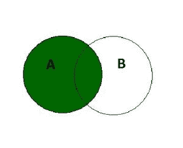

# SQL 左连接

> 原文: [https://www.geeksforgeeks.org/sql-left-join/](https://www.geeksforgeeks.org/sql-left-join/)

## 概述

SQL 中的 `LEFT JOIN` 关键字返回所有**匹配的记录(或行)**和出现在**左表中但不在右表中的记录(或行)。**这意味着，如果某一行出现在左表中但不在右表中，结果将包括该行，但在右表的每一列中有一个空值。如果右表中的记录不在左表中，它将不会包含在结果中。



### 左连接的语法

```sql
SELECT column_name(s) 
FROM tableA 
LEFT JOIN tableB ON tableA.column_name = tableB.column_name;
```

## SQL 左连接示例

在本例中，我们将考虑两个表，雇员表包含在特定部门工作的雇员的详细信息，部门表包含部门的详细信息。

### 员工表

| `EMP_no` | `EMP_name` | `Age` | `Salary` | `dept_no` |
| :--- | :--- | :--- | :--- | :--- |
| E1 | Washinghar | 28 | 25,000 | D1 |
| E2 | IT | 30 | 34,000 | D1 |
| E3 | 德里 | 32 | 36,000 | D2 |
| E4 | 尼廷赛尼 | 34 | 38,000 |  |

### 部门表

| `dept_no` | `dept_name` | `location` |
| :--- | :--- | :--- |
| D1 | HR | 海得拉巴 |
| D2 | IT | 德里 |

为了对这两个表执行左连接，我们将使用以下 SQL 查询:

```sql
select emp_no, emp_name, age, salary, dept_name, location 
from employee 
left join department on employee.dept_no = department.dept_no;
```

我们将得到的输出如下:

| `EMP_no` | `EMP_name` | `Age` | `Salary` | `dept_name` | `location` |
| :--- | :--- | :--- | :--- | :--- | :--- |
| E1 | Washinghar | 28 | 25,000 | HR | 海得拉巴 |
| E2 | IT | 30 | 34,000 | HR | 海得拉巴 |
| E3 | 德里 | 32 | 36,000 | IT | 德里 |
| E4 | 尼廷赛尼 | 34 | 38,000 |  |  |

因为左连接给出了匹配的行和出现在左表中但不在右表中的行。在本例中，我们看到不在特定部门工作的员工，即没有部门值为 `NULL` 的员工，在左连接后包含部门名称和位置的 `NULL` 值。