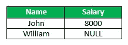
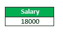
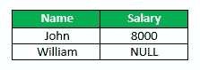
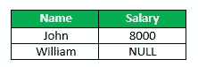
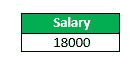
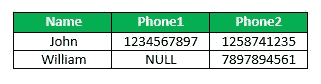
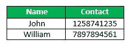
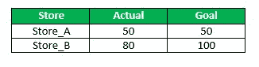
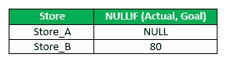

# SQL 空函数

> 原文: [https://www.geeksforgeeks.org/sql-null-functions/](https://www.geeksforgeeks.org/sql-null-functions/)

以下是在 SQL 中定义的空函数：

## 1. `ISNULL()`

`ISNULL()` 函数在 SQL Server 和 MySQL 中有不同的用法。在 SQL Server 中，`ISNULL()` 函数用于替换 NULL 值。

**语法：**

```sql
SELECT column(s), ISNULL(column_name, value_to_replace)
FROM table_name;
```

**示例：**
考虑下面的员工表，



**查询：** 查找所有员工的薪资之和，如果任意员工的薪资不可用（或为空值），则使用薪资为 10000。

```sql
SELECT SUM(ISNULL(Salary, 10000)) AS Salary
FROM Employee;
```

输出：



在 MySQL 中，`ISNULL()` 函数用于测试表达式是否为空。如果表达式为空，则返回真，否则返回假。

**语法：**

```sql
SELECT column(s)
FROM table_name
WHERE ISNULL(column_name);
```

**示例：**
考虑下面的员工表，



**查询：** 取表中所有薪资可用的员工姓名（非空）。

```sql
SELECT Name
FROM Employee
WHERE ISNULL(Salary);
```

输出：


## 2. `IFNULL()`

此函数在 MySQL 中可用，但在 SQL Server 或 Oracle 中不可用。此函数接受两个参数。如果第一个参数不是 NULL，则函数返回第一个参数。否则，返回第二个参数。此函数通常用于将 NULL 值替换为另一个值。

**语法：**

```sql
SELECT column(s), IFNULL(column_name, value_to_replace)
FROM table_name;
```

**示例：**
考虑下面的员工表，



**查询：** 查找所有员工的薪资之和，如果任意员工的薪资不可用（或为空值），则使用薪资为 10000。

```sql
SELECT SUM(IFNULL(Salary, 10000)) AS Salary
FROM Employee;
```

输出：



## 3. `COALESCE()`

SQL 中的 `COALESCE()` 函数返回其参数中第一个非 NULL 的表达式。如果所有表达式都计算为 null，则 `COALESCE()` 函数将返回 null。

**语法：**

```sql
SELECT column(s), COALESCE(expression_1,....,expression_n)
FROM table_name;
```

**示例：**
考虑下面的 `Contact_info` 表，



**查询：** 取每个员工的姓名、联系电话。

```sql
SELECT Name, COALESCE(Phone1, Phone2) AS Contact
FROM Contact_info;
```

输出：



## 4. `NULLIF()`

`NULLIF()` 函数接受两个参数。如果两个参数相等，则返回 NULL。否则返回第一个参数。

**语法：**

```sql
SELECT column(s), NULLIF(expression1, expression2)
FROM table_name;
```

**示例：**
考虑下面的销售表，



```sql
SELECT Store, NULLIF(Actual, Goal)
FROM Sales;
```

输出：



本文由 **[Anuj Chauhan](https://www.facebook.com/anuj0503)** 供稿。如果你喜欢 GeeksforGeeks 并想投稿，你也可以使用 [contribute.geeksforgeeks.org](http://www.contribute.geeksforgeeks.org) 写一篇文章或者把你的文章邮寄到 contribute@geeksforgeeks.org。看到你的文章出现在极客博客主页上，帮助其他极客。

如果你发现任何不正确的地方，或者你想分享更多关于上面讨论的话题的信息，请写评论。