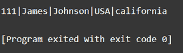
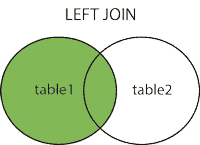
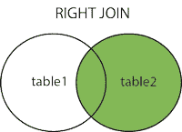
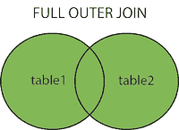

# SQL 外部连接

> 原文: [https://www.geeksforgeeks.org/sql-outer-join/](https://www.geeksforgeeks.org/sql-outer-join/)

在[关系数据库管理系统](https://www.geeksforgeeks.org/rdbms-full-form/)中，我们遵循规范化的原则，允许我们将大表最小化为小表。通过在连接中使用 `select` 语句，我们可以检索回大表。外部联接有以下三种类型。

1.  左外连接
2.  右外连接
3.  完全外部连接

## 创建数据库

运行以下命令创建数据库。

```sql
Create database testdb;
```

## 使用数据库

运行以下命令使用数据库。

```sql
use testdb;
```

## 向数据库添加表

运行以下命令向数据库添加表。

```sql
CREATE TABLE Students (
   StudentID int,
   LastName varchar(255),
   FirstName varchar(255),
   Address varchar(255),
   City varchar(255)
);
```

## 将行插入数据库

```sql
INSERT INTO students (
StudentID,
LastName,
FirstName,
Address,
City
)
VALUES
(
111, 
'James',
 'Johnson',
 'USA',
 california
);
```

## 数据库输出

键入以下命令获取输出。

```sql
SELECT * FROM students;
```



## 外部连接类型

### 左外连接

左连接操作返回左表的所有记录和右表的匹配记录。在右表中找不到匹配的元素，在这种情况下表示为空。



**语法:**

```sql
SELECT column_name(s)
FROM table1
LEFT JOIN Table2 
ON Table1.Column_Name=table2.column_name;
```

### 右外连接

右连接操作返回右表的所有记录和左表的匹配记录。在左表中找不到匹配的元素，在这种情况下表示为空。



**语法:**

```sql
SELECT column_name(s)
FROM table1
RIGHT JOIN table2
ON table1.column_name = table2.column_name;
```

### 完全外部联接

当左表记录或右表记录匹配时，完全外部联接关键字返回所有记录。



**语法:**

```sql
SELECT column_name
FROM table1
FULL OUTER JOIN table2
ON table1.columnName = table2.columnName
WHERE condition;
```

## 示例

创建第一个示例表 `students`。

```sql
CREATE TABLE students (
 id INTEGER,
 name TEXT NOT NULL,
 gender TEXT NOT NULL
);
-- insert some values
INSERT INTO students VALUES (1, 'Ryan', 'M');
INSERT INTO students VALUES (2, 'Joanna', 'F');
INSERT INTO students Values (3, 'Moana', 'F');
```

创建第二个样表 `college`。

```sql
CREATE TABLE college (
 id INTEGER,
 classTeacher TEXT NOT NULL,
 Strength TEXT NOT NULL
);
-- insert some values
INSERT INTO college VALUES (1, 'Alpha', '50');
INSERT INTO college VALUES (2, 'Romeo', '60');
INSERT INTO college Values (3, 'Charlie', '55');
```

对以上两个表执行外部连接。

```sql
SELECT college.classTeacher, students.id
FROM students
FULL OUTER JOIN college
ON students.id = college.id
ORDER BY college.classTeacher;
```

上面的代码将对 `students` 和 `college` 表执行完全外部连接，并将返回与 `college.id` 和 `students.id` 匹配的输出。输出将是 `college` 表中的 `classTeacher` 和 `students` 表中的 `id`。结果将由 `college` 表中的 `classTeacher` 排序。

| classTeacher | id  |
| :----------- | :-- |
| Alpha        | 1   |
|              | 2   |
| Charlie      | 3   |
| Romeo        | 2   |