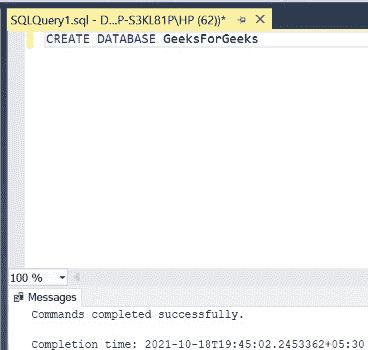
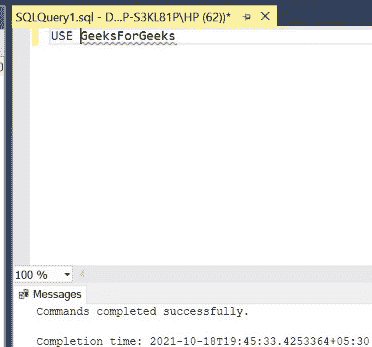
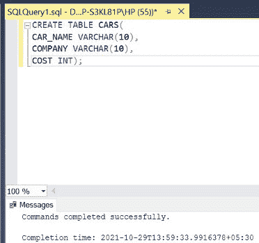
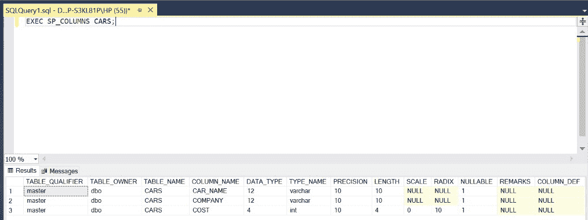
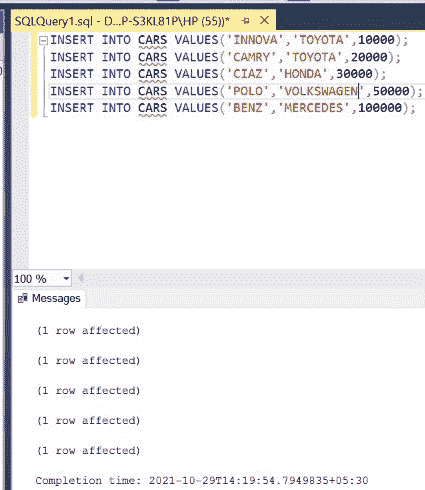
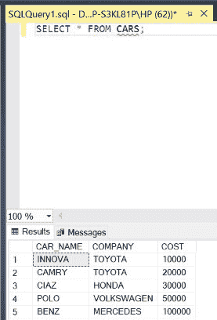
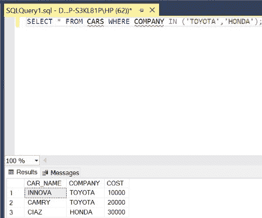
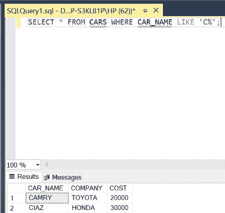
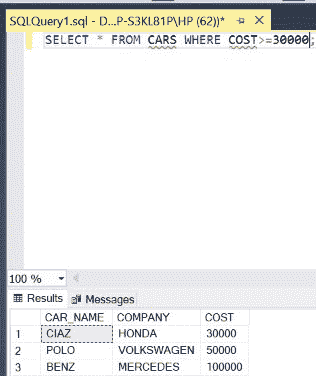

# 同列多值匹配的 SQL 查询

> 原文: [https://www.geeksforgeeks.org/sql-query-for-matching-multiple-values-in-the-same-column/](https://www.geeksforgeeks.org/sql-query-for-matching-multiple-values-in-the-same-column/)

在 SQL 中，为了匹配同一列中的多个值，我们需要在查询中使用一些特殊的词。下面，使用 `IN`、`LIKE` 和比较运算符 (`>=`) 演示了 3 种方法来实现这一点。在本文中，我们将使用微软的 SQL Server 作为我们的数据库。

## 步骤 1: 创建数据库
为此，使用下面的命令创建一个名为 `GeeksForGeeks` 的数据库。

**查询:**
```sql
CREATE DATABASE GeeksForGeeks
```

*输出:*


## 步骤 2: 使用 GeeksForGeeks 数据库
为此，请使用以下命令。

**查询:**
```sql
USE GeeksForGeeks
```

*输出:*


## 步骤 3: 创建 CARS 表
在数据库 `GeeksForGeeks` 中创建一个 `CARS` 表。该表有 3 列，即 `CAR_NAME`、`COMPANY` 和 `COST`，包含各种汽车的名称、公司和成本。

**查询:**
```sql
CREATE TABLE CARS(
CAR_NAME VARCHAR(10),
COMPANY VARCHAR(10),
COST INT);
```

*输出:*


## 步骤 4: 描述表结构
描述 `CARS` 表的结构。

**查询:**
```sql
EXEC SP_COLUMNS CARS;
```

*输出:*


## 步骤 5: 插入数据
在 `CARS` 表中插入 5 行。

**查询:**
```sql
INSERT INTO CARS VALUES('INNOVA','TOYOTA',10000);
INSERT INTO CARS VALUES('CAMRY','TOYOTA',20000);
INSERT INTO CARS VALUES('CIAZ','HONDA',30000);
INSERT INTO CARS VALUES('POLO','VOLKSWAGEN',50000);
INSERT INTO CARS VALUES('BENZ','MERCEDES',100000);
```

*输出:*


## 步骤 6: 显示所有行
显示 `CARS` 表的所有行。

**查询:**
```sql
SELECT * FROM CARS;
```

*输出:*


## 步骤 7: 使用 IN 匹配多个值
检索属于丰田和本田公司的所有汽车的详细信息。

*注意* – 在 `WHERE` 子句中使用 `IN` 来匹配同一列（即 `COMPANY`）中的多个值（即 `TOYOTA` 和 `HONDA`）。

**语法:**
```sql
SELECT * FROM TABLE_NAME WHERE COLUMN_NAME IN (MATCHING_VALUE1,MATCHING_VALUE2);
```

**查询:**
```sql
SELECT * FROM CARS WHERE COMPANY IN ('TOYOTA','HONDA');
```

*输出:*


## 步骤 8: 使用 LIKE 匹配多个值
检索名称以字母 `C` 开头的所有汽车的详细信息。

*注意* – 使用 `LIKE` 来匹配同一列（即 `CAR_NAME`）中的多个值（即 `CAMRY` 和 `CIAZ`）。

**语法:**
```sql
SELECT * FROM TABLE_NAME WHERE COLUMN_NAME LIKE 'STARTING_LETTER%';
```

**查询:**
```sql
SELECT * FROM CARS WHERE CAR_NAME LIKE 'C%';
```

*输出:*


## 步骤 9: 使用比较运算符匹配多个值
检索所有成本大于等于 30000 的车的详细信息。

*注* – 使用比较运算符 `>=` 来匹配同一列（即 `COST`）中的多个值（即 `30000`、`50000` 和 `100000`）。

**语法:**
```sql
SELECT * FROM TABLE_NAME WHERE COLUMN_NAME >=VALUE;
```

**查询:**
```sql
SELECT * FROM CARS WHERE COST>=30000;
```

*输出:*
