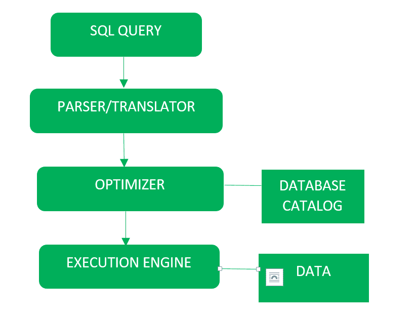
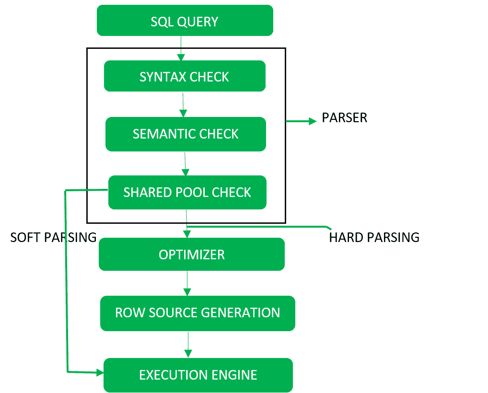

# SQL 查询处理

> 原文: [https://www.geeksforgeeks.org/sql-query-processing/](https://www.geeksforgeeks.org/sql-query-processing/)

**查询处理**包括将高层查询翻译成低层表达式，可用于文件系统的物理层、查询优化和查询的实际执行，以获得实际结果。

查询处理的框图如下:



详细示意图如下所示:



它通过以下步骤完成:

## Step-1: Parser

在解析调用期间，数据库执行以下检查：语法检查、语义检查和共享池检查，之后将查询转换为关系代数。

解析器执行以下检查（参考详细图表）：

### Syntax check
得出 SQL 语法有效性。示例：

```sql
SELECT * FORM employee
```

这里的 `FROM` 的错误拼写是由这个检查给出的。

### 语义检查
判断语句是否有意义。示例：查询包含不存在的表名，该检查将检查该表名。

### 共享池检查
每个查询在执行过程中都有一个哈希代码。因此，该检查确定共享池中是否存在已编写的哈希代码。如果共享池中存在代码，则数据库不会采取额外的优化和执行步骤。

**硬解析和软解析**
如果有一个新的查询，并且其哈希代码不存在于共享池中，则该查询必须通过称为硬解析的附加步骤，否则如果哈希代码存在，则查询不会通过附加步骤。它只是直接传递给执行引擎（参考详细的图表）。这就是所谓的软解析。
硬解析包括以下步骤——优化器和行源生成。

## Step-2: Optimizer

在优化阶段，数据库必须至少对一个唯一的 DML 语句执行硬解析，并在此解析期间执行优化。此数据库从不优化 DDL，除非它包含需要优化的 DML 组件，例如子查询。

这是一个过程，其中检查用于满足查询的多个查询执行计划，并且满足最有效的查询计划来执行。
数据库目录存储执行计划，然后优化器传递最低成本的执行计划。

**行源生成**
行源生成是一种软件，它从优化器接收最佳执行计划，并生成可供数据库其他部分使用的迭代执行计划。迭代计划是二进制程序，当由 SQL 引擎执行时会产生结果集。

## 步骤-3: 执行引擎

最终运行查询并显示所需结果。