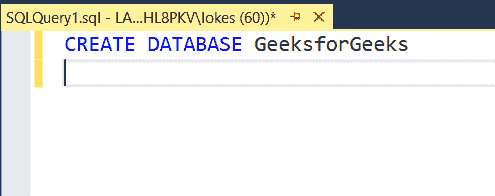
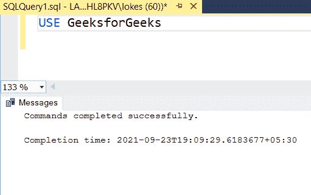
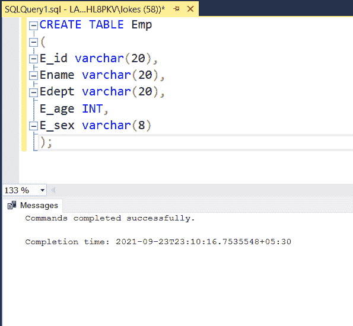
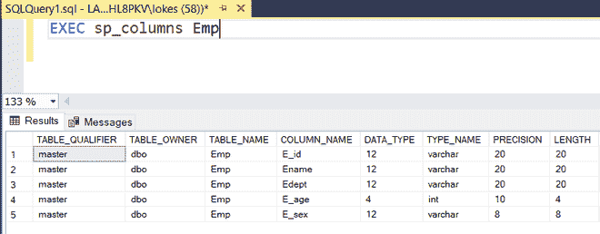
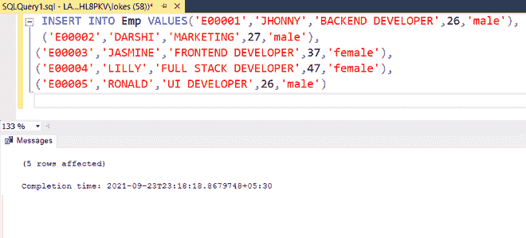
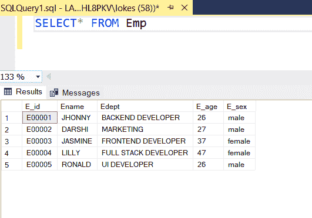
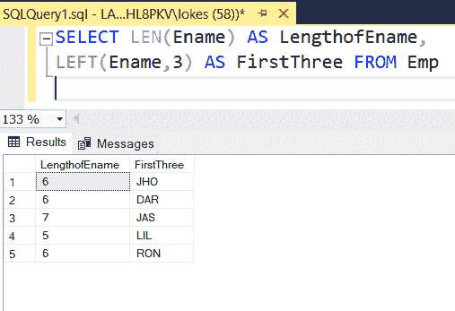
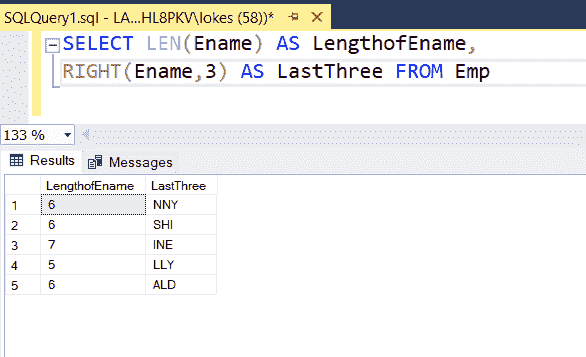

# 显示 Emp 表中埃纳姆列长度和前 3 个字符的 SQL 查询

> 原文: [https://www.geeksforgeeks.org/sql-query-to-display-the-length-and-first-3-characters-of-ename-column-in-emp-table/](https://www.geeksforgeeks.org/sql-query-to-display-the-length-and-first-3-characters-of-ename-column-in-emp-table/)

为了显示字符串的长度和前三个字符，字符串函数在 SQL 中非常有用。在本文中，让我们看看如何使用 MSSQL 作为服务器来显示 Emp 表中埃纳姆列的长度和前 3 个字符。

## 语法

为了找到字符串的长度，我们使用 `LEN()` 函数。

```sql
LEN(Ename)
```

要找到字符串的前 n 个字符，我们使用 `LEFT()` 函数：

```sql
LEFT(Ename , N)
```

## 步骤 1: 创建数据库

我们使用下面的命令创建一个名为 GeeksforGeeks 的数据库。

```sql
CREATE DATABASE GeeksforGeeks
```



## 步骤 2: 使用数据库

要使用 GeeksforGeeks 数据库，请使用以下命令：

```sql
USE GeeksforGeeks;
```



## 步骤 3: 创建表格

使用如下 SQL 查询创建一个包含 5 列的 Emp 表。

```sql
CREATE TABLE Emp
(
E_id varchar(20),
Ename varchar(20),
Edept varchar(20),
E_age INT,
E_sex varchar(8)
);
```



## 步骤 4: 验证数据库

使用如下 SQL 查询查看数据库的描述。

```sql
EXEC sp_columns Emp
```



## 步骤 5: 将数据插入表中

使用如下 SQL 查询将行插入 Emp 表。

```sql
 INSERT INTO Emp VALUES('E00001','JHONNY','BACKEND DEVELOPER',26,'male'),
 ('E00002','DARSHI','MARKETING',27,'male'),
('E00003','JASMINE','FRONTEND DEVELOPER',37,'female'),
('E00004','LILLY','FULL STACK DEVELOPER',47,'female'),
('E00005','RONALD','UI DEVELOPER',26,'male')
```



## 步骤 6: 验证插入的数据

使用如下选择查询检查表中插入的数据。

```sql
SELECT* FROM Emp
```



## 查询示例

查询显示埃纳姆列的长度和前 3 个字符。

```sql
SELECT LEN(Ename) AS LengthofEname,
LEFT(Ename,3) AS FirstThree FROM Emp
```



查询显示埃纳姆列的长度和最后 3 个字符。

```sql
SELECT LEN(Ename) AS LengthofEname,
RIGHT(Ename,3) AS LastThree FROM Emp
```

