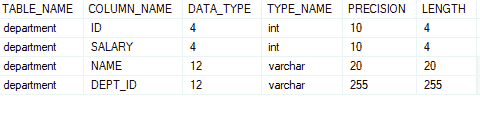
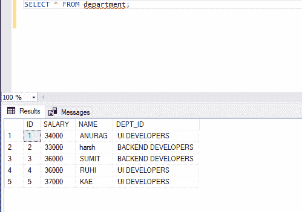
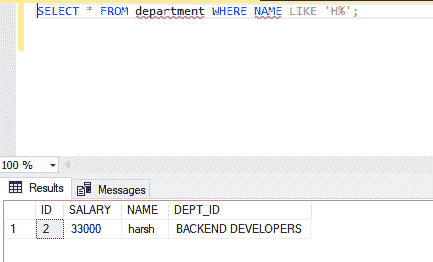
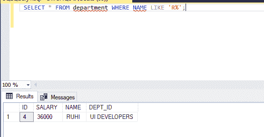

# SQL查询：查找姓名以特定字母开头的人

> 原文：[https://www.geeksforgeeks.org/sql-query-to-find-the-name-of-a-person-whose-name-starts-with-specific-letter/](https://www.geeksforgeeks.org/sql-query-to-find-the-name-of-a-person-whose-name-starts-with-specific-letter/)

在这里，我们将看到如何在SQL中找到一个名字以指定字母开头的人的名字。在本文中，我们将使用`微软SQL Server`作为我们的数据库。

例如，找到名字以字母“H”开头的人的名字。我们将在SQL查询中的指定字母后使用`%`符号。在这里，我们将首先创建一个名为`geeks`的数据库，然后在该数据库中创建一个表`department`。之后，我们将对该表执行查询。

## 创建数据库

```sql
CREATE DATABASE geeks;
```

## 使用该数据库

```sql
USE geeks;
```

## 创建表

这是我们表中的`geeks`数据库。

```sql
CREATE TABLE department(
    ID int,
    SALARY int,
    NAME Varchar(20),
    DEPT_ID Varchar(255));
```

## 查看表格结构

```sql
EXEC sp_column department;
```



## 在表格中添加数值

```sql
INSERT INTO department VALUES (1, 34000, 'ANURAG', 'UI DEVELOPERS');
INSERT INTO department VALUES (2, 33000, 'harsh', 'BACKEND DEVELOPERS');
INSERT INTO department VALUES (3, 36000, 'SUMIT', 'BACKEND DEVELOPERS');
INSERT INTO department VALUES (4, 36000, 'RUHI', 'UI DEVELOPERS');
INSERT INTO department VALUES (5, 37000, 'KAE', 'UI DEVELOPERS');
```


## 查看表中的数据

这是我们表里面的数据。

```sql
SELECT * FROM department;
```



## 查找名字以指定字母开头的人

现在让我们找到一个名字以指定字母开头的人的名字。

> **语法：**
>
> `SELECT` “列名”
>
> `FROM` “表名”
>
> `WHERE` “列名” `LIKE` { PATTERN };

### 例1：查找以“h”开头的名字

```sql
 SELECT * FROM department WHERE NAME LIKE 'H%';
```

**输出：**



### 例2：查找以“r”开头的名字

```sql
 SELECT * FROM department WHERE NAME LIKE 'R%';
```

**输出：**

