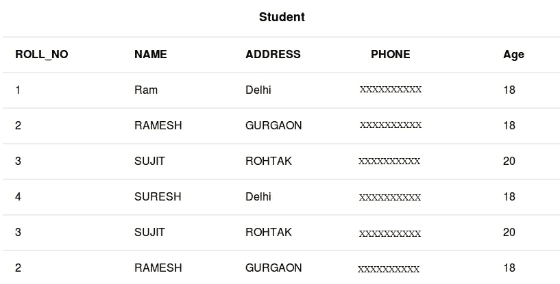
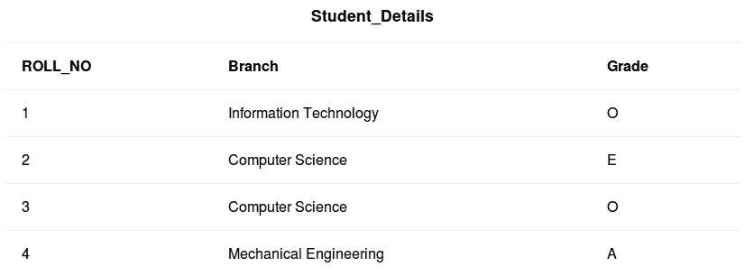

# SQL UNION 子句

> 原文: [https://www.geeksforgeeks.org/sql-union-clause/](https://www.geeksforgeeks.org/sql-union-clause/)

`UNION` 子句用于组合两个单独的 `SELECT` 语句，并将结果集生成为两个 `SELECT` 语句的并集。

**注意：**

1.  两个 `SELECT` 语句中使用的字段必须顺序相同、编号相同、数据类型相同。
2.  `UNION` 子句在结果集中产生不同的值，要获取重复的值，必须使用 `UNION ALL`，而不仅仅是 `UNION`。

## 基本语法

```sql
SELECT column_name(s) FROM table1 UNION SELECT column_name(s) FROM table2;
```
结果集由不同的值组成。

```sql
SELECT column_name(s) FROM table1 UNION ALL SELECT column_name(s) FROM table2;
```
结果集也包含重复值。

[](https://media.geeksforgeeks.org/wp-content/cdn-uploads/table11.jpg)

[](https://media.geeksforgeeks.org/wp-content/uploads/table12.jpg)

## 查询

### 获取不同的 ROLL_NO
从 `Student` 和 `Student_Details` 表中获取不同的 `ROLL_NO`。

```sql
SELECT ROLL_NO FROM Student UNION SELECT ROLL_NO FROM Student_Details;
```

输出：

| **ROLL_NO** |
| :--- |
| one |
| Two |
| three |
| four |

### 获取包含重复值的 ROLL_NO
从 `Student` 和 `Student_Details` 表中获取 `ROLL_NO`，包括重复值。

```sql
SELECT ROLL_NO FROM Student UNION ALL SELECT ROLL_NO FROM Student_Details;
```

输出：

| **ROLL_NO** |
| :--- |
| one |
| Two |
| three |
| four |
| three |
| Two |

### 复杂查询与排序
从 `Student` 表中获取 `ROLL_NO` 大于 3 的 `ROLL_NO` 和 `NAME`，从 `Student_Details` 表中获取 `ROLL_NO` 小于 3 的 `ROLL_NO` 和 `Branch`，包括重复值，最后按 `ROLL_NO` 对数据进行排序。

```sql
SELECT ROLL_NO,NAME FROM Student WHERE ROLL_NO>3 
UNION ALL
SELECT ROLL_NO,Branch FROM Student_Details WHERE ROLL_NO<3
ORDER BY 1;
```
注意：两个 `SELECT` 语句中的列名可以不同，但数据类型必须相同。在结果集中，将使用第一个 `SELECT` 语句中的列名。

输出：

| **ROLL_NO** | **NAME** |
| :--- | :--- |
| one | IT |
| Two | CS |
| four | SURESH |

本文由 **[Pratik Agarwal](https://www.facebook.com/Pratik.Agarwal01)** 供稿。如果你喜欢 GeeksforGeeks 并想投稿，你也可以使用 [contribute.geeksforgeeks.org](http://www.contribute.geeksforgeeks.org) 写一篇文章或者把你的文章邮寄到 `contribute@geeksforgeeks.org`。看到你的文章出现在极客博客主页上，帮助其他极客。

如果你发现任何不正确的地方，或者你想分享更多关于上面讨论的话题的信息，请写评论。