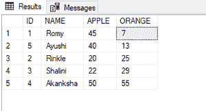

# 使用 CASE in ORDER BY 子句按 SQL 中 2 列的最低值对记录进行排序

> 原文：[https://www.geeksforgeeks.org/using-case-in-order-by-clause-to-sort-records-by-lowest-value-of-2-columns-in-sql/](https://www.geeksforgeeks.org/using-case-in-order-by-clause-to-sort-records-by-lowest-value-of-2-columns-in-sql/)

在本文中，我们将看到如何在 `ORDER BY` 子句中使用 `CASE`，按照 SQL 中 2 列的最低值对记录进行排序。

## CASE 语句

`CASE` 语句包含一个或多个条件及其相应的结果。当满足一个条件时，它停止读取，并返回相应的结果（类似于 `IF-ELSE` 语句）。

如果没有条件为真，它将返回 `CASE` 语句中 `ELSE` 子句中指定的值。如果语句中没有 `ELSE` 子句，它将返回空值。

### CASE 语法

```sql
CASE
   WHEN condition1 THEN result1
   WHEN condition2 THEN result2
   WHEN condition3 THEN result3
   ELSE result
END;
```

## ORDER BY

`ORDER BY` 关键字用于按升序或降序对结果集进行排序。默认情况下，它按升序对记录进行排序。`ASC` 或 `DESC` 是分别按升序或降序对记录进行排序的关键字。

### ORDER BY 语法

```sql
SELECT column_name1, column_name2, ...
FROM table_name
ORDER BY column_name1, column_name2, ... ASC|DESC;
```

## 操作步骤

### 步骤 1：创建数据库

使用下面的 SQL 语句创建一个名为 `geeks` 的数据库。

**查询：**

```sql
CREATE DATABASE geeks;
```

### 步骤 2：使用数据库

使用下面的 SQL 语句将数据库上下文切换到 `geeks`。

**查询：**

```sql
USE geeks;
```

### 步骤 3：表格定义

我们的 `geeks` 数据库中有以下演示表。

**查询：**

```sql
CREATE TABLE demo_table(
ID int,
NAME VARCHAR(20),
APPLE int,
ORANGE int);
```

### 步骤 4：将数据插入表格

**查询：**

```sql
INSERT INTO demo_table VALUES
(1, 'Romy', 45, 7),
(2, 'Rinkle', 20, 25),
(3,'Shalini', 22, 29),
(4, 'Akanksha',50, 55),
(5,'Ayushi', 40, 13);
```

### 步骤 5：使用 ORDER BY 子句中的 CASE 按照 2 列的最低值对记录进行排序

为了演示，我们将使用 `ORANGE` 和 `APPLE` 列的最低值对表格进行排序。

**查询：**

```sql
SELECT * FROM demo_table
ORDER BY CASE  
          WHEN  APPLE< ORANGE THEN APPLE
          ELSE ORANGE
        END
```

**输出：**



**输出说明：**

*   首先是 `ID=1`，因为 `ID=1` 的 `ORANGE` 列在表中具有最低的记录。
*   `ID=5` 是第二个，因为 `ID=5` 的 `ORANGE` 列在表中有倒数第二个记录。
*   `ID=2` 是第三个，因为 `ID=2` 的 `APPLE` 列在表中具有倒数第三的记录，以此类推。