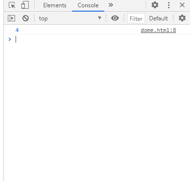
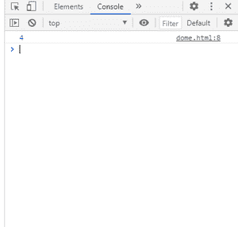

# SVG 多字符串长度属性

> 原文: [https://www.geeksforgeeks.org/svg-domstringlist-length-property/](https://www.geeksforgeeks.org/svg-domstringlist-length-property/)

`SVG DOMStringList.length` 属性返回给定 `DOMStringList` 元素的长度。

**语法:**

```html
len = DOMStringList.length
```

**返回值:** 该属性返回 `DOMStringList` 的长度。

## 例 1

```html
<!DOCTYPE html>
<html>

<body>
    <svg width="350" height="350"
        xmlns="http://www.w3.org/2000/svg">

        <script>
            var a = ["gfg", "a", "c", "eg"];
            console.log(a.length)
        </script>
    </svg>
</body>

</html>
```

**输出:**



## 例 2

```html
<!DOCTYPE html>
<html>

<body>
    <svg width="350" height="350"
        xmlns="http://www.w3.org/2000/svg">

        <script>
            var a = [1, 2, 4, 56];
            console.log(a.length)
        </script>
    </svg>
</body>

</html>
```

**输出:**

