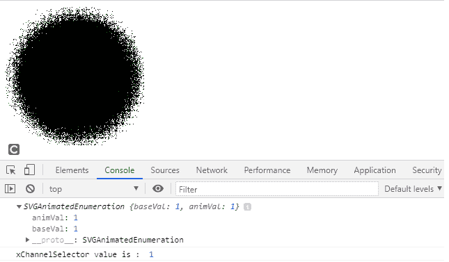
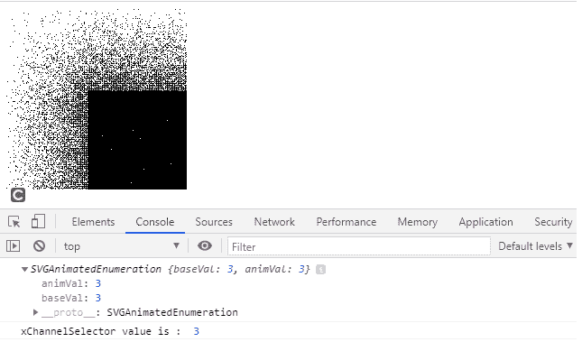

# SVG feDisplacementMap.xChannelSelector 属性

> 原文: [https://www.geeksforgeeks.org/svg-fedisplacementmap-xchannelselector-property/](https://www.geeksforgeeks.org/svg-fedisplacementmap-xchannelselector-property/)

`SVGFeDisplacementMap.xChannelSelector` 属性返回对应于 `feDisplacementMap` 元素的 `xChannelSelector` 组件的 `SVGAnimatedEnumeration` 对象。

## 语法

```html
var a = FEDisplacementMap.xChannelSelector
```

## 返回值

该属性返回与元素的 `xChannelSelector` 组件对应的 `SVGAnimatedEnumeration` 对象。

## 示例 1

```html
<!DOCTYPE html> 
<html>

<body> 
    <svg width="200" height="200"
        viewBox="0 0 220 220">

        <filter id="displacementFilter">
            <feTurbulence type="turbulence"
                baseFrequency="1" numOctaves="2"
                result="turbulence"/>
            <feDisplacementMap in2="turbulence"
                in="SourceGraphic" scale="50"
                xChannelSelector="R"
                yChannelSelector="B" id="gfg"/> 
        </filter>

        <circle cx="100" cy="100" r="100"
            stroke="green" style="filter: url(#displacementFilter)" />

        <script type="text/javascript">
            var g = document.getElementById("gfg");
            console.log(g.xChannelSelector)
            console.log("xChannelSelector value is : ", g.xChannelSelector.baseVal)
        </script>
    </svg> 
</body>

</html>
```

**输出:**



## 示例 2

```html
<!DOCTYPE html> 
<html>

<body> 
    <svg width="200" height="200"
        viewBox="0 0 220 220">

        <filter id="displacementFilter">
            <feTurbulence type="turbulence"
                baseFrequency="5" numOctaves="2"
                result="turbulence" />
            <feDisplacementMap in2="abc"
                in="SourceGraphic" scale="200"
                xChannelSelector="B"
                yChannelSelector="R" id="gfg" /> 
        </filter>

        <rect width="250" height="250" style="filter: url(#displacementFilter)" />

        <script type="text/javascript">
            var g = document.getElementById("gfg");
            console.log(g.xChannelSelector)
            console.log("xChannelSelector value is : ", g.xChannelSelector.baseVal)
        </script>
    </svg> 
</body>

</html>
```

**输出:**



## 支持的浏览器

*   Google Chrome
*   Edge
*   Firefox
*   Safari
*   Opera
*   Internet Explorer