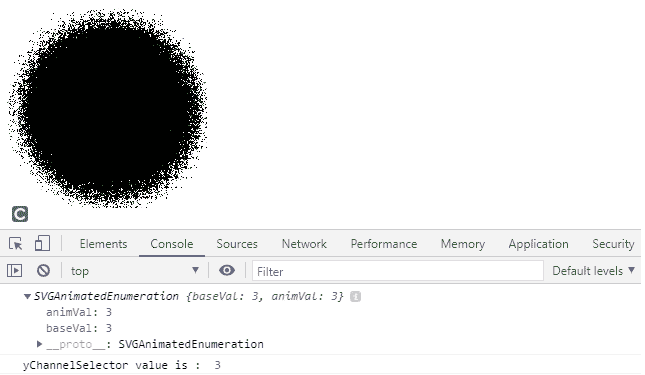
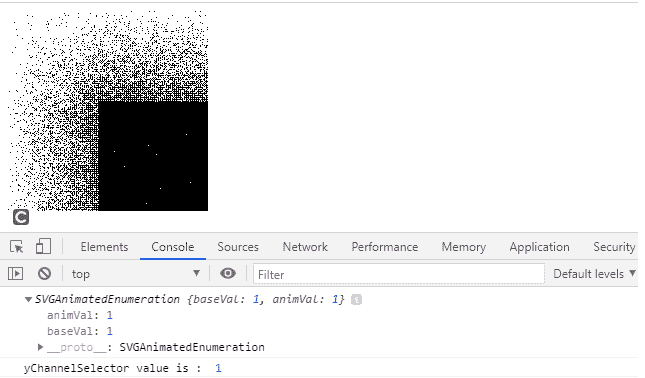

# SVGfeDisplacementMap.yChannelSelector 属性

> 原文: [https://www.geeksforge.org/svg-fedisplacementmap-ychannelselector-property/](https://www.geeksforgeeks.org/svg-fedisplacementmap-ychannelselector-property/)

SVG `<feDisplacementMap>` 元素的 `yChannelSelector` 属性返回一个对应于 `feDisplacementMap.yChannelSelector` 元素的 `yChannelSelector` 组件的 `SVGAnimatedEnumeration` 对象。

**语法:**

```html
var a = FEDisplacementMap.yChannelSelector
```

**返回值:**
该属性返回与元素的 `yChannelSelector` 组件对应的 `SVGAnimatedEnumeration` 对象。

### 示例 1

```html
<!DOCTYPE html>
<html>
<body>
    <svg width="200" height="200" viewBox="0 0 220 220">
        <filter id="displacementFilter">
            <feTurbulence type="turbulence" baseFrequency="1" numOctaves="2" result="turbulence"/>
            <feDisplacementMap in2="turbulence" in="SourceGraphic" scale="50" xChannelSelector="R" yChannelSelector="B" id="gfg"/>
        </filter>
        <circle cx="100" cy="100" r="100" stroke="green" style="filter: url(#displacementFilter)" />
        <script type="text/javascript">
            var g = document.getElementById("gfg");
            console.log(g.yChannelSelector)
            console.log("yChannelSelector value is : ", g.yChannelSelector.baseVal)
        </script>
    </svg>
</body>
</html>
```

**输出:**



### 示例 2

```html
<!DOCTYPE html>
<html>
<body>
    <svg width="200" height="200" viewBox="0 0 220 220">
        <filter id="displacementFilter">
            <feTurbulence type="turbulence" baseFrequency="5" numOctaves="2" result="turbulence" />
            <feDisplacementMap in2="abc" in="SourceGraphic" scale="200" xChannelSelector="B" yChannelSelector="R" id="gfg" />
        </filter>
        <rect width="250" height="250" style="filter: url(#displacementFilter)" />
        <script type="text/javascript">
            var g = document.getElementById("gfg");
            console.log(g.yChannelSelector)
            console.log("yChannelSelector value is : ", g.yChannelSelector.baseVal)
        </script>
    </svg>
</body>
</html>
```

**输出:**



**支持的浏览器:**

*   Google Chrome
*   Edge
*   Firefox
*   Safari
*   Opera
*   Internet Explorer