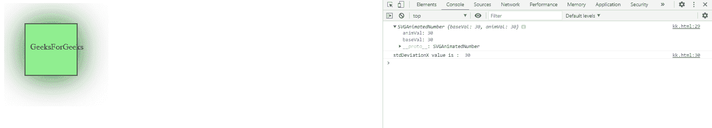
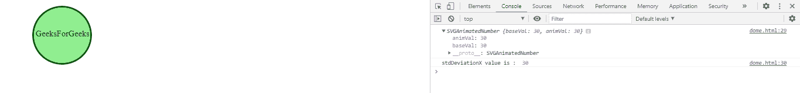

# SVG FeDropShadow stdDeviationX 属性

> 原文: [https://www.geeksforgeeks.org/svg-fedropshadow-stddeviationx-property/](https://www.geeksforgeeks.org/svg-fedropshadow-stddeviationx-property/)

## 属性说明

`SVGFeDropShadow.stdDeviationX` 属性返回对应于 `feDropShadow` 元素的 `stdDeviation` X 组件的 `SVGAnimatedNumber` 对象。

**语法:**

```javascript
var a = FEDropShadow.stdDeviationX
```

**返回值:**
此属性返回对应于 `feDropShadow` 元素的 `stdDeviation` X 组件的 `SVGAnimatedNumber` 对象。

## 示例1

### HTML

```html
<!DOCTYPE html>
<html>
<body>
    <svg width="200" height="200">
        <defs>
            <filter id="drop_shadow"
                filterUnits="objectBoundingBox"
                x="-50%" y="-60%" width="250%"
                height="250%">
                <feDropShadow in="SourceGraphic"
                    dx="1" dy="1" stdDeviation="30"
                    flood-color="darkgreen" id="gfg" />
            </filter>
        </defs>
        <rect x="40" y="40" width="100"
            height="100" style="stroke: #000000;
                fill: lightgreen;
                filter: url(#drop_shadow);" />
        <g fill="#FFFFFF" stroke="black"
            font-size="10" font-family="Verdana">
            <text x="50" y="90">GeeksForGeeks</text>
        </g>
        <script type="text/javascript">
            var g = document.getElementById("gfg");
            console.log(g.stdDeviationX)
            console.log("stdDeviationX value is : ",
                g.stdDeviationX.baseVal)
        </script>
    </svg>
</body>
</html>
```

**输出:**



## 示例2

### HTML

```html
<!DOCTYPE html>
<html>
<body>
    <svg width="200" height="200">
        <defs>
            <filter id="blur"
                filterUnits="objectBoundingBox"
                x="-10%" y="-10%" width="300%"
                height="300%">
                <feDropShadow in="StrokePaint"
                    dx="1" dy="1" stdDeviation="30"
                    flood-color="darkgreen" id="gfg" />
            </filter>
        </defs>
        <circle cx="110" cy="60" r="55"
            stroke="darkgreen" stroke-width="3"
            fill="Lightgreen"
            style="stroke: filter: url(#blur);" />
        <g fill="#FFFFFF" stroke="Green"
            font-size="10" font-family="Verdana">
            <text x="60" y="62">GeeksForGeeks</text>
        </g>
        <script type="text/javascript">
            var g = document.getElementById("gfg");
            console.log(g.stdDeviationX)
            console.log("stdDeviationX value is : ",
                g.stdDeviationX.baseVal)
        </script>
    </svg>
</body>
</html>
```

**输出:**



## 支持的浏览器

*   Google Chrome
*   Edge
*   Firefox
*   Safari
*   Opera

**参考:** T2