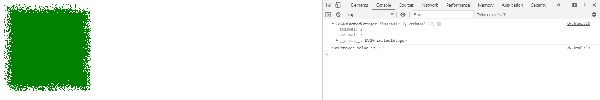
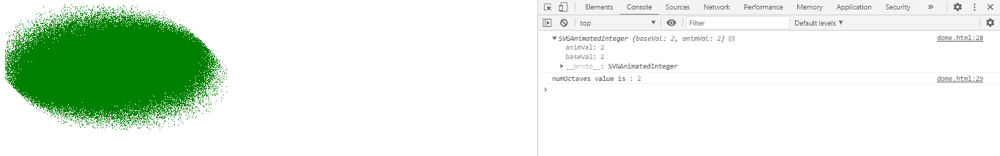

# SVG feTurbulence 元素的 numOctaves 属性

> 原文：[https://www.geeksforgeeks.org/svg-feturbulenceelement-numoctaves-attribute/](https://www.geeksforgeeks.org/svg-feturbulenceelement-numoctaves-attribute/)

`feTurbulence` 元素的 `numOctaves` 属性返回一个与 `feTurbulence` 元素的 `numOctaves` 组件相对应的 `SVGAnimatedInteger` 对象。

**语法：**

```javascript
var a = FETurbulenceElement.numOctaves
```

**返回值：**
该属性返回一个对应于 `feTurbulence` 元素的 `numOctaves` 组件的 `SVGAnimatedInteger` 对象。

## 示例 1

```html
<!DOCTYPE html> 
<html>

<body>

<svg width="200" height="200"
        viewBox="0 0 220 220">

<filter id="FillPaint">

<feTurbulence id='gfg' type="turbulence"
                baseFrequency="0.5" numOctaves="2"
                seed="5" stitchTiles="stitch" />

<feDisplacementMap in2="turbulence"
                in="SourceGraphic" scale="50"
                xChannelSelector="B"
                yChannelSelector="B" />

</filter>

<rect width="200" height="200"
            style=" fill:green; 
            filter: url(#FillPaint);" />

<script type="text/javascript">
            var g = document.getElementById("gfg");
            console.log(g.numOctaves);
            console.log("numOctaves value is :",
               g.numOctaves.baseVal);
        </script> 
    </svg> 
</body>

</html>
```

**输出：**



## 示例 2

```html
<!DOCTYPE html> 
<html>

<body>

<svg width="400" height="400"
        viewBox="0 0 250 250">

<filter id="FillPaint">

<feTurbulence id="gfg" type="fractalNoise"
                baseFrequency="2" numOctaves="2"
                seed="1" stitchTiles="stitch"
                result="turbulence" />

<feDisplacementMap in2="turbulence"
                in="SourceGraphic" scale="50"
                xChannelSelector="B"
                yChannelSelector="B" />

</filter>

<ellipse cx="100" cy="60" rx="100"
            ry="50" style=" fill: green; 
            filter: url(#FillPaint);" /> 
        <script type="text/javascript">
            var g = document.getElementById("gfg");
            console.log(g.numOctaves);
            console.log("numOctaves value is :",
                g.numOctaves.baseVal);
        </script>
    </svg> 
</body>

</html>
```

**输出：**



**支持的浏览器：**

*   Google Chrome
*   Edge
*   Firefox
*   Safari
*   Opera
*   Internet Explorer