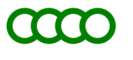
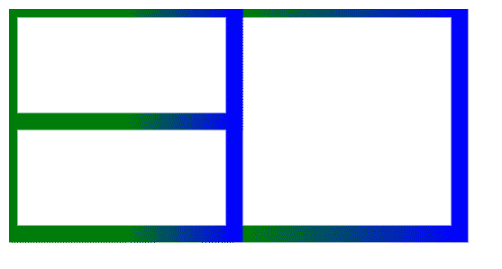

# SVG `<g>` 元素

> 原文: [https://www.geeksforgeeks.org/svg-g-element/](https://www.geeksforgeeks.org/svg-g-element/)

SVG `<g>` 元素是一个用于对其他 SVG 元素进行分组的容器。

应用于 `<g>` 元素的变换也在其子元素上执行，其属性由其子元素继承。

## 语法

```html
<g attributes="" >
    <elements>
</g>
```

## 属性

*   **核心属性:** 这些属性是 `id` 等核心属性。
*   **样式属性:** 这些属性定义样式，例如 `class`、`style`。
*   **条件属性:** 这些属性是基于条件的，例如 `systemLanguage`。
*   **演示属性:** 用于给出演示效果的属性，例如 `color`、`clip-rule` 等。

## 示例 1: 从 `<g>` 元素继承属性制作绿色连续圆

```html
<!DOCTYPE html>
<html>

<body>
    <svg width="1200" height="1200">
        <g fill="white" stroke="green" stroke-width="10">
            <circle cx="40" cy="40" r="25" />
            <circle cx="80" cy="40" r="25" />
            <circle cx="120" cy="40" r="25" />
            <circle cx="160" cy="40" r="25" />
        </g>
    </svg>
</body>

</html>
```

**输出:**



## 示例 2: 制作继承属性相同的矩形

```html
<!DOCTYPE html>
<html>

<body>
    <svg width="1200" height="1200">
        <defs>
            <linearGradient id="gfgStr">
                <stop offset="50%"   stop-color="green" />
                <stop offset="100%" stop-color="blue" />
            </linearGradient>
        </defs>

        <g fill="white" stroke="url(#gfgStr)" stroke-width="15">
            <rect width="400" height="200" />
            <rect width="200" height="200" />
            <rect width="200" height="100" />
        </g>
    </svg>
</body>

</html>
```

**输出:**



## 支持的浏览器

此 SVG 元素支持以下浏览器:

*   Chrome
*   Edge
*   Firefox
*   Safari
*   Internet Explorer
*   Opera