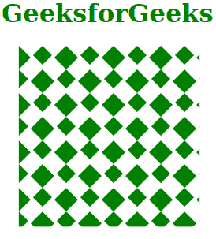
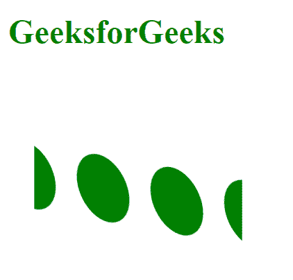

# SVG 模式转换属性

> 原文: [https://www.geeksforgeks.org/svg-patterntransform-attribute/](https://www.geeksforgeks.org/svg-patterntransform-attribute/)

`patternTransform`属性描述了应用于模式的转换函数列表。

## 语法

```html
patternTransform = "values"
```

## 属性值

`patternTransform`属性接受以下描述的值:

*   `matrix`: 变换函数将对象移动 x 和 y。
*   `scale`: 缩放变换功能通过 x 和 y 指定缩放操作。
*   `rotate`: 旋转变换功能指定围绕给定点旋转一个角度。
*   `skewX`: `skewX`变换函数指定沿 x 轴倾斜一个角度的偏斜变换。
*   `skewY`: 偏斜变换函数指定沿 y 轴偏斜一个角度的偏斜变换。

以下示例说明了`patternTransform`属性的使用。

## 示例 1

```html
<!DOCTYPE html>
<html>

<body>
    <h1 style="color: green;">
        GeeksforGeeks
    </h1>

<svg viewBox="-30 0 1200 1200" 
        xmlns="http://www.w3.org/2000/svg">

<pattern id="geek" x="0" y="0" 
            width="200" height="200" 
            patternUnits="userSpaceOnUse"
            patternTransform="rotate(45) scale(0.2 0.2)">

<rect class="checker" fill="green" 
                x="0" width="100" height="100" y="0">
            </rect>

<rect class="checker" fill="green" 
                x="100" width="80" height="80" y="100"> 
            </rect>
        </pattern>

<rect x="0" y="0" width="18%" 
            height="18%" fill="url(#geek)">
        </rect>
    </svg>
</body>

</html>
```

**输出:**



## 示例 2

```html
<!DOCTYPE html>
<html>

<body>
    <h1 style="color: green;">
        GeeksforGeeks
    </h1>

<svg viewBox="0 0 500 500" 
        xmlns="http://www.w3.org/2000/svg">

<pattern id="geeksforgeeks" height=".48" 
            width=".18" fill="green"
            patternTransform="rotate(10)skewX(20) scale(2 2.5)">

<circle cx="5" r="5" cy="5" />
        </pattern>

<rect width="80" height="80" x="10" 
            y="10" fill="url(#geeksforgeeks)" />
    </svg>
</body>

</html>
```

**输出:**

