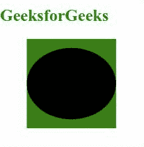
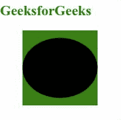

# SVG 指针事件属性

> 原文: [https://www.geeksforgeeks.org/svg-pointer-events-attribute/](https://www.geeksforgeeks.org/svg-pointer-events-attribute/)

`pointer-events`属性允许我们定义一个元素是否或何时可能成为鼠标事件的目标。应用于以下元素: `<a>`、`<circle>`、`<clipPath>`、`<defs>`、`<ellipse>`、`<foreignObject>`、`<g>`、`<image>`、`<line>`、`<marker>`、`<mask>`、`<path>`。

**语法:**

```html
pointer-events = bounding-box | visiblePainted | visibleFill | 
                 visibleStroke | visible | painted | fill |
                 stroke | all | none
```

**属性值:**
`pointer-events`属性接受上面提到的和下面描述的值:

*   **auto:** 用来描述元素必须对指针事件做出反应。
*   **none:** 用于描述元素对指针事件没有反应。
*   **visiblePainted:** 当鼠标光标位于元素的内部或周边，并且填充或描边属性设置为非空值时，此值只能作为指针事件的目标。
*   **visibleFill:** 当鼠标光标位于元素内部时，该值只能是指针事件的目标。
*   **visibleStroke:** 当鼠标光标在元素的周界上时，该值只能是指针事件的目标。
*   **visible:** 当鼠标光标位于元素内部或周边时，该值只能是指针事件的目标。
*   **painted:** 当鼠标光标位于元素的内部或周边，并且填充或描边属性设置为非空值时，该值只能是指针事件的目标。
*   **fill:** 当指针位于元素内部时，该值只能是指针事件的目标。
*   **stroke:** 当指针在元素的周长上时，该值只能是指针事件的目标。
*   **all:** 当指针位于元素内部或周边时，该值只能是指针事件的目标。

以下示例说明了`pointer-events`属性的使用。

### 示例 1

```html
<!DOCTYPE html>
<html>

<body>
    <div style="color: green;">
        <h2>
            GeeksforGeeks
        </h2>

        <svg viewBox="0 0 100 10" 
             xmlns="http://www.w3.org/2000/svg">

            <rect x="3" y="0" height="10" 
                  width="10" fill="green" />

            <ellipse cx="8" cy="5" rx="5" ry="4" 
                     fill="black" 
                     pointer-events="visiblePainted" />
        </svg>
    </div>

    <script>
        window.addEventListener(
            'mouseup', (e) => {
                let geekColor =
                    Math.round(Math.random() *
                        0xFFFFFF)
                let fill =
                    '#' + geekColor.toString(16).
                        padStart(5, '0')
                e.target.style.fill = fill
            });
    </script>
</body>

</html>
```

**输出:**



### 示例 2

```html
<!DOCTYPE html>
<html>

<body>
    <div style="color: green;">
        <h2>
            GeeksforGeeks
        </h2>

        <svg viewBox="0 0 100 10" 
             xmlns="http://www.w3.org/2000/svg">

            <rect x="3" y="0" height="10" 
                  width="10" fill="green" />

            <ellipse cx="8" cy="5" rx="5" 
                     ry="4" fill="black" 
                     pointer-events="none" />
        </svg>
    </div>

    <script>
        window.addEventListener(
            'mouseup', (e) => {
                let geekColor =
                    Math.round(Math.random()
                        * 0xFFFFFF)
                let fill =
                    '#' + geekColor.toString(16).
                        padStart(6, '0')
                e.target.style.fill = fill
            });
    </script>
</body>

</html>
```

**输出:**

