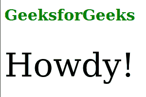

# SVG 系统语言属性

> 原文: [https://www.geeksforgeeks.org/svg-systemlanguage-attribute/](https://www.geeksforgeeks.org/svg-systemlanguage-attribute/)

`systemLanguage`属性表达了许多支持的语言标签的列表。

使用该属性的元素包括: `<a>`、`<altGlyph>`、`<animate>`、`<animateColor>`、`<animateMotion>`、`<animateTransform>`、`<audio>`、`<canvas>`、`<circle>`、`<clipPath>`、`<cursor>`、`<defs>`、`<ellipse>`、`<feBlend>`、`<feColorMatrix>`、`<feComponentTransfer>`、`<feComposite>`、`<feConvolveMatrix>`、`<feDiffuseLighting>`、`<feDisplacementMap>`、`<feDistantLight>`、`<feDropShadow>`、`<feFlood>`、`<feFuncA>`、`<feFuncB>`、`<feFuncG>`、`<feFuncR>`、`<feGaussianBlur>`、`<feImage>`、`<feMerge>`、`<feMergeNode>`、`<feMorphology>`、`<feOffset>`、`<fePointLight>`、`<feSpecularLighting>`、`<feSpotLight>`、`<feTile>`、`<feTurbulence>`、`<filter>`、`<font>`、`<font-face>`、`<font-face-format>`、`<font-face-name>`、`<font-face-src>`、`<font-face-uri>`、`<foreignObject>`、`<g>`、`<glyph>`、`<glyphRef>`、`<hatch>`、`<hatchpath>`、`<image>`、`<line>`、`<linearGradient>`、`<marker>`、`<mask>`、`<mesh>`、`<meshgradient>`、`<meshpatch>`、`<meshrow>`、`<metadata>`、`<missing-glyph>`、`<mpath>`、`<path>`、`<pattern>`、`<polygon>`、`<polyline>`、`<radialGradient>`、`<rect>`、`<script>`、`<set>`、`<solidcolor>`、`<stop>`、`<style>`、`<svg>`、`<switch>`、`<text>`、`<textPath>`、`<title>`、`<tref>`、`<tspan>`、`<unknown>`、`<use>`、`<video>`。

## 语法

```html
systemLanguage = "language-tags"
```

## 属性值

`systemLanguage`属性接受上面提到的和下面描述的值。

*   **语言标签:** 该属性值包括的标签有: `ar`、`de`、`nl`、`en-us`、`en-gb`、`en-au`、`en`、`es`、`fr`、`ja`、`ru` 等。

下面的例子说明了`systemLanguage`属性的使用。

### 例 1

```html
<!DOCTYPE html>
<html>

<body>

<h1 style="color: green;">
        GeeksforGeeks
    </h1>

<svg viewBox="0 -20 300 350">
        <switch>
            <text systemLanguage="ar">مرحبا</text>
            <text systemLanguage="de, nl">Hallo!</text>
            <text systemLanguage="en-us">Howdy!</text>
            <text systemLanguage="en-gb">Wotcha!</text>
            <text systemLanguage="en-au">G'day!</text>
            <text systemLanguage="en">Hello!</text>
            <text systemLanguage="es">Hola!</text>
            <text>Sorry no language matched!</text>
        </switch>
    </svg>
</body>

</html>
```

**输出:**



### 例 2

```html
<!DOCTYPE html>
<html>

<body>

<h1 style="color: green; text-align: center;">
        GeeksforGeeks
    </h1>

<svg viewBox="-30 -20 300 350">
        <switch>
            <text systemLanguage="ar">مرحبا</text>
            <text systemLanguage="de, nl">Hallo!</text>
            <text systemLanguage="es">Hola!</text>
            <text>Sorry no language matched!</text>
        </switch>
    </svg>
</body>

</html>
```

**输出:**

