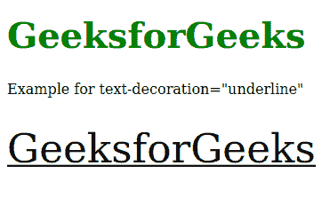
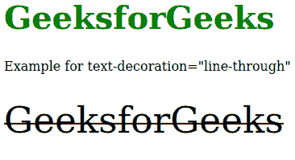

# SVG 文字装饰属性

> 原文: [https://www.geeksforgeeks.org/svg-text-decoration-attribute/](https://www.geeksforgeeks.org/svg-text-decoration-attribute/)

`text-decoration`属性定义文本是否用删除线、上划线和/或下划线书写。CSS `text-decoration`属性和 SVG `<text>`元素的`text-decoration`属性的主要区别在于，SVG 使用“`fill`”和“`stroke`”值来绘制文字装饰。仅对以下元素有效：`<altGlyph>`、`<text>`、`<textPath>`、`<tref>`、`<tspan>`。

## 语法

```html
text-decoration = "text-decoration-line" | "text-decoration-style" 
                 | "text-decoration-color"
```

## 属性值

`text-decoration`属性接受上面提到的和下面描述的值：

*   `text-decoration-line`: 将`text-decoration-line`设置为`underline`或`line-through`。
*   `text-decoration-style`: 设置装饰所用线条的风格，如`solid`、`wavy`或`dashed`。
*   `text-decoration-color`: 设置装饰的颜色。

## 示例

### 示例 1

以下示例说明了`text-decoration`属性的使用。

```html
<!DOCTYPE html>
<html>

<body>
    <h1 style="color: green; font-size: 40px;">
        GeeksforGeeks
    </h1>

    <p>
        Example for text-decoration="underline"
    </p>

    <svg viewBox="0 0 450 250" 
        xmlns="http://www.w3.org/2000/svg">

        <text y="20" text-decoration="underline">
            GeeksforGeeks
        </text>
    </svg>
</body>

</html>
```

**输出:**



### 示例 2

```html
<!DOCTYPE html>
<html>

<body>
    <h1 style="color: green; font-size: 40px;">
        GeeksforGeeks
    </h1>

    <p>
        Example for text-decoration="line-through"
    </p>

    <svg viewBox="0 0 450 250" 
        xmlns="http://www.w3.org/2000/svg">

        <text x="0" y="40" 
            text-decoration="line-through">
            GeeksforGeeks
        </text>
    </svg>
</body>

</html>
```

**输出:**

