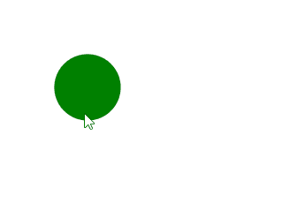

# SVG `<title>` 元素

> 原文: [https://www.geeksforgeeks.org/svg-title-element/](https://www.geeksforgeeks.org/svg-title-element/)

`<title>` SVG 元素提供了任何 SVG 容器元素或图形元素的可访问的短文本描述。

`<title>` 元素中的文本不作为图形的一部分呈现，但浏览器通常将其显示为工具提示。当您将鼠标悬停在元素上时，将显示该元素的标题。

**语法:**

```html
<title> TITLE HERE </title>
```

**属性:**

*   **核心属性:** 这些属性是 `id` 等核心属性。
*   **样式属性:** 这些属性定义样式、`class`、`style`。

**示例:** 从 `<g>` 元素继承属性制作绿色连续圆圈。

```html
<!DOCTYPE html>
<html>

<body>
    <svg viewBox="0 0 100 100">
        <circle cx="5" cy="5" r="2" fill="green">
            <title>I'm a Geeky Circle</title>
        </circle>
    </svg>
</body>

</html>
```

**输出:**



**支持的浏览器:**

*   `Google Chrome`
*   `Microsoft Edge`
*   `Firefox`
*   `Safari`
*   `Opera`