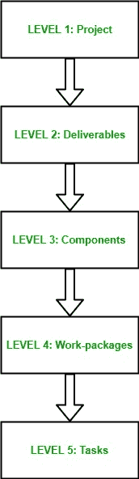

# 软件工程中的活动识别方法

> 原文：[https://www.geeksforgeeks.org/activity-identification-approaches-in-software-engineering/](https://www.geeksforgeeks.org/activity-identification-approaches-in-software-engineering/)

在[软件工程](https://www.geeksforgeeks.org/software-engineering-introduction-to-software-engineering/)中，我们大多有非常复杂和大规模的项目要处理。这些复杂的大规模项目被划分为更简单、易管理、独立和小的任务，称为**活动**。

在任何软件项目中，有 3 种最常见的活动识别方法：

## 1. Activity based approach
它包括创建项目在其生命周期中应该涉及的所有活动的列表。这可以通过使用一个包括整个项目团队的头脑风暴过程以及对过去项目的分析来完成。`Work Breakdown Structure (WBS)` 就是为此目的而创建的。它涉及将一个复杂的大规模项目分解为更简单、可管理、独立和更小的任务，这些任务可以由一个开发团队在几周内完成。

项目树的根由项目名称本身标记。每个节点（活动）被递归分解并分成更小的子活动，直到在叶级别，这些活动需要大约两周的时间来开发，并且可以交给单个开发团队。它遵循自上而下的方法。

## 2. 基于产品的方法
它包括生成产品分解结构和产品流程图。基于产品的结构与工作分解结构非常相似，工作分解结构包括将复杂的大规模产品划分为其子产品，直到在叶级获得简单的、可管理的、独立的和更小的产品。产品分解结构是在工作分解结构之前构建的，它侧重于生成成功完成项目所需的所有子产品的有序列表。

这种生成的结构有助于创建工作分解结构，进而有助于确定生产所需子产品所需的活动。一个产品被排除在产品细分结构之外的可能性要比一个活动被排除在工作细分结构之外的可能性小得多。

## 3. Hybrid approach
在这种方法中，基于以下内容构建一个替代的工作分解结构：
*   最终可交付成果的简单列表。
*   对于每个交付物，生产该产品所需的一组活动。

纯粹基于活动的工作分解结构的主要问题是，在识别了所有活动之后，总是忽略了按适当顺序对它们进行排序的任务。因此，混合方法为我们提供了工作分解结构的修改版本，它包括了产品分解结构的一些重要属性，并且由于它包括了两种方法的重要属性，所以它克服了两种方法的缺点。

IBM（国际商业机器公司）建议在工作分解结构中使用以下 5 个级别：

*   **Level-1: 项目**
    它包括软件开发团队在完成完整的软件开发生命周期后想要开发的实际项目。这是整个开发过程的主要目标和输出，因此，必须以详细的方式定义。
*   **第 2 级: 可交付成果**
    这些是在每一个里程碑之后生成的子产品，如[软件需求规范(SRS)](https://www.geeksforgeeks.org/how-to-write-a-good-srs-for-your-project/)、软件设计文档(SDD)等。这些也有助于分析每个里程碑的项目进度。
*   **级别-3: 组件**
    这些是在项目开发生命周期中作为模块和测试产生可交付成果以产生系统软件所需的关键项目。
*   **第 4 级: 工作包**
    这些是生产一个组件所需的主要项目或任务集合，该组件反过来又作为之后构建可交付成果的基础。
*   **第 5 级: 任务**
    这些任务是指分配给一个人/团队完成的任务，是项目的基本组成部分。