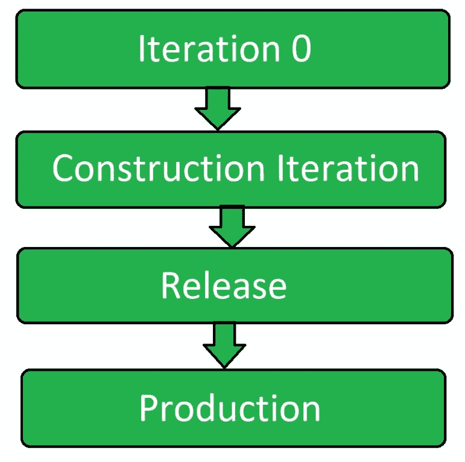

# 敏捷软件测试

> 原文：[`https://www.geeksforgeeks.org/agile-software-testing/`](https://www.geeksforgeeks.org/agile-software-testing/)

**敏捷测试**是一种遵循敏捷软件开发原则来测试软件应用的软件测试类型。

项目团队的所有成员以及特殊的专家和测试人员都参与敏捷测试。敏捷测试不是一个单独的阶段，它与所有的开发阶段一起执行，即需求、设计和编码以及测试用例生成。敏捷测试在整个开发生命周期中同时发生。

敏捷测试人员与开发团队成员一起参与整个开发生命周期，测试人员帮助根据客户需求构建软件，并进行更好的设计，因此代码成为可能。

敏捷测试团队作为一个团队朝着实现质量的单一目标而工作。敏捷测试有更短的时间框架，称为迭代或循环。这种方法也被称为交付驱动方法，因为它可以在更短的时间内对可行的产品进行更好的预测。

## 敏捷测试原则

*   **缩短反馈迭代：**
    在敏捷测试中，测试团队在每个迭代中都能了解产品开发及其质量。因此，持续的反馈最小化了反馈响应时间，修复成本也得以降低。
*   **测试并行进行：**
    敏捷测试不是一个独立的阶段。它与开发阶段并行进行。它确保在该迭代中实现的功能真正完成。测试不会被搁置到后续阶段。
*   **全员参与：**
    敏捷测试涉及开发团队和测试团队的每一位成员。它包括各种开发人员和专家。
*   **文档轻量化：**
    敏捷测试人员使用可重用的检查清单来建议测试，并关注测试的本质而非附带细节，以此代替全局测试文档。使用轻量级的文档工具。
*   **干净代码：**
    检测到的缺陷在同一个迭代中被修复。这确保了在开发的任何阶段都有干净的代码。

## 敏捷测试生命周期

### 迭代0
这是测试过程的第一阶段，在此阶段执行初始设置。测试环境在此迭代中建立。

### 构建迭代
这是测试过程的第二阶段。它是测试的主要阶段，大部分工作在此阶段完成。它是一系列构建解决方案增量的迭代。

### 发布
此阶段包括完整的系统测试和验收测试。为了完成测试阶段，产品在构建迭代中会受到更严格的测试。在此阶段，测试人员处理缺陷故事。

### 生产
这是敏捷测试的最后阶段。在移除所有缺陷和提出的问题后，在此阶段最终确定产品。

## 敏捷测试活动
敏捷测试包括以下活动：

*   参与迭代计划
*   从测试的角度评估任务
*   使用特性描述编写测试用例
*   单元测试
*   集成测试
*   特征测试
*   缺陷修复
*   集成测试
*   验收测试
*   测试进度状态报告
*   缺陷跟踪