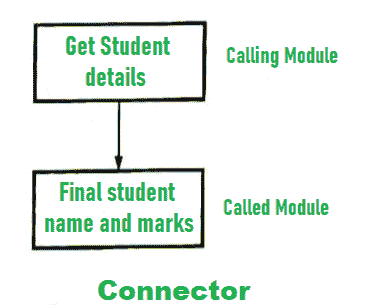
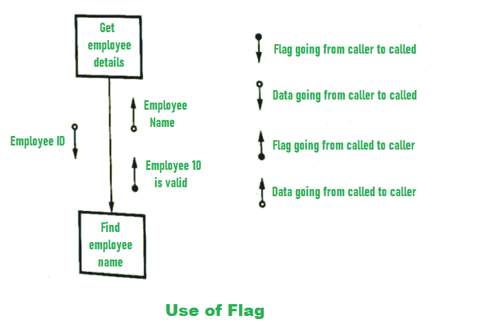
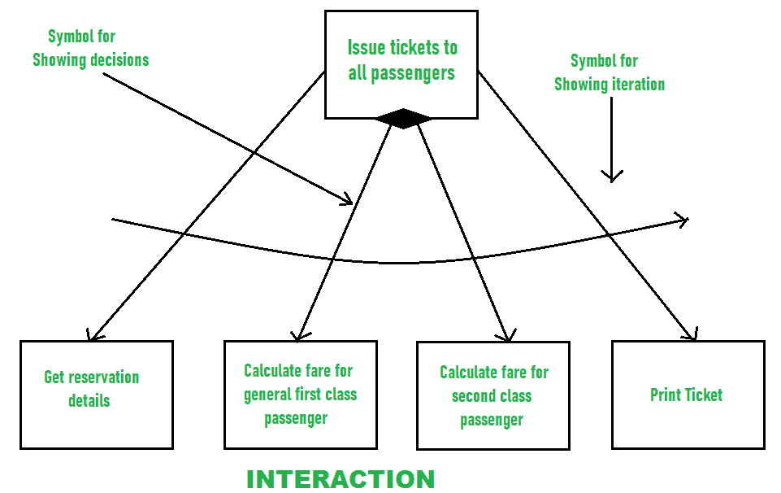
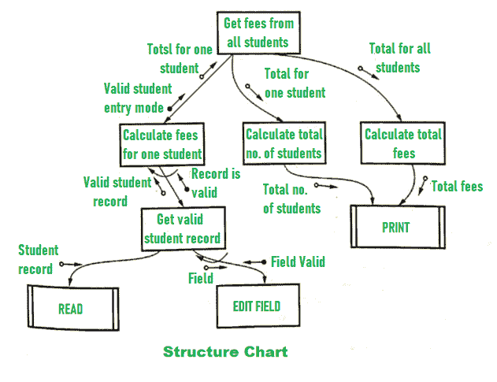

# 软件工程中的结构分析和设计

> 原文：[https://www.geeksforgeeks.org/analyzing-and-designing-structure-in-software-engineering/](https://www.geeksforgeeks.org/analyzing-and-designing-structure-in-software-engineering/)

`结构图`是结构化设计的主要工具。它是一种标准化格式，用于显示页面的详细信息并对页面内容进行分类。

## 结构图的基本元素

结构化图表中的基本元素是`模块`。该模块被定义为具有四个属性的程序语句的集合。

*   `输入输出`：模块从调用者那里得到的信息称为输入，接收方从模块那里得到的信息称为输出。
*   `函数`：函数处理输入并产生输出。
*   `力学`：仅仅是代码或逻辑，在它们的帮助下，功能得以实现。
*   `内部数据`：是自己的工作空间。

两个模块可以通过一个连接器相互连接，如下所示：

## 数据和标志的使用

模块使用`数据`和`标志`。数据由不同的模块处理。标志用作控制信号。它可以被设置或重置。
例如，如果我们有两个模块，一个用于获取员工详情（调用者），另一个用于查找员工姓名（被调用者），那么调用者模块将发送数据作为员工ID，被调用者模块将使用该ID查找员工的姓名。如果员工ID有效，被调用者模块将向调用者模块发送该消息。

数据和标志的使用如下所示：

## 迭代和决策

结构化图表中的迭代和决策如下所示：

## 结构图示例

结构图的示例如下所示：

