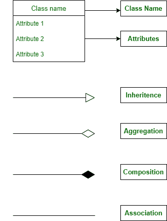
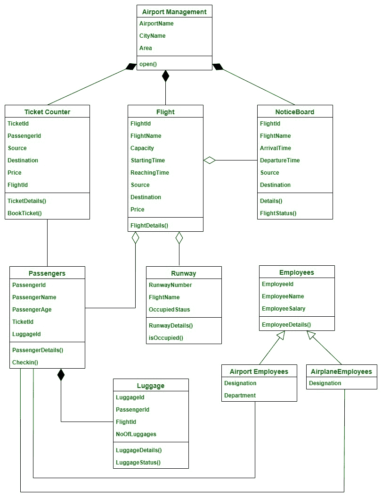

# 机场管理系统类图

> 原文：[https://www.geeksforgeeks.org/class-diagram-for-airport-management-system/](https://www.geeksforgeeks.org/class-diagram-for-airport-management-system/)

机场是一个复杂的系统，每天有成千上万的国内和国际航班在其中运行，需要适当的规划和执行才能使其成为一个管理系统。

## 类

*   `AirportManagement` – 本课程包含机场的整体细节。
*   `TicketCounter` – 它允许乘客购买车票并支付车票费用。
*   `Flight` – 这包含了机场的所有航班信息。
*   `Employees` – 员工可以是两种类型–机场员工和飞机员工。这个类是两个子类的父类——`AirportEmployees`和`AirlineEmployees`。
*   `AirportEmployees` – 该类是`Employees`的子类。它描述了在机场工作的员工。它包含他们的名称和部门，如海关、票务、食品等。
*   `AirlineEmployees` – 该类是`Employees`的子类，包含空姐、飞行员等称谓。表示在飞机内工作的员工。
*   `Runway` – 这包含了跑道的详细信息，并且它还告诉特定的跑道是否被任何航班占用。
*   `Passenger` – 该类别包含乘客详细信息。
*   `NoticeBoard` – 该类别包含当前航班和特定日期尚未到达和离开的航班。
*   `Luggage` – 该类包含特定乘客的行李详情。

## 属性

*   `AirportManagement` – 机场名称、城市名称、区域。
*   `TicketCounter` – ticket id，PassengerId，Source，Destination，Price，FlightId。
*   `Flight` – 航班编号、航班名称、运力、出发时间、到达时间、来源、目的地、价格。
*   `Employees` – 员工 Id、员工姓名、员工工资。
*   `AirportEmployees` – 名称、部门。
*   `AirlineEmployees` – 名称。
*   `Runway` – 运行航路号、航班名称、占用状态。
*   `Passenger` – 乘客识别号、乘客姓名、乘客姓名、机票号码、行李识别号。
*   `NoticeBoard` – 航班编号、航班名称、到达时间、出发时间、源目的地。
*   `Luggage` – 行李舱、乘客舱、飞行舱、行李舱。

## 方法

### 1. AirportManagement

*   `open()` - 这表示机场是否在运行，帮助我们启动和停止机场运行。

### 2. TicketCounter

*   `ticketDetails()` – 此方法显示我们的机票和可用航班的详细信息及其价格。
*   `bookTicket()` – 这个方法就是订票。

### 3. Flight

*   `flightDetails()` – 该方法用于显示航班的所有详细信息以及每个航班预订的机票数量。

### 4. Employees

*   `employeeDetails()` – 该方法用于显示员工的详细信息及其指定。

### 5. Runway

*   `runwayDetails()` – 该方法给出跑道长度、已预留跑道的航班以及当前在该跑道上的航班。
*   `isOccupied()` – 表示跑道是否有人。

### 6. Passenger

*   `passengerDetails()` – 该方法显示机场内乘客的全部详细信息。
*   `checkIn()` – 这个方法是为了登机。

### 7. NoticeBoard

*   `details()` – 该方法显示所有在机场的航班的详细信息，还显示已经起飞和即将抵达的航班的时间和详细信息。
*   `flightStatus()` – 该方法显示特定航班的状态，并显示航班是否延误或即将起飞，以及乘客数量。

### 8. Luggage

*   `luggageDetails()` – 该方法显示与特定乘客相关的所有行李的详细信息。
*   `luggageStatus()` – 此方法用于指示行李的状态，并表示是否托运。

## 关系

### 继承

继承是子类从父类或基类获取资源的概念。在继承中，允许共享属性的类称为父类，从父类获取属性的类称为子类。继承大大减少了重新编码的需要，并允许代码重用。

> 这里`Employees`类是父类，`AirportEmployees`和`AirlineEmployees`是其子类。

### 关联

关联是一种关系，在这种关系中，两个类使用彼此和它们的方法。在关联中，没有一个类是另一个类的所有者，因为两个类相互使用，仍然保留在自己的空间中。

> 在这里，`Passenger`和`Employees`之间存在关联关系，因为乘客需要员工，员工为乘客服务，但他们都存在于自己的空间中。

### 聚合

聚合是一种关系，其中一个类依赖于另一个类，但即使没有另一个类也可以存在。简而言之，依赖类在物理上并不包含在独立类中。

> 这里这三个类遵循聚合，
> *   `Flight`和`Passenger`
> *   `Flight`和`NoticeBoard`
> *   `Flight`和`Runway`
>
> 乘客、通知板和跑道在某种程度上与飞行有关，但它们也可以在没有飞行的情况下存在，一个飞行可以被另一个飞行代替。

### 组合

组合是一种关系类型，其中一个特定的类拥有另一个类。在组合中，依赖类不能在没有独立类的情况下存在，并且物理上包含在独立类中。

> 在这里，`Passenger`和`Luggage`遵循一种组合关系，因为没有主人(乘客)，行李甚至不能存在。

## 符号

## 类图

