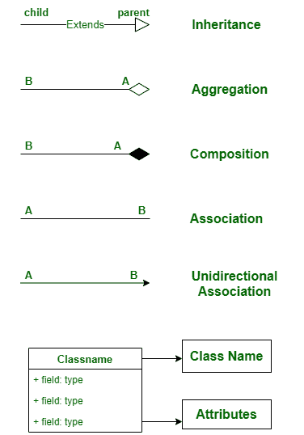
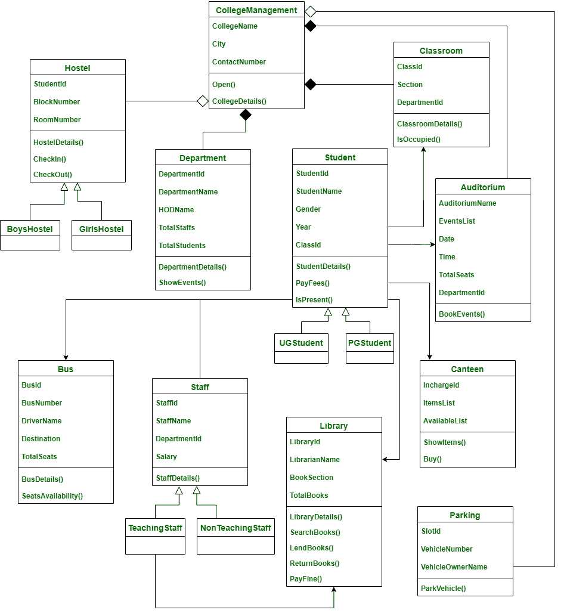

# 学院管理系统类图

> 原文: [https://www.geeksforgeeks.org/class-diagram-for-college-management-system/](https://www.geeksforgeeks.org/class-diagram-for-college-management-system/)

类图是表示类之间关系的方式。在本文中，我们将看到学院管理系统的类图。

## 类

*   `CollegeManagement` – 这个班是整个系统的整体主班。
*   `Department` – 本课包含学院各个系的详细情况。
*   `Student` – 这个班是给学生的，是两个子班——`UGStudent` 和 `PGStudent` 的基础班。因为学生是学生，学生是学生。
*   `UGStudent` – 该类是 `Student` 的子类，包含 UGStudent 的详细信息。
*   `PGStudent` – 该类是 `Student` 的子类，包含 PGStudent 的详细信息。
*   `Staff` – 学院有两种人员。所以这个类是两个子类的基类——`TeachingStaff` 和 `NonTeachingStaff`。
*   `TeachingStaff` – 该班是 `Staff` 的子班。因为教工就是教工。
*   `NonTeachingStaff` – 该类是 `Staff` 的子类。因为非教学人员是工作人员。
*   `ClassRoom` – 这门课包含了整个学院每一个教室的细节。
*   `Canteen` – 这个班是用来存放学院内部食堂的详细资料的。
*   `Library` – 这门课包含了学院中某个特定图书馆的详细信息。
*   `Bus` – 该类包含总线的详细信息以及总线驱动程序的详细信息。
*   `Hostel` – 招待所有两种类型。所以这个类是两个子类的基类——`BoysHostel` 和 `GirlsHostel`。
*   `BoysHostel` – 这个班是 `Hostel` 的儿童班。因为男孩旅馆是一家招待所。
*   `GirlsHostel` – 这个班是 `Hostel` 的子班。因为女生宿舍是招待所。
*   `Parking` – 本课包含某学院停车区的详细信息。停车区可供学生、工作人员、游客等使用。
*   `Auditorium` – 礼堂是任何活动或嘉宾演讲发生的地方。这个类包含了它的细节。

## 属性

*   `CollegeManagement` — 大学名称、城市、联系号码
*   `Department` – 部门标识、部门名称、部门名称、总员工、总学生
*   `Student` – 学生标识、学生姓名、性别、年份、班级标识
*   `Staff` – 员工名称、员工姓名、部门标识、工资
*   `ClassRoom` – 教室号、教室号、部门号
*   `Canteen` – 在目标，项目列表，可用列表
*   `Library` – 图书馆标识、图书馆名称、图书部分、总图书
*   `Bus` – 公交车、公交车号、司机名、目的地、总座位
*   `Hostel` - 学生代号、区块号、房间号
*   `Parking` – 槽号、车辆号、车辆所有者名称
*   `Auditorium` – 礼堂名称、事件列表、日期、时间、总座位、部门标识

## 方法

### 1. CollegeManagement

*   `Open()` – 这个方法告诉学院是否开放。
*   `CollegeDetails()` – 该方法包含学院的详细信息，如名称、位置和联系电话。

### 2. Department

*   `DepartmentDetails()` – 此方法包含部门名称及其对应的部门负责人名称，每个部门的学生总数。
*   `ShowEvents()` – 此方法用于显示特定部门的任何事件。

### 3. Student

*   `StudentDetails()` – 该方法包含了学院中每个学生的所有信息。
*   `FeePayment()` – 该方式包含每个学生的缴费状态。
*   `IsPresent()` – 此方法显示学生是否在特定日期出现在学院。

### 4. Staff

*   `StaffDetails()` – 该方法包含教师和非教师的详细信息以及他们的工资详细信息。

### 5. ClassRoom

*   `ClassRoomDetails()` – 此方法显示每个教室的详细信息以及教室属于哪个部门。
*   `IsOccupied()` – 此方法告知教室是否有人。

### 6. Canteen

*   `DisplayItems()` – 该方法显示食堂中存在的项目。
*   `Buy()` – 此方法用于在学院食堂购买任何物品。

### 7. Library

*   `LibraryDetails()` – 此方法包含学院内部图书馆的详细信息。
*   `SearchBooks()` – 此方法用于搜索图书馆中的任何一本书。
*   `LendBooks()` – 这个方法是从图书馆取书。
*   `ReturnBooks()` – 此方法用于包含还书的详细信息。
*   `PayFine()` – 此方法包含支付罚款的详细信息。

### 8. Bus

*   `BusDetails()` – 该方法包含区域详情、公交名称、司机详情等公交详情。
*   `SeatAvailability()` – 该方法显示特定公交车中可用座位的详细信息。

### 9. Hostel

*   `HostelDetails()` – 该方法包含招待所的详细信息，如街区数量、典狱长详细信息、食物详细信息等。
*   `CheckIn()` – 这种方法是检查学生是否在宿舍。
*   `CheckOut()` – 这种方法是检查学生在外地时是否从招待所结账。

### 10. Parking

*   `ParkVehicle()` – 该方法用于存储学院内停放车辆的详细信息。

### 11. Auditorium

*   `BookEvents()` – 这种方法是预订礼堂进行活动。

## 关系

### 1. 继承

继承是从一个类到另一个类获取所需属性的实践。获取属性的类称为子类。允许获取其属性的类称为父类。这就是所谓的亲子关系。Ie. **“Is-a”** 关系

> 这里，下面的类遵循继承
> *   `Student` - `UGStudent` 和 `PGStudent`
> *   `Staff` - `TeachingStaff` 和 `NonTeachingStaff`
> *   `Hostel` - `BoysHostel` 和 `GirlsHostel`
>
> **Student - UGStudent 和 PGStudent:**
> `UGStudent` 和 `PGStudent` 是 `Student` 的子班级，UG 是学生，PG 是学生。
>
> **Staff - TeachingStaff 和 NonTeachingStaff:**
> `TeachingStaff` 和 `NonTeachingStaff` 是 `Staff` 的子班级。教职员工是教职员工，非教职员工也是教职员工。
>
> **Hostel - BoysHostel 和 GirlsHostel:**
> `BoysHostel` 和 `GirlsHostel` 是 `Hostel` 的儿童班。男生宿舍是招待所，女生宿舍是招待所。

### 2. 聚合

在聚合中，A 类和 B 类是相互依赖的，这表明 A 有一个 B and B 的实例，B 有一个实例，但它们在物理上并不包含在彼此内部。简单来说，B 类可以没有 a 类而存在，它遵循 **“has-a”** 关系。

> 这里，下面的类遵循聚合，
> *   `CollegeManagement` 和 `Hostel`
> *   `CollegeManagement` 和 `Parking`
>
> 他们遵循聚合，因为没有学院，招待所和停车场也能存在。

### 3. 组成

在组合中，A 类和 B 类是相互依赖的，这表明 A 类在 A 类中有一个 B 类的实例，换句话说，B 类物理上包含在 A 类中，所以 B 类没有 A 类就不能存在，它遵循一种 **“has-A”** 的关系。

> 在这里，
> *   `CollegeManagement` 和 `Department`
> *   `CollegeManagement` 和 `Auditorium`
> *   `CollegeManagement` 和 `ClassRoom`
>
> 遵循构图。
>
> 因为院系、礼堂、教室离不开学院管理，是在学院管理内部物理构成的。

### 4. 关联

在关联中，一个类不以任何方式委托给另一个类，但是这两个类相互使用，并在各自的空间中运行。它遵循“使用”关系。

> 在这里，
> *   `Student` 和 `Staff`
>
> 遵循关联，因为学生使用员工，员工使用学生。

### 5. 单向关联

在单向关联中，两个类在某些方面是相关的，但是只有一个类使用另一个类，而另一个类没有从这种关系中受益。甲类可以叫乙类，乙类不能叫甲类。

> 在这里，
> *   `Student` 和 `ClassRoom`
> *   `Student` 和 `Library`
> *   `TeachingStaff` 和 `Library`
> *   `Student` 和 `Bus`
> *   `Student` 和 `Auditorium`
> *   `Student` 和 `Canteen`
>
> 遵循单向关联，因为教室、图书馆、公共汽车、礼堂和食堂正在被学生使用，而另一方面，教室、图书馆、公共汽车、礼堂和食堂并没有从与学生的关系中受益。所以他们遵循单向联想。

## 符号

## 类图

