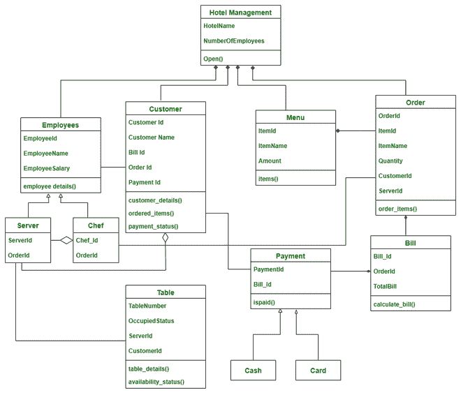

# 酒店管理系统类图

> 原文：[https://www.geeksforgeeks.org/class-diagram-for-hotel-management-system/](https://www.geeksforgeeks.org/class-diagram-for-hotel-management-system/)

类图是一种展示各种对象之间的属性和关系的 UML 图。

## 类

该系统中使用的类有：

*   `HotelManagement`：这个类描绘的是整个酒店，说的是酒店是开业还是关门。
*   `Staff`：包含员工的详细信息。有两种员工，服务员和厨师。这个雇员类是两个子类——`Server`和`Chef`的父类。
*   `Server`：它包含服务器的详细信息、它们被分配到的表、当前服务的订单等。
*   `Chef`：包含厨师在做特定订单的细节。
*   `Customer`：包含客户的详细信息。
*   `Table`：它包含表的详细信息，如表号和分配给该表的服务器。
*   `Menu`：菜单包含餐厅中所有可提供的食物项目、它们的可用性、奖品等。
*   `Order`：订单描述与特定表格和客户相关的订单。
*   `Bill`：账单使用订单和菜单计算。
*   `Payment`：这个班是做支付的。付款有两种方式，现金或信用卡。所以`Payment`是父类，`Cash`和`Card`是子类。
*   `Cash`：可以现金支付。
*   `Card`：付款可以刷卡，也可以在线。

## 属性

*   `HotelManagement` – 酒店名称，员工人数
*   `Staff` – 员工 Id、员工姓名、员工工资
*   `Server` – 伺服器，顺序 Id
*   `Chef` – 厨师 Id，定语
*   `Customer` – 客户标识、客户名称、账单标识、订单标识、付款标识
*   `Table` – 表号、占用状态、服务器标识、客户标识
*   `Menu` – item id、ItemName、Amount
*   `Order` – 订单标识、项目标识、项目名称、数量、客户标识、服务器标识
*   `Bill` — 条例草案 _Id、订单编号、合计条例草案
*   `Payment` – 付款编号，账单编号

## 方法

### 1. HotelManagement

*   `open()` - 用于指示酒店是否在运行。

### 2. Staff

*   `employeeDetails()` – 此方法包含员工的详细信息。

### 3. Customer

*   `customerDetails()` – 这描述了客户的详细信息。
*   `orderedItems()` – 此方法包含客户订购的项目。
*   `paymentStatus()` - 表示客户是否付款。

### 4. Table

*   `tableDetails()` – 此方法包含了表的详细信息以及客户和座位数。
*   `availabilityStatus()` – 此方法表示表是否被占用。

### 5. Menu

*   `items()` – 该方法显示菜单项、其可用性和价格。

### 6. Order

*   `orderItems()` – 该方法对用户从菜单中选择的项目进行排序。

### 7. Bill

*   `calculateBill()` – 此方法计算特定表格的账单。

### 8. Payment

*   `isPaid()` – 显示支付是否成功。

## 关系

### 继承

继承是“是关系”。它有一个父类及其对应的子类。子类从父类继承所需的方法和属性。

> 这里，`Staff`是父类，`Server`和`Chef`是子类，因为`Server`是`Staff`，`Chef`是`Staff`。

### 关联

在关联中，两个类相互关联，但在物理上并不相互包含。用“关系称为”。在关联关系中，考虑我们有两个类 A 和 B，其中类 A 调用类 B，类 B 也调用类 A。

> 在这里，
> *   `Staff`和`Customer`
> *   `Server`和`Table`
> *   `Customer`和`Payment`
> *   `Chef`和`Order`
>
> 遵循关联关系。

### 成分

也叫“有”关系，A 类有 B 类的一个实例，B 类在 A 类内部构成，没有 A 类就不能独立存在，所以在构成上一个类完全依赖于另一个类，物理上包含在里面。

> 在这里，
> *   `Menu`和`Order`
> *   `Order`和`Bill`
> *   `Bill`和`Payment`
>
> 遵循组成关系
>
> 没有`Menu`就不能有`Order`，没有`Order`就不能有`Bill`，没有`Bill`就不能有`Payment`。所以这里`Order`包含在`Menu`中，`Bill`包含在`Order`中，`Payment`包含在`Bill`中。

### 聚合

也称为“有”关系，其中 A 类有 B 类的实例，但是 B 类不是在 A 类内部组成的，没有 A 类可以独立存在，所以在聚合中，两个类相互依赖，相互使用，但是没有一个包含在另一个内部。

> 在这里，
> *   `Customer`和`Server`
> *   `Chef`和`Server`
>
> 遵循聚合关系
>
> `Server`与`Customer`相关联，但也可以在没有`Customer`的情况下存在，同样，`Chef`与`Server`相关联，但也可以在没有`Server`的情况下存在。

## 符号

## 类图

